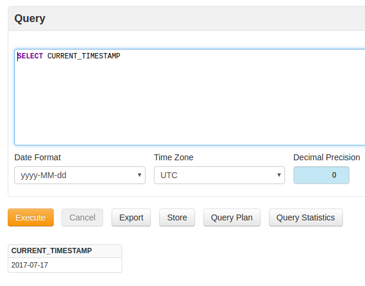
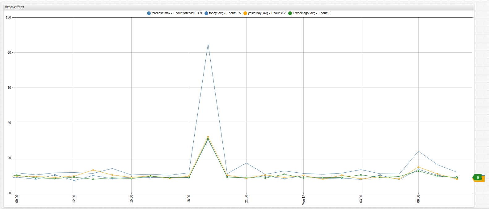
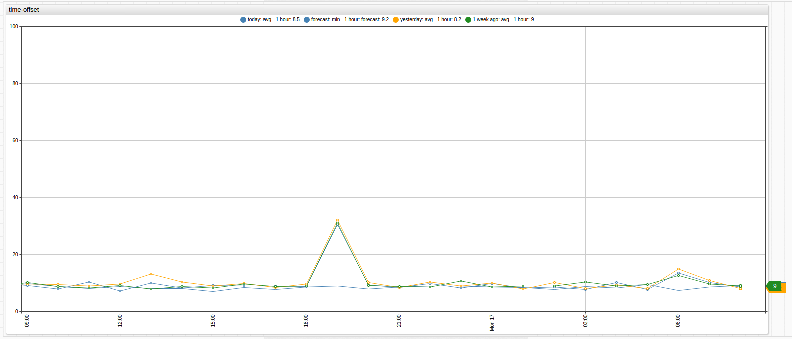
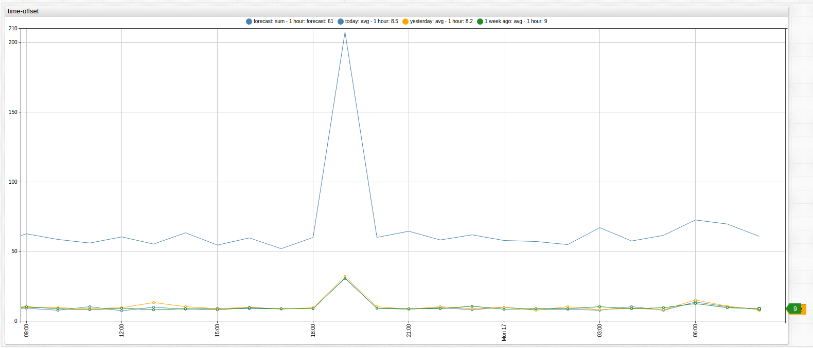
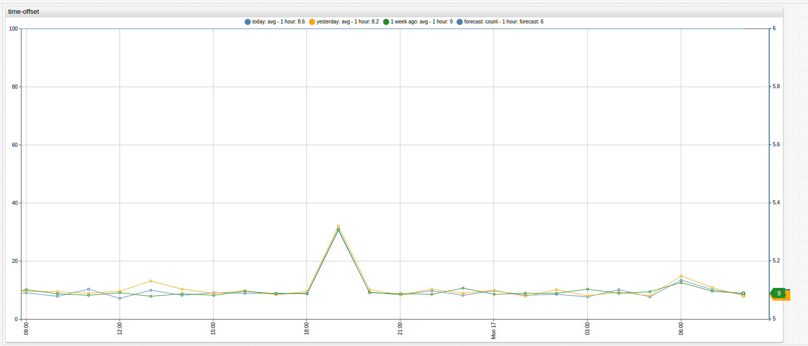

Weekly Change Log: July 10, 2017 - July 16, 2017
==================================================

### ATSD

| Issue| Category    | Type    | Subject              |
|------|-------------|---------|----------------------| 
| 4390 | sql | Bug | Fixed [`CAST`](https://github.com/axibase/atsd/tree/master/api/sql#keywords) conversion error with the built-in `time` column. |
| [4375](#Issue-4375) | sql | Feature | Added support for [`CURRENT_TIMESTAMP`](https://github.com/axibase/atsd/tree/master/api/sql#current_timestamp) and [`DBTIMEZONE`](https://github.com/axibase/atsd/tree/master/api/sql#dbtimezone) functions. |
| [4360](#Issue-4360) | forecast | Feature | Added support for additional aggregation functions in [forecast](https://axibase.com/products/axibase-time-series-database/forecasts/) settings: `AVG`, `MIN`, `MAX`, `SUM`, `COUNT`.  |

### ATSD  

##### Issue 4375

The `CURRENT_TIMESTAMP` function returns current database time in the ISO 8601 datetime format. It is analogous to the [`NOW`](https://github.com/axibase/atsd/tree/master/api/sql#keywords)
function which returns current database time in Unix milliseconds.

The [`DBTIMEZONE`](https://github.com/axibase/atsd/tree/master/api/sql#dbtimezone) function returns the current database timezone name or GMT offset.

##### Issue 4360

A custom aggregation function such as `MAX` can now be selected in Forecast settings. Previously only `AVG` function was supported. Aggregation functions are applied to regularize the underlying time series prior to applying H-W or ARIMA algorithms.

###### AVG

Averages the values during a period.

###### MAX 

Displays the maximum value during a period.

###### MIN

Displays the minimum value dueing a period.

###### SUM

Sums the values during a period.

###### COUNT 

Displays the number of samples for a period.

