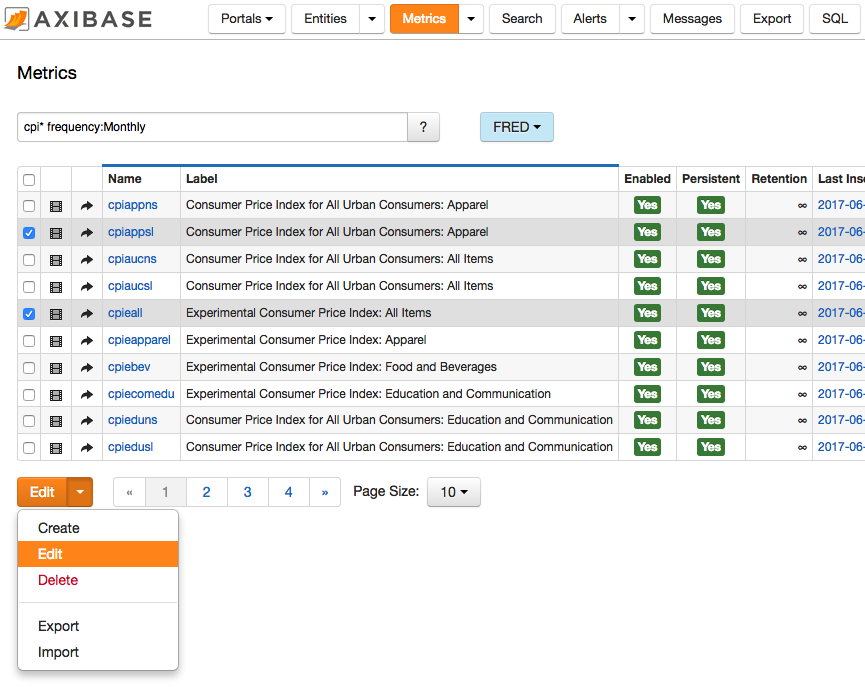

Weekly Change Log: July 17, 2017 - July 23, 2017
==================================================

### ATSD
| Issue| Category    | Type    | Subject              |
|------|-------------|---------|----------------------| 
| 4409 | export | Bug | Added `metrics.unit` to the list of fields in the backup xml files. |
| 4400 | sql | Bug | Fixed illegal syntax error when querying table names containing dots. |
| [4398](#Issue-4398) | UI | Feature | Refactored the **[Metrics]** tab to improve usability. |
| 4359 | forecast | Bug |  Fixed a [Forecast](https://axibase.com/products/axibase-time-series-database/forecasts/) calculation error if the settings specify an [endtime](https://axibase.com/products/axibase-time-series-database/visualization/end-time/) in the future.|
| [4286](#Issue-4286) | sql | Feature | Formalize boolean logic in SQL queries. |

### ATSD

#### Issue 4398

**Feature Details**: 

* Flexible search expression
* Tag sets to display common sets of metric tags
* State stored in cookies
* Button toolbar simplified

#### Issue 4286

Truth Tables for Logical Operators:

**Table 1.1**

| X | Not X |
|:---:|:-----:|
|`true`| `false` |
| `false` | `true` |
| `NULL` | `NULL` |

**Table 1.2**

| X | Y | X and Y | X or Y |
|:---:|:---:|:-------:|:------:|
| `true` | `true` | `true` | `true` |
| `true` | `false` | `false` | `true` |
| `false` | `false` | `false` | `false` |
| `true` | `NULL` | `NULL` | `true` |
| `false` | `NULL` | `false` | `NULL` |
| `NULL` | `NULL`| `NULL` | `NULL` |
