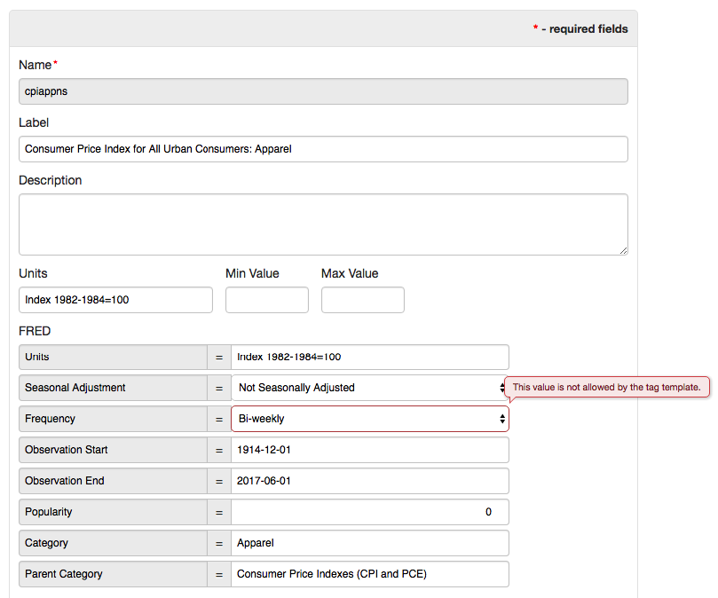

Weekly Change Log: July 31, 2017 - August 06, 2017
==================================================

### ATSD

| Issue| Category    | Type    | Subject              |
|------|-------------|---------|----------------------|
| 4452 | UI | Bug | Fix response body formatting in the built-in API client. |
| 4443 | email | Bug | Add support for UTF-8 characters in email subjects. |
| 4435 | UI | Feature | Display alert message on Users and Entity Group pages if `api.guest.access.enabled` is enabled. |
| 4433 | UI | Bug | Fix Delete button on the Portal Editor page. |
| 4432 | installation | Bug | Read hostname from `/proc/sys/kernel/hostname` if the hostname command is not installed on the Linux server. |
| 4428 | installation | Bug | Set file ownership to `axibase:axibase` instead of `axibase:root` when installing ATSD from deb/rpm package. |
| 4421 | sql | Bug | Revert a change which caused empty results to be returned for a non-existing table without raising an error. |
| [4420](#issue-4420) | sql | Bug | Return data type as `bigint` for columns that previously were classified as `long`. |
| [4406](#issue-4406) | UI | Feature | Highlight error if tag value is not allowed by a dictionary tag specified in the metric or entity tag template. |
| 4405 | UI | Feature | Add support for exporting and importing tag templates into XML on **Configuration > Tag Templates** page. |
| [4395](#issue-4395) | jdbc | Feature | Add support for [wildcards](https://github.com/axibase/atsd-jdbc/blob/master/README.md#database-metadata) in `getTables` and `getColumns` methods. |
| [4389](#issue-4389) | jdbc | Feature | Add support for inserting metric and entity [tags and fields](https://github.com/axibase/atsd-jdbc/blob/master/insert.md#metric-metadata-columns) in `INSERT` statements. |
| [4388](#issue-4388) | jdbc | Feature | Add support for local [datetime](https://github.com/axibase/atsd-jdbc/blob/master/insert.md#date) format `yyyy-MM-dd HH:mm:ss[.fffffffff]` in `INSERT` statements. |
| 4385 | jdbc | Feature | Add `missingMetric` [connection property](https://github.com/axibase/atsd-jdbc/blob/master/README.md#jdbc-connection-properties-supported-by-driver) to control driver behavior in case of unknown table.|
| 4383 | jdbc | Bug | Include the reserved `atsd_series` if `tables=*` [connection property](https://github.com/axibase/atsd-jdbc/blob/master/README.md#jdbc-connection-properties-supported-by-driver) selects all tables. |
| 4379 | jdbc | Bug | Fixed an error with `NULL` values in [`INSERT`](https://github.com/axibase/atsd-jdbc/blob/master/insert.md) statements. |
| 4374 | sql | Feature | [SQL Metadata API](https://github.com/axibase/atsd/blob/master/api/sql/api-meta.md) method should return metadata for the pre-defined columns even if the metric doesn't exist.|
| [4373](#issue-4373) | jdbc | Bug | Raise exception if parameter data type is not valid.  |
| [4372](#issue-4372) | jdbc | Bug | Add support for [inserting series tags](https://github.com/axibase/atsd-jdbc/blob/master/insert.md#insert-syntax). |
| 4371 | jdbc | Bug | Fix bug with `INSERT` statements if the table name is quoted. |
| 4370 | jdbc | Bug | Avoid sending a duplicate [metadata](https://github.com/axibase/atsd/blob/master/api/sql/api-meta.md) query when inserting data. |
| 4369 | jdbc | Feature | Add support for [`timestamptz`](https://github.com/axibase/atsd-jdbc/blob/master/insert.md#time-zone) connection property to control how timestamps are parsed and formatted when inserting data. |
| 4368 | sql | Bug | Handle placeholders in prepared statements in [SQL Metadata API](https://github.com/axibase/atsd/blob/master/api/sql/api-meta.md) method. |
| 4366 | jdbc | Feature | Refactor [JDBC URL](https://github.com/axibase/atsd-jdbc/blob/master/README.md#jdbc-url). |
| 4365 | sql | Bug | Fixed a bug which caused the server to use an incorrect timezone in `GROUP BY PERIOD` [queries](https://github.com/axibase/atsd/tree/master/api/sql#period) if the database is running in a user-defined timezone. |
| 4363 | sql | Feature | Implement an `/api/sql/meta` method to obtain [query metadata](https://github.com/axibase/atsd/blob/master/api/sql/api-meta.md) without executing the query. |
| 4345 | forecast | Bug | Add support for tag wildcards in [series queries](https://github.com/axibase/atsd/blob/master/api/data/series/query.md#entity-filter-fields) for forecast data: `type=FORECAST`. |
| [4328](#issue-4328) | sql | Feature | Add support for [`LAG`](https://github.com/axibase/atsd/blob/master/api/sql/README.md#lag) function in `JOIN` queries. |
| [4303](#issue-4303) | jdbc | Feature | Add support for inserting data with JDBC driver using [`INSERT` and `UPDATE`](https://github.com/axibase/atsd-jdbc/blob/master/insert.md) queries. |
| 4278 | core | Bug | Fix a bug causing the data compaction to hang when multiple detailed column families are present. |
| 3983 | api-rest	| Bug |	Data API: tags are incorrectly concatenated with [`group`](https://github.com/axibase/atsd/blob/master/api/data/series/group.md) processor. |
| 3874 | api-network | Bug | Data API: series command fails to overwrite value when inserted in batch with [append flag](https://github.com/axibase/atsd/blob/master/api/network/series.md#text-append). |

### ATSD

##### Issue 4420

```sql
SELECT time FROM jvm_memory_used LIMIT 1
```

```json
        {
          "columnIndex": 1,
          "name": "time",
          "titles": "time",
          "datatype": "bigint",
          "table": "jvm_memory_used",
          "propertyUrl": "atsd:time",
          "dc:description": "Sample time in epoch milliseconds"
        }
```

Now all columns that returned `long` will be returning `bigint`.

```sql
SELECT COUNT(*) FROM test_m
```

```json
        {
          "columnIndex": 1,
          "name": "count(*)",
          "titles": "count(*)",
          "datatype": "long",
          "propertyUrl": "atsd:count"
        }
```

##### Issue 4406



##### Issue 4395

 The expression uses `%` and `_` wildcards to match tables and columns by name.

```java
 // Match tables disk_used, disk_used_percent
 ResultSet rs = dmd.getTables(null, null, "_isk_%", null);
 ```
 
##### Issue 4389

```sql
INSERT INTO "temperature"
         (entity, datetime, value, tags.surface, metric.units, entity.tags.location)
  VALUES ('sensor-01', '2017-08-21T00:00:00Z', 24.5, 'Outer', 'Celsius', 'SVL')
```

##### Issue 4388

```sql
INSERT INTO 'my-metric' (entity, value, datetime) VALUES ('e-1', 123, '2017-07-12 04:05:00.34567')
```

##### Issue 4373

```java
final String sql = "INSERT INTO metric1 (time, entity, value, tags) VALUES (?,?,?,?)";
try (PreparedStatement stmt = connection.prepareStatement(sql)) {
    stmt.setLong(1, System.currentTimeMillis());
    stmt.setString(2, "entity1");
    stmt.setString(3, "Hello"); //must be a number
    stmt.setString(4, null);
    stmt.executeUpdate();
}
```

##### Issue 4372

Multiple tag pairs must be separated by semi-colon or inserted with [`setTags`](https://github.com/axibase/atsd-jdbc/blob/master/insert.md#parameterized-queries) method.

```css
tag1=abc;tag2=cde
```

```java
                String query = "INSERT INTO minsert1 (datetime, entity, value, tags) VALUES (?, ?, ?, ?)";
                PreparedStatement st = conn.prepareStatement(query);
                st.setTimestamp(1, new Timestamp(time));
                st.setString(2, entityName);
                st.setDouble(3, val);
                st.setString(4, "tag1=abc;tag2=cde");
```

##### Issue 4365

```sql
SELECT time, date_format(time, 'yyyy-MM-dd HH:mm', 'Europe/Vienna')
  FROM m1 
GROUP BY period(1 DAY, 'Europe/Vienna')
```

##### Issue 4328

```sql
SELECT t1.tags.company_name, datetime, 
  t1.value, t2.value, 
  t1.value - t2.value, 
  t1.value - LAG(t1.value)
FROM assets t1 
  JOIN liabilities t2 
WHERE t1.tags.company_name = 'Mutual of Omaha Insurance Company'
  --ORDER BY datetime
  WITH ROW_NUMBER(t1.tags.company_name ORDER BY datetime) <= 2
```

##### Issue 4303

The JDBC driver provides support for writing data into ATSD using INSERT and UPDATE statements. These statements are parsed by the driver into network commands which are inserted into the database with the Data API [command](https://github.com/axibase/atsd/blob/master/api/data/ext/command.md) method.

```sql
INSERT INTO temperature (entity, datetime, value, tags.surface)
                 VALUES ('sensor-01', '2017-08-21T00:00:00Z', 24.5, 'Outer')
                 
UPDATE temperature SET value = 24.5 
  WHERE entity = 'sensor-01' AND datetime = '2017-08-21T00:00:00Z' AND tags.surface = 'Outer'                 
```

```ls
series e:sensor-01 d:2017-08-21T00:00:00Z m:temperature=24.5 t:surface=Outer
```
