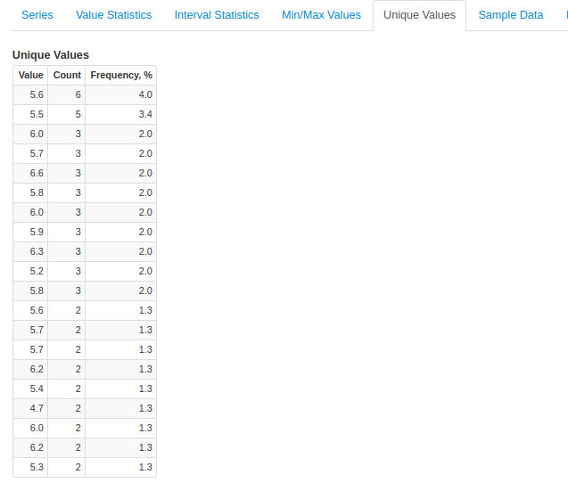

Weekly Change Log: August 07, 2017 - August 13, 2017
==================================================

### ATSD

| Issue| Category    | Type    | Subject              |
|------|-------------|---------|----------------------|
| 4470 | admin | Feature | Collect disk usage [metrics](https://github.com/axibase/atsd/blob/master/administration/monitoring.md#collected-metrics) from the server where ATSD is installed. |
| 4467 | api-rest | Feature | Allow access to [entity group list](https://github.com/axibase/atsd/blob/master/api/meta/entity-group/get-entities.md) method if API guest access is enabled. |
| 4466 | metric | Bug | Add support for `timePrecision`, `persistent`, `retentionIntervalDays` fields in the [metric](https://github.com/axibase/atsd/blob/master/api/network/metric.md) command. |
| 4465 | metric | Bug | Add validation for [Invalid Action](https://github.com/axibase/atsd/blob/master/api/meta/metric/list.md#invalid-actions) field in the [metric](https://github.com/axibase/atsd/blob/master/api/network/metric.md) command. |
| [4464](#issue-4464) | api-rest | Feature | Speed up series queries with [tag expressions](https://github.com/axibase/atsd/blob/master/api/data/series/query.md#tag-expression-filter) such as `tags.mount_point LIKE '/*'`. |
| 4456 | security | Feature | Update ATSD dependencies (used packages and libraries) to resolve known security issues in netty, Spring, httpclient, xstream, commons-fileupload. |
| [4454](#issue-4454) | api-rest | Feature | Standardize period alignment when period is measured in years. | 
| 4453 | security | Bug | User without necessary entity permissions can view series records on the Search tab. |
| 4445 | message | Bug | Fixed a bug which caused [message retention](https://github.com/axibase/atsd/blob/master/api/data/messages/delete.md#description) to not work. |
| 4434 | security | Feature | Add option for administrators to impersonate another user account. The **Impersonate** button is available on the user's settings page. |
| 4424 | UI | Bug | Fix XML serialization in backup and export XML files if the database is using a file encoding other than UTF-8. |
| 4407 | search | Bug | Fix a memory leak in HBase region servers during full search indexing. |
| [4386](#issue-4386) | sql | Feature | Add support for querying datetime column using standard Timestamp format `yyyy-MM-dd[ HH:mm:SS`. |
| [4382](#issue-4382) | UI | Feature | Unique Values tab added to the Series Statistics page. |

### ATSD

##### Issue 4464

```json
[
  {
    "startDate": "1970-01-01T00:00:00Z",
    "endDate": "now",
    "entity": "nurswgvml007",
    "metric": "disk_used",
    "tagExpression": "tags.mount_point LIKE '/*'",
    "limit": 1,
    "seriesLimit": 1
  }
]
```

##### Issue 4456

```json
[
  {
    "entity": "us.irs",
    "metric": "Expatriated.Citizens",
    "aggregate": {
      "types": [
        "SUM"
      ],
      "period": {
        "count": 1,
        "unit": "YEAR",
        "align": "END_TIME"
      }
    },
    "startDate": "2000-07-01T00:00:00Z",
    "endDate": "2017-07-01T00:00:00Z"
  }
]
```

##### Issue 4386

The supported format is `yyyy-MM-dd HH:mm:SS[.NNNNNNNNN]`. The dates are parsed according to the database time zone.

```sql
SELECT *
  FROM cpu_busy 
WHERE ((datetime >= '2017-07-10 10:06:56.065') AND (datetime <= '2017-07-11 18:49:33.408941')) 
  LIMIT 5
```

##### Issue 4382


