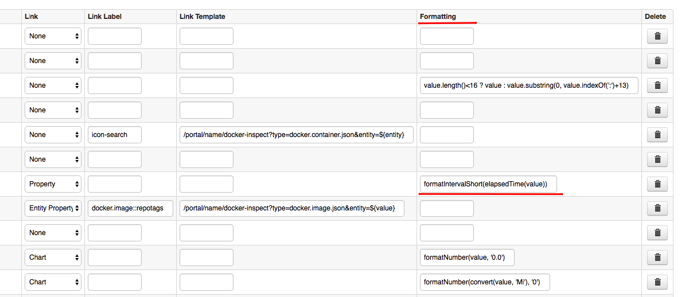
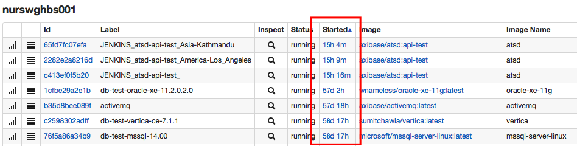
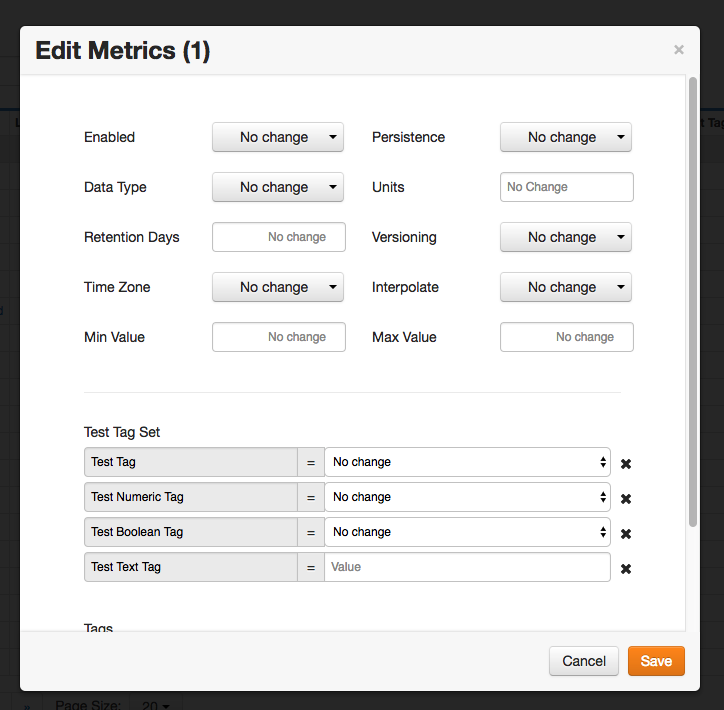
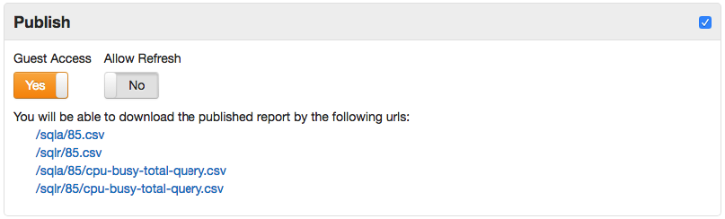
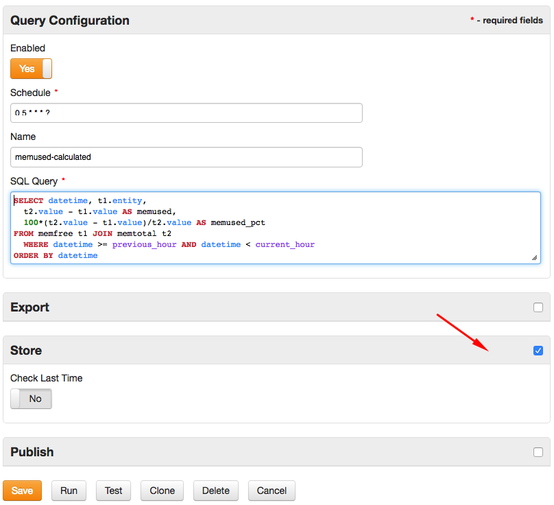

Weekly Change Log: August 14, 2017 - August 20, 2017
==================================================

### ATSD

| Issue| Category    | Type    | Subject              |
|------|-------------|---------|----------------------|
| 4498 | core | Bug | Add warning if Zookeeper returns TableExistsException which requires clearing [Zookeeper cache](https://github.com/axibase/atsd/blob/master/administration/restarting.md#zookeeper-cache). |
| 4496 | entity_views | Bug | Fixed an error which created duplicate entity views on each database start. |
| 4481 | core | Bug | Fixed an error caused by a parent tag template referencing a child tag template in a loop. |
| [4480](#issue-4480) | entity_views | Feature | Implement `formatInterval` and `formatIntervalShort` [functions](https://github.com/axibase/atsd/blob/master/rule-engine/functions-time.md) in Entity Views. |
| 4479 | UI | Bug | Fix multiple UI issues with tag templates. |
| 4478 | entity | Bug | Add support for entity names containing commas in **Entity Group** editor. |
| [4476](#issue-4476) | api-rest | Feature | Apply [`limit`](https://github.com/axibase/atsd/tree/master/api/sql#limiting) parameter when querying [forecast](https://github.com/axibase/atsd/blob/master/api/data/series/examples/query-named-forecast.md) data.
| [4460](#issue-4460) | UI | Feature | Display request execution time in the built-in API client. |
| [4415](#issue-4415) | UI | Feature | Refactor metric and entity list editors to support group actions.   |
| 4408 | UI | Bug | Refactor Metrics and Entity tabs. |
| 4362 | client | Feature | Add support for HTTP `HEAD` method in the built-in API client. |
| [4317](#issue-4317) | sql | Feature | Add support for [publishing](https://github.com/axibase/atsd/blob/master/api/sql/scheduled-sql.md#link) scheduled SQL report files.|
| [4297](#issue-4297) | sql | Feature | Add support for [storing derived series](https://github.com/axibase/atsd/blob/master/api/sql/scheduled-sql-store.md). |

### ATSD

#### Issue 4480

```java
formatInterval(elapsedTime(value)) + " ago"
```





#### Issue 4476

```json
[
  {
    "entity": "nurswgvml007",
    "metric": "cpu_busy",
    "type": "FORECAST",
    "startDate": "2016-10-01T00:00:00Z",
    "endDate": "2016-11-01T00:00:00Z",
    "limit": 1
  }
]
```

The Limit setting controls the number of samples contained in the resultset.

#### Issue 4460


Query execution time highlighted above.

#### Issue 4415



#### Issue 4317

Files produced by an SQL report can be made available for [downloading](https://github.com/axibase/atsd/blob/master/api/sql/scheduled-sql.md#link) by end-users. The report files contain records that were prepared by the server when the scheduled task was last executed.



#### Issue 4297

The Store option enables [writing the results](https://github.com/axibase/atsd/blob/master/api/sql/scheduled-sql-store.md) of the query back into the database.


