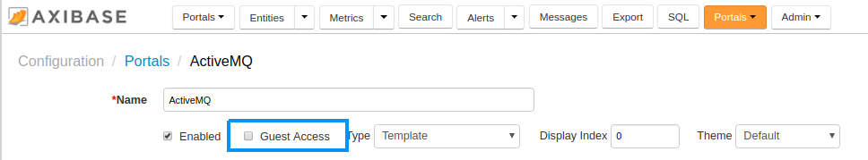
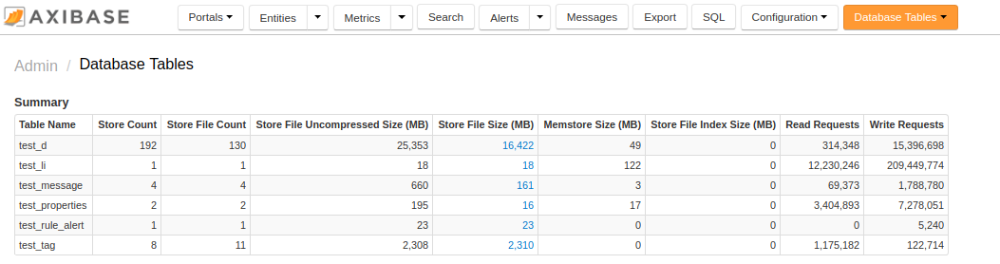

Weekly Change Log: August 28, 2017 - September 03, 2017
==================================================

### ATSD

| Issue| Category    | Type    | Subject              |
|------|-------------|---------|----------------------|
| [4532](#issue-4532) | security | Feature | Add support for **Guest** access to portals. |
| 4531 | api-rest | Bug | Fix bug causing message commands to be logged as series commands in the `command.log`. |
| 4528 | statistics | Bug | Fix the estimated schedule for series that are collected with monthly frequency. |
| [4525](#issue-4525) | UI | Feature | Summary Table added to **Database Tables** page to simplify data growth monitoring. |
| 4519 | core | Feature | Licensing restrictions removed to allow all database editions to compress data with `gz` and `lzo` algorithms. |
| 4503 | UI | Bug | Restrict access to **Rules** and **Entity Views** pages for users with an Editor role. |
| 4502 | sql | Bug | Add the `encodeTags` parameter to [SQL API](https://github.com/axibase/atsd/tree/master/api/sql) method. |
| 4477 | core | Feature | Add HBase coprocessors to ATSD tables programmatically to avoid changing `hbase-site.xml`. |
| 4410 | Bug | Java API | Add missing metric methods to the [Java API Client](https://github.com/axibase/atsd-api-java). |
| [4351](#issue-4351) | jdbc | Feature | Add support for extended [tag methods](https://github.com/axibase/atsd-jdbc#tag-columns) in the JDBC driver. |

### ATSD

#### Issue 4532

The "Guest Access" check box controls unauthenticated access to a selected portal.



#### Issue 4525

The Summary Table in **Configuration** > **Database Tables** displays totals for key data tables. 



#### Issue 4351

```java
//serialize
Map<String, String> seriesTags = new HashMap<String, String>();
seriesTags.put("surface", "Outer");
seriesTags.put("status", "Initial");
// ...
aps.setTags(2, seriesTags);

// de-serialize
Map<String, String> seriesTags = rs.getTags(3);
```
