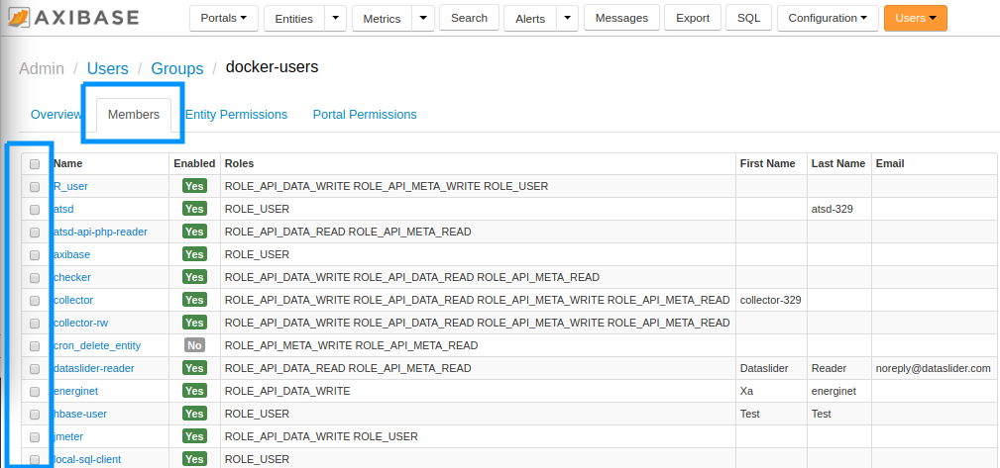

Weekly Change Log: September 04, 2017 - September 10, 2017
==================================================

### ATSD

| Issue| Category    | Type    | Subject              |
|------|-------------|---------|----------------------|
| [4545](#issue-4545) | sql | Feature | Custom SQL wildcards '*' and '?' replaced with standard [wildcards](https://github.com/axibase/atsd/tree/master/api/sql#match-expressions) '%' and '_'. |
| 4537 | search | Bug | Fixed an IndexNotFoundException if the series search indexing is not ready immediately after the installation. |
| [4533](#issue-4533) | UI | Feature | User Group membership form refactored to allow adding/removing multiple members at once. |
| 4524 | core | Feature | Collect `table_size` metric before and after the compaction. |
| 4516 | core | Feature | Add validator for ATSD coprocessor jar file at startup. |
| 4511 | UI | Feature | Implement `formatNumber` and `convert` functions in rule engine and entity views. |
| 4506 | security | Bug | Deny metadata export for unauthorized users without necessary entity permissions. |
| 4501 | UI | Bug | UI: Format stack trace in SQL console. |
| 4488 | csv | Bug | CSV Parser: fixed length split broken. |
| 4307 | sql | Bug | Fix row ordering for samples timestamped before January 1, 1970. |
| [4235](#issue-4235) | api-rest | Feature | `FIRST`, `LAST`, `MIN_VALUE_TIME`, `MAX_VALUE_TIME` aggregators added to series queries with [grouping](https://github.com/axibase/atsd/blob/master/api/data/series/group.md#grouping-functions). |
| 2792 | api-rest | Support | `counter` field removed from [metric](https://github.com/axibase/atsd/blob/master/api/meta/metric/list.md#fields) schema. |
| 2605 | UI | Bug | Rename old fields on the CSV parser editor form. |

### ATSD

#### Issue 4545

```sql
SELECT datetime, entity, value, tags.mount_point, tags.file_system
  FROM "df.disk_used_percent"
WHERE datetime >= PREVIOUS_HOUR
  AND tags.file_system LIKE '/dev/%'
-- old syntax
-- AND tags.file_system LIKE '/dev/*'
```

#### Issue 4533

Group membership can be modified using the checkbox at the left of the screen, under the **Members** Tab.



#### Issue 4235

```json
[
  {
    "entities": [
      "nurswgvml007",
      "nurswgvml006"
    ],
    "metric": "mpstat.cpu_busy",
    "group": {
      "type": "LAST",
      "period": {
        "count": 1,
        "unit": "MINUTE"
      }
    },
    "startDate": "2017-05-30T00:57:00.000Z",
    "endDate": "2017-05-30T01:00:00.000Z"
  }
]

```
