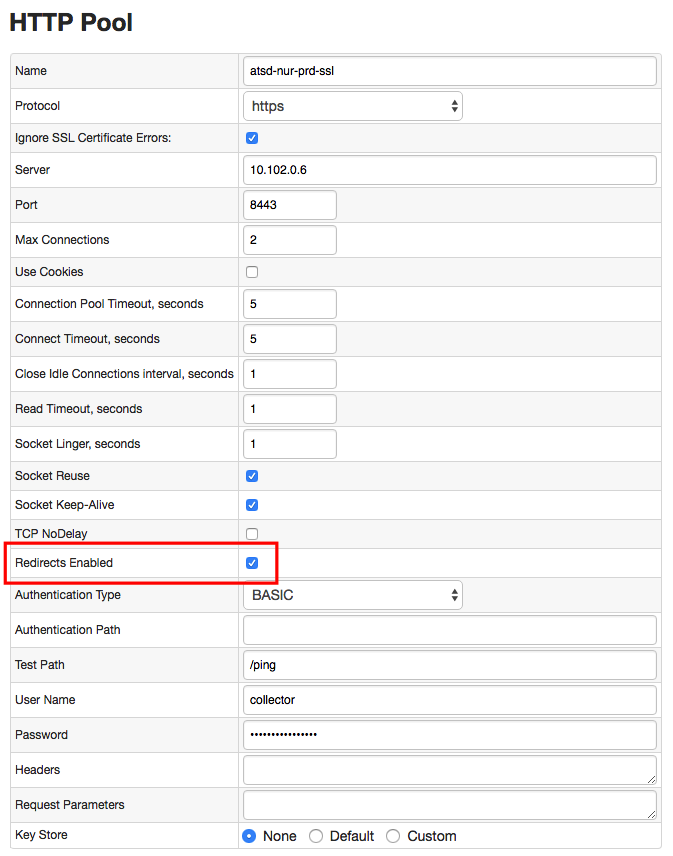

Weekly Change Log: September 11, 2017 - September 17, 2017
==================================================

## ATSD

| Issue| Category    | Type    | Subject              |
|------|-------------|---------|----------------------|
| 4565 | admin | Bug | Remove redundant roles assigned to the built-in administrator account.  |
| 4562 | meta-api | Bug | Requests to delete malformed entities (containing whitespace) are failing.  |
| 4561 | meta-api | Bug | Requests to delete a non-existent entity should return 400 status code instead of code 200 (OK).  |
| 4559 | core | Bug | Table size and region count may be underreported if metrics are sampled immediately after compaction.  |
| 4546 | security | Bug | User with `USER` role can access unauthorized records via API requests to `/api/v1/metrics` and `/api/v1/metrics` methods. |
| [4518](#issue-4518) | sql | Bug | Fix invalid expression error for time/datetime column in inline views. |
| [4508](#issue-4508) | sql | Feature | Add support for joins in subqueries. |
| [4397](#issue-4397) | sql | Feature | Allow `JOIN ON` syntax if the `ON` condition is the same as the implicit condition. |
| [4272](#issue-4272) | sql | Bug | Incorrect datetime filtering if the between condition is grouped in parenthesis. |

### Issue 4518

```sql
SELECT COUNT(value) FROM (
  SELECT max(time) as "time", entity, COUNT(value) as "value"
    FROM "bom.gov.au.air_temp"
    WHERE datetime > current_day GROUP BY entity
)
```

### Issue 4508

```sql
SELECT max(value) FROM (
  SELECT datetime, (cpi.value - ppi.value) AS "value"
    FROM cpi
    JOIN ppi
)
GROUP BY PERIOD (1 YEAR)
```

### Issue 4397

* JOIN ON condition:

```sql
SELECT *
  FROM disk_used t1
  JOIN disk_size t2
  ON (t1.entity = t2.entity AND t1.datetime = t2.datetime AND t1.tags = t2.tags)
WHERE t1.datetime BETWEEN '2017-07-15T09:00:00Z' AND '2017-07-15T09:00:05Z'
```

* Implicit JOIN condition

```
SELECT *
  FROM cpu_busy t1
  JOIN USING ENTITY disk_size t2
  --ON (t1.entity = t2.entity AND t1.datetime = t2.datetime)
WHERE t1.datetime BETWEEN '2017-07-15T09:00:20Z' AND '2017-07-15T09:00:30Z'
```

### Issue 4272

```sql
SELECT datetime
  FROM test_m1
WHERE (datetime BETWEEN '2017-01-01T00:00:00.000Z' AND '2017-01-02T00:00:00.000Z')
   OR (datetime = '2017-01-04T00:00:00.000Z')
```

## Axibase Collector

| Issue| Category    | Type    | Subject              |
|------|-------------|---------|----------------------|
| [4566](#issue-4566)  | docker | Bug | Add 'Redirects Enabled' setting to HTTP pool to handle authentication errors with `302` status response. |
| 4513 | docker | Bug | Set correct entity name for the docker host when the `/etc/hosts` files resolves to 'localhost'. |

### Issue 4566


