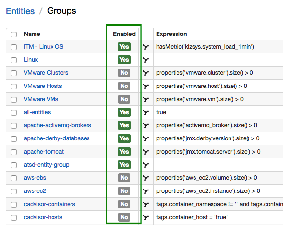
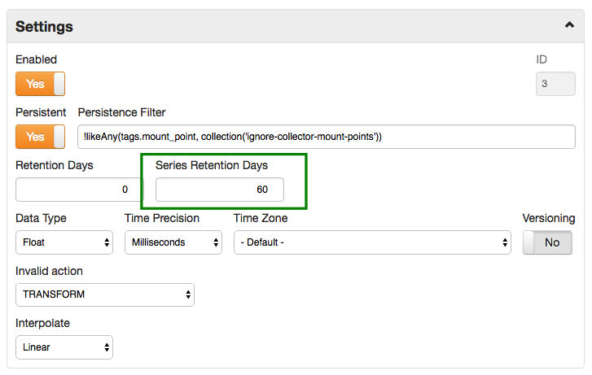
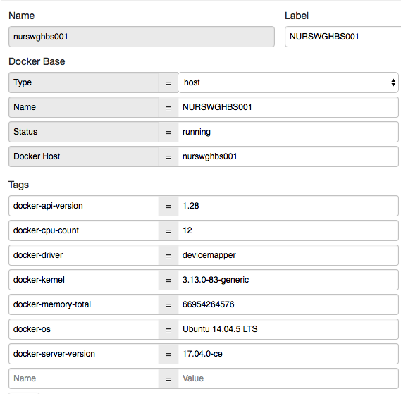

Weekly Change Log: September 18, 2017 - September 24, 2017
==================================================

## ATSD

| Issue| Category    | Type    | Subject              |
|------|-------------|---------|----------------------|
| 4578 | rule engine | Bug | Custom alias not resolved in Alter Message text.  |
| 4576 | core | Bug | Duplicate samples stored after data compaction.  |
| 4574 | admin | Bug | Reduce excessive ATSD at startup. |
| 4571 | ui | Bug | Fix missing suggestions in auto-complete if entries contain non-ASCII characters. |
| 4569 | ui | Feature | Standardize available fields for filtering in the API and UI. |
| [4555](#issue-4555) | sql | Bug | Time/datetime `NOT BETWEEN` filter error. |
| [4554](#issue-4554) | sql | Feature | Add support for `datetime !=` condition in the `WHERE` clause. |
| [4499](#issue-4499) | ui | Feature | Add support for Enabled/Disabled field for Entity Groups. |
| 4475 | ui | Bug | Display warnings if the entity record is missing in the last insert table. |
| [4437](#issue-4437) | sql | Bug | Date literal should not be implicitly converted to time data type. |
| [4295](#issue-4295) | sql | Bug | `DETAIL` interpolation with `OUTER` range fails to calculate values. |
| [4281](#issue-4281) | sql | Bug | Incorrect `ISNULL` result with null tags field. |
| [4147](#issue-4147) | sql | Feature | Support for `entity.timeZone` and `metric.timeZone` in PERIOD and `WITH INTERPOLATE` functions. |
| [2766](#issue-2766) | core | Feature | Series Retention Days setting to delete expired series. |

## Charts

| Issue| Category    | Type    | Subject              |
|------|-------------|---------|----------------------|
| 4543 | core | Feature | Add support for [user-defined](https://github.com/axibase/charts/tree/master/syntax/udf.md) functions. |

## Axibase Collector

| Issue| Category    | Type    | Subject              |
|------|-------------|---------|----------------------|
| [4563](#issue-4563)  | docker | Feature | Add entity tags to docker host entities. |
| 4577 | jdbc | Bug | Execute sql tasks in the same order as they are specified in the job configuration. |
| 4573 | docker | Bug | Fix entity label collision if container has a label named 'LABEL'. |
| 4022 | jdbc | Bug | Perform only one query execution during test. |

---

### Issue 4555

```sql
SELECT datetime, value
  FROM "cache.size"
WHERE datetime NOT BETWEEN '2017-01-02T00:00:00.000Z' AND '2017-01-02T00:00:00.000Z'
  LIMIT 3
```

### Issue 4554

```sql
SELECT datetime, value
  FROM test_m1
WHERE datetime != '2017-01-01T00:00:00.000Z'
```

### Issue 4499

Disabled entity groups are not displayed in the end-user web interface and are excluded from scheduled synchronization to reduce the load on the database.



### Issue 4437

```sql
SELECT '2017-08-01T00:00:00Z'
```

### Issue 4295

```sql
SELECT datetime AS 'datetime',
  COALESCE(t1.entity, t2.entity) AS 'entity',
  t1.value AS 'calc.cpu_busy',
  t2.value AS 'calc.memory_free',
  t2.tags.file_system AS 'tags.file_system',
  t2.tags.mount_point AS 'tags.mount_point'
  FROM cpu_busy t1
  OUTER JOIN USING entity disk_used t2
WHERE t1.datetime BETWEEN '2017-06-16T14:00:00Z' AND '2017-06-16T14:01:00Z'
  AND t1.entity = 'nurswgvml006' AND t2.entity = 'nurswgvml006'
  WITH INTERPOLATE(DETAIL, LINEAR, OUTER)
```

### Issue 4281

```sql
SELECT
    tags, tags IS NULL, ISNULL(tags, '-'),
    tags.tag, tags.tag IS NULL, ISNULL(tags.tag, '-')
FROM test_tags_null
```

### Issue 4147

```sql
SELECT datetime, date_format(time, 'yyyy-MM-dd HH:mm:ss z', metric.timeZone) AS metric_datetime, date_format(time, 'yyyy-MM-dd HH:mm:ss z', entity.timeZone) AS entity_datetime, value
  FROM cpu_busy
  WHERE entity = 'nurswgvml007'
    AND date_format(time, 'yyyy-MM-dd HH:mm:ss', metric.timeZone) >= '2017-05-01 12:00:00'
    AND date_format(time, 'yyyy-MM-dd HH:mm:ss', metric.timeZone)  < '2017-05-03 12:00:00'
  WITH INTERPOLATE(1 DAY, LINEAR, INNER, NONE, CALENDAR, metric.timeZone)
```

### Issue 2766

The new 'Series Retention Days' setting allows deleting series which have not been updated for a long period of time.



---

### Issue 4543

```ls
[configuration]
  height-units = 2
  width-units = 2
  import mm = my_math.js

[group]
  [widget]
    type = chart
    timespan = 1 hour
    [series]
      metric = mpstat.cpu_busy
      entity = nurswgvml007
      alias = s1
    [series]
      value = mm.multiplyBy('s1', 2)
```

[Chartlab Example](https://apps.axibase.com/chartlab/bc36b341)

---

### Issue 4563


