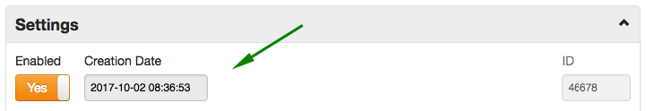

Weekly Change Log: September 25, 2017 - October 1, 2017
==================================================

## ATSD

| Issue| Category    | Type    | Subject              |
|------|-------------|---------|----------------------|
| 4603 | admin | Bug | Logging: removed freemarker Log4j runtime warnings.  |
| [4576](#issue-4576) | rule_engine | Feature | Implemented [lookup functions](../../rule-engine/functions.md#entity-tag-functions) `entity_tags` and `entity_tag`.  |
| 4593 | security | Feature | Retain session when the built-in administrator account is created. |
| 4587 | security | Feature | Create built-in user groups to simplify initial configuration. |
| [4586](#issue-4586) | api | Feature | Store `createDate` for new entities and metrics. |
| 4584 | api | Bug | Fix concurrency error when deleting a large set of entities using Meta API. |
| [4581](#issue-4581) | api | Bug | Incorrect last insert date in the response object if last insert date filter is specified in the request. |

## Charts

| Issue| Category    | Type    | Subject              |
|------|-------------|---------|----------------------|
| 4601 | widget-settings | Bug | Rename `getValueAtPoint` function as `getValueForDate`. |

## Axibase Collector

| Issue| Category    | Type    | Subject              |
|------|-------------|---------|----------------------|
| 4596 | docker | Feature | Validate atsd_url and collector password in the entrypoint script prior to starting the collector. |
| 4577 | core | Bug | Update packages to latest stable versions without known security issues. |

---

### Issue 4576

The new lookup functions can be used for creating correlated rules that depend on the state of another (related) entity, for example container<->host / container<->image / volume<->container.


```javascript
count() = 0 AND entity_tag(entity.tags['collector-host'], 'status') = 'running'
```

### Issue 4586



### Issue 4581

```ls
GET https://atsd_host:8443/api/v1/metrics/docker.cpu.sum.usage.total.percent/series?maxInsertDate=2017-09-19T20:51:00Z
```

The response incorrectly returned entities with `lastInsertDate` greater than `maxInsertDate` parameter while displaying a wrong `lastInsertDate` value in the response.

```json
[
  {
    "metric": "docker.cpu.sum.usage.total.percent",
    "entity": "nurswghbs001",
    "tags": {},
    "lastInsertDate": "2017-09-19T20:50:36.712Z"
  }
]
```

> Actual lastInsertDate was `2017-09-19T21:15:00Z`
