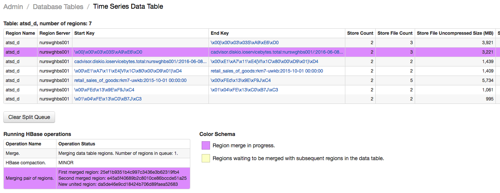

Weekly Change Log: October 2, 2017 - October 8, 2017
==================================================

## ATSD

| Issue| Category    | Type    | Subject              |
|------|-------------|---------|----------------------|
| [4619](#issue-4619) | api | Feature | Modify how `maxInsertDate` parameter is processed to search for metrics and entities without last insert date.   |
| 4618 | sql | Bug | Fix empty file name '.xlsx' for scheduled SQL reports in Excel format. |
| 4613 | admin | Bug | Default alert logger is deleted when logback configuration is reloaded. |
| 4607 | entity | Feature | Speed up adding new entities to expression-based groups. |
| 4606 | jdbc | Bug | Remove 'commons-lang3' dependency conflict. |
| 4606 | installation | Feature | Include default entity tag templates for 'docker*' entitiies in the distribution. |
| [4589](#issue-4589) | core | Feature | Implement administrator interface to split and merge regions. |
| 4580 | client | Feature | Upgrade the [Python client](https://github.com/axibase/atsd-api-python) with new methods and parameters. |

## Axibase Collector

| Issue| Category    | Type    | Subject              |
|------|-------------|---------|----------------------|
| 4609 | docker | Feature | Send `entity` command for new objects to ensure they're quickly added to expression-based groups. |
| 4594 | installation | Support | Speed up collector installation and start-up. |
| 4065 | installation | Support | Print detailed information during the startup process. |
---

### Issue 4619

```elm
GET https://atsd_host:8443/api/v1/metrics?maxInsertDate=1970-01-01T00:00:00Z&limit=3
```

Refer to [entity](../api/meta/entity/list.md#additional-examples) examples and [metric](../api/meta/metric/list.md#additional-examples) examples.

### Issue 4589



