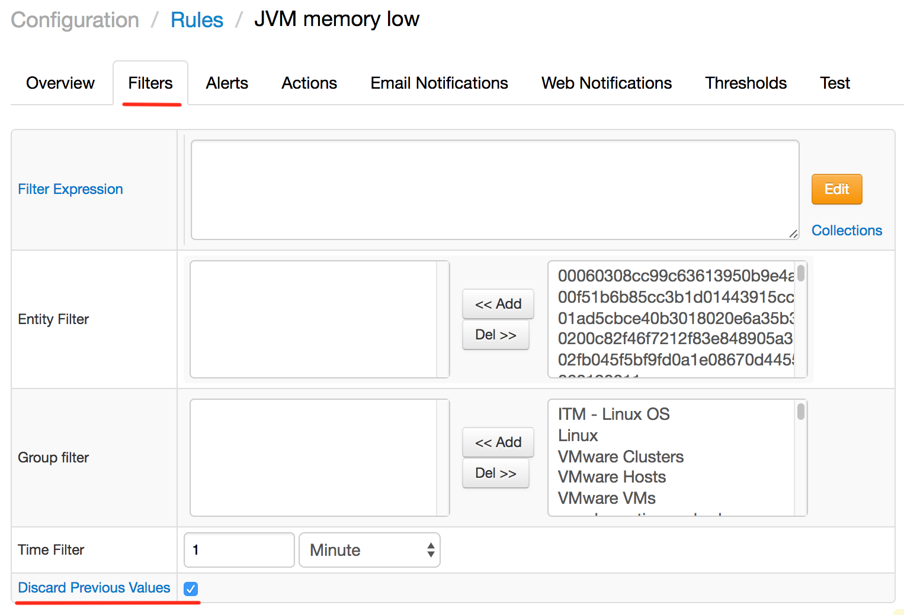
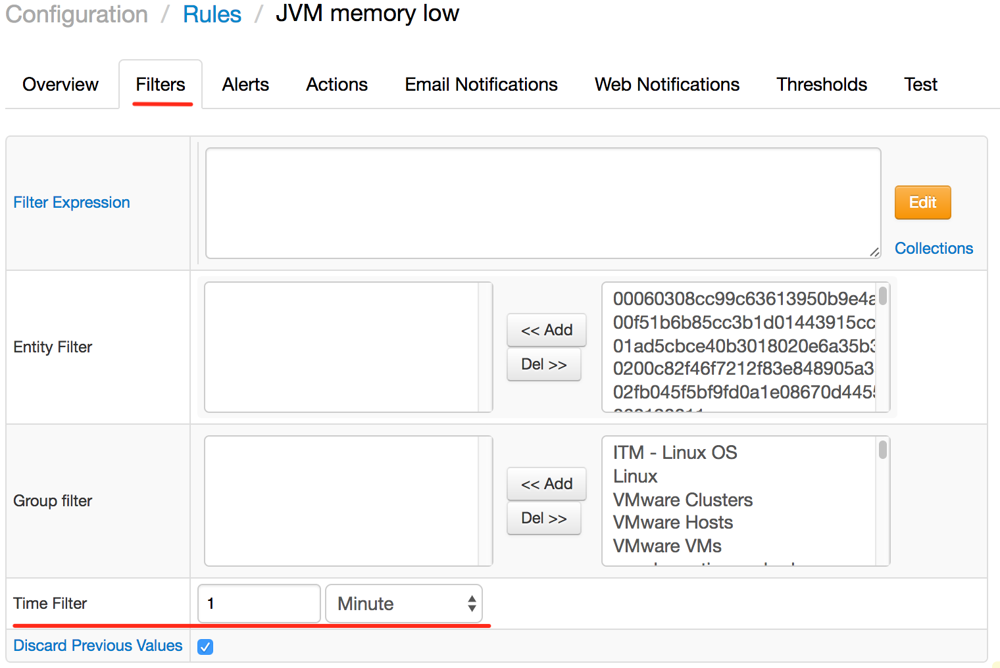
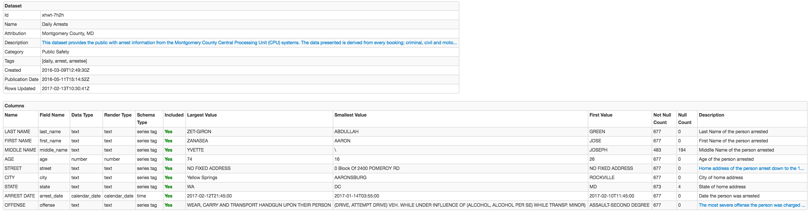

Weekly Change Log: February 6 - February 12, 2017
=================================================

### ATSD

| Issue| Category       | Type    | Subject                                                                              |
|------|----------------|---------|--------------------------------------------------------------------------------------| 
| 3912 | sql            | Bug     | Fixed NullPointerException in [`JOIN`](/docs/api/sql#join) queries without a `WHERE` condition.                                                                                                          |
| 3910 | rule engine    | Bug     | Invalid rules are logged with rule name to simplify troubleshooting.                                    |
| [3909](#issue-3909) | rule engine    | Feature | Added a `Discard Previous Values` filter option to control processing of commands with a timestamp earlier than the most recent one.                                                                                                               |
| 3902 | api-network    | Bug     | Fixed deletion of annotations by batched [series](/docs/api/network/series.md#series-command) commands with the [append](/docs/api/network/series.md#text-append) flag.                                            |
| 3894 | rule engine    | Bug     | Fixed validation of user-defined variables. |
| 3893 | sql            | Bug     | Fixed delta aggregator behavior with filtered dates.                                  |
| 3892 | sql            | Bug     | Fixed usage of the [CASE](/docs/api/sql#case) statement in `SELECT` clauses with grouping by the `time` column.    |
| 3890 | sql            | Bug     | Fixed tag encoding error in high-cardinality metrics.                                 |
| 3887 | UI             | Bug     | Added HTML-escaping for columns on SQL Queries page.                                  | 
| 3885 | api-network    | Bug     | Fixed annotation append behavior by batched [series](/docs/api/network/series.md#series-command) commands with the [append](/docs/api/network/series.md#text-append) flag.                                             |
| 3883 | rule engine    | Bug     | Variables are now allowed to be referenced by other variables.                            |
| 3880 | sql            | Bug     | Fixed NullPointerException in [`JOIN`](/docs/api/sql#join) queries when aggregating `null` values.   |
| [3879](#issue-3879) | rule engine    | Feature | Added time filter to control how historical and future records are discarded.                                                                    |
| 3872 | sql            | Bug     | Fixed a merge issue with [`JOIN USING entity`](/docs/api/sql#join-with-using-entity) clause.              |
| 3860 | api-rest       | Bug     | [series](/docs/api/network/series.md#series-command) query now returns text values with [last=true](/docs/api/data/series/query.md#control-filter-fields) field.                                                             |
| 3844 | sql            | Bug     | The [`ISNULL`](/docs/api/sql#join) function is now allowed to be a part of expression.               |
| 3508 | log_aggregator | Feature | Added ability to limit maximum event message size.                                          |

### Collector

| Issue| Category       | Type    | Subject                                                                              |
|------|----------------|---------|--------------------------------------------------------------------------------------| 
| 3903 | socrata        | Bug     | Implemented filtering and trimming of tag values before saving.                                      |
| [3899](#issue-3899) | socrata        | Feature | Added capability to launch an automated job from dataset url.                                                |
| 3877 | socrata        | Bug     | Annotations are added under numeric metric names.                                         |
| [3864](#issue-3864) | socrata        | Feature | Added a summary table displayed in `Test` mode.                                            |
| [3859](#issue-3859) | socrata        | Feature | Added a URL wizard.                                                                   | 

### Charts

| Issue| Category       | Type    | Subject                                                                              |
|------|----------------|---------|--------------------------------------------------------------------------------------| 
| 3908 | table          | Bug     | Fixed row sorting when conditional 'display: none' style is used.                                      |
| [3901](#issue-3901) | portal    | Support | Added ability to hide rows if no alert is raised for all metrics in a row.          |
| [3792](#issue-3792) | box       | Feature | Implemented class 'Metro'.                                                            |

## ATSD

### Issue 3909
--------------
The `Discard Previous Values` option allows you to discard commands timestamped earlier than the time of the most recent event in the given window.

### Issue 3879
--------------

## Collector

### Issue 3899
--------------
An example for launching a socrata job can be found in [this tutorial](https://github.com/axibase/atsd-use-cases/blob/master/SocrataPython/README.md).

### Issue 3864
--------------

### Issue 3859
--------------

The generated configuration:

## Charts

### Issue 3901
--------------
[Example portal](https://apps.axibase.com/chartlab/bb65c060) where rows without alerts get hidden:

### Issue 3792
--------------
[Example of `Metro` class](https://apps.axibase.com/chartlab/6d6ae13c/2/):

