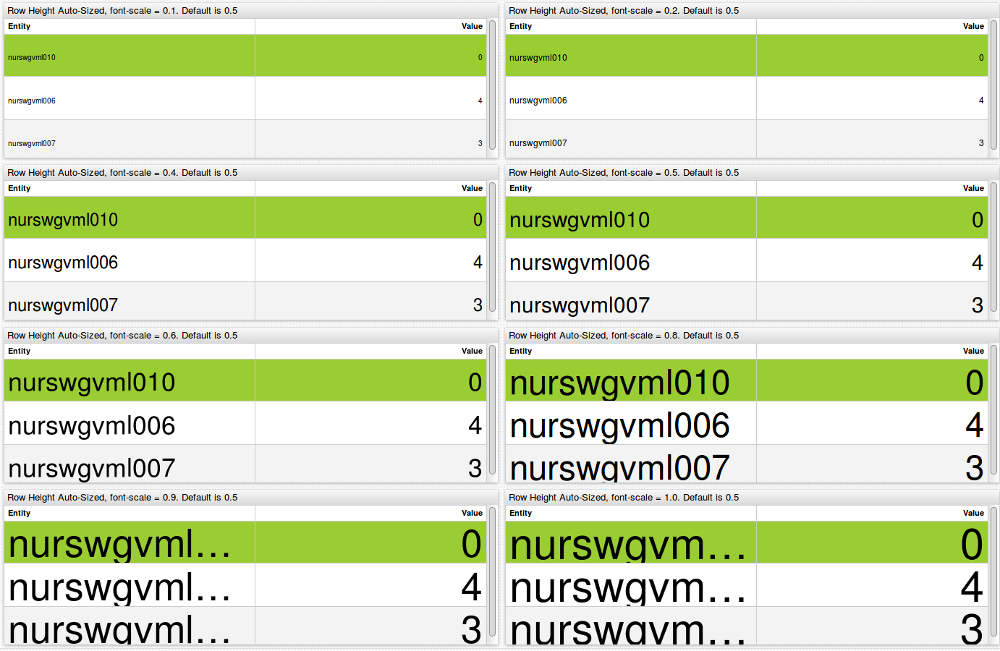

Weekly Change Log: February 13 - February 19, 2017
==================================================

### ATSD

| Issue| Category        | Type    | Subject                                                                              |
|------|-----------------|---------|--------------------------------------------------------------------------------------| 
| 3925 | api-rest        | Feature     | Added column alias to metadata with [metadataFormat=`COMMENTS`](/docs/api/sql/api.md#parameters) and outputFormat=`csv`.                                                       |
| [3919](#issue-3919) | csv        | Feature | Added an option to ignore top-N header lines in [CSV Parser](/parsers/csv/README.md).                                                                  |
| 3898 | rule engine     | Bug     | Fixed incorrect error validation of user-defined `column` aliases.                                                      |
| [3889](#issue-3889) | rule engine     | Bug     | Fixed `entity.label` field not accessible in filter [`expressions`](/docs/rule-engine/expression.md).                                                                 |

### Collector

| Issue| Category        | Type    | Subject                                                                              |
|------|-----------------|---------|--------------------------------------------------------------------------------------| 
| 3895 | socrata         | Bug     | Added heuristics to automatically classify and ignore fields in Socrata data sources. |
| 3891 | docker          | Bug     | Fixed missing `entity` command for a new container when 'Lifecycle event monitoring' is disabled.   |

### Charts

| Issue| Category        | Type    | Subject                                                                              |
|------|-----------------|---------|--------------------------------------------------------------------------------------| 
| [3921](#issue-3921) | widget-settings | Bug     | Added an `escape()` method to `list` and `var` arrays to escape commas in elements.         |
| 3917 | widget-settings | Bug     | Added the ability to escape commas and backslashes in settings which contain a list.                 |
| [3897](#issue-3897) | table      | Feature | Added an `auto-height` setting.                                                                |
| [3896](#issue-3896) | table      | Feature | Added a setting to hide table headers.                                                   |
| [3791](#issue-3791) | table      | Bug     | Fixed slider un-focus behavior after data update.                |

## ATSD

### Issue 3919
--------------

The option allows ignoring top-N header lines in the imported CSV file. This enables skipping multi-line headers or metadata sections in CSV files.

* Example: Skip 1 line `Title: "ORO.csv"` since it contains no separators.

```
Title: "ORO.csv"
1148,PST,'RESERVOIR ELEVATION (feet)'
20130101,0000,828.09
20130101,0100,828.11
20130101,0200,828.13
```

* Example 2. Skip 8 lines (empty and prefixed with `:`) to start with line `.A ORO 20160312 PS DH0000 /LSH 2325491`.

```

:CDEC data from OROVILLE DAM
:RESERVOIR STORAGE af
:Station ID ORO, sensor number 15, duration H
:Specified start date '03/12/2016 00:00' and ending date '03/14/2016 00:00'
:Note:  All data is PST and is displayed in 4-digit year format to comply with Y2K requirements.
:
:  sta yyyymmdd PS DHhhmm /code value
.A ORO 20160312 PS DH0000 /LSH 2325491 
```


### Issue 3889
--------------

The `entity.label` parameter is now supported in the rule filter.


 

## Charts

### Issue 3921
--------------

Added an `escape()` method to `list` and `var` arrays, so that this collections can now be serialized as follows  `@{arrayName.escape()}`. The `escape()` method escapes commas and backslashes in each element in an array.

```
  [dropdown]
    options = @{countries.escape()}
    change-field = series.tags.ctyname
```

https://apps.axibase.com/chartlab/ff94d98d/2/

### Issue 3897
--------------

New generic table settings:

| Setting | Description |
|---|---|
| auto-height	| Calculate row height automatically based on amount of vertical space allocated to the widget and the number of rows.|
| font-scale	| Ratio of font height to row height when auto-height is enabled. Minimum row height is 10px, maximum row height is 64px. |
| table-header-style	| Custom CSS style applied to table header, including a style to hide the header altogether. |
| header-style	| Custom CSS style applied to widget header, including a style to hide the widget header altogether. |

https://apps.axibase.com/chartlab/e02b8303/3/

https://apps.axibase.com/chartlab/e02b8303/4

https://apps.axibase.com/chartlab/e02b8303/5

https://apps.axibase.com/chartlab/e02b8303/6




