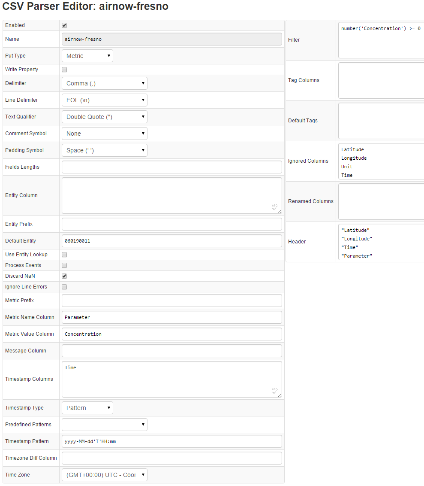

# Air Quality CSV Example

#### Original CSV File:

```
"36.785378","-119.773206","2015-07-09T00:00","CO","0.12","PPM"
"36.785378","-119.773206","2015-07-09T00:00","NO2","2.0","PPB"
"36.785378","-119.773206","2015-07-09T00:00","OZONE","48.0","PPB"
"36.785378","-119.773206","2015-07-09T00:00","PM10","37.0","UG/M3"
"36.785378","-119.773206","2015-07-09T00:00","PM2.5","7.5","UG/M3"
"36.785378","-119.773206","2015-07-09T00:00","SO2","1.0","PPB"
"36.785378","-119.773206","2015-07-09T01:00","CO","0.12","PPM"
"36.785378","-119.773206","2015-07-09T01:00","NO2","2.0","PPB"
"36.785378","-119.773206","2015-07-09T01:00","OZONE","46.0","PPB"
"36.785378","-119.773206","2015-07-09T01:00","PM10","37.0","UG/M3"
"36.785378","-119.773206","2015-07-09T01:00","PM2.5","7.4","UG/M3"
"36.785378","-119.773206","2015-07-09T01:00","SO2","1.0","PPB"
"36.785378","-119.773206","2015-07-09T02:00","CO","0.12","PPM"
"36.785378","-119.773206","2015-07-09T02:00","NO2","3.0","PPB"
"36.785378","-119.773206","2015-07-09T02:00","OZONE","44.0","PPB"
"36.785378","-119.773206","2015-07-09T02:00","PM10","37.0","UG/M3"
"36.785378","-119.773206","2015-07-09T02:00","PM2.5","7.3","UG/M3"
"36.785378","-119.773206","2015-07-09T02:00","SO2","1.0","PPB"
"36.785378","-119.773206","2015-07-09T03:00","CO","0.14","PPM"
"36.785378","-119.773206","2015-07-09T03:00","NO2","4.0","PPB"
"36.785378","-119.773206","2015-07-09T03:00","OZONE","41.0","PPB"
"36.785378","-119.773206","2015-07-09T03:00","PM10","37.0","UG/M3"
"36.785378","-119.773206","2015-07-09T03:00","PM2.5","7.1","UG/M3"
"36.785378","-119.773206","2015-07-09T03:00","SO2","1.0","PPB"
"36.785378","-119.773206","2015-07-09T04:00","CO","0.13","PPM"
"36.785378","-119.773206","2015-07-09T04:00","NO2","3.0","PPB"
"36.785378","-119.773206","2015-07-09T04:00","OZONE","37.0","PPB"
"36.785378","-119.773206","2015-07-09T04:00","PM10","36.0","UG/M3"
"36.785378","-119.773206","2015-07-09T04:00","PM2.5","7.0","UG/M3"
"36.785378","-119.773206","2015-07-09T04:00","SO2","0.0","PPB"
```

#### Parser Configuration Screenshot:



#### Parser Configuration Description

| Field | Setting | Reason | 
| --- | --- | --- | 
|  Enabled  |  Set to true  |  Enables parsing of CSV files.<br>Use of this parser configuration is allowed in Axibase Collector.  | 
|  Name  |  Unique name – airnow-fresno  |  Unique name to distinguish a particular parser from others.<br>Useful when working with Axibase Collector, as parser configurations are referred to by their unique name.  | 
|  Put Type  |  Metric  |  The CSV file in question contains time series (metrics) environmental data.  | 
|  Delimiter  |  Comma  |  A comma is used to separate columns.  | 
|  Default Entity  |  Unique entity name – `060190011`  |  No entity name is present in the CSV file; it is assigned manually to the ID of the monitoring station.<br>All data will be written to this unique entity, making it easy to distinguish from others.  | 
|  Metric Name Column  |  Parameter  |  Parameter column contains all metric names: CO, NO2, OZONE, PM10, PM2.5, SO2.  | 
|  Metric Value Column  |  Concentration  |  Concentration column contains the values for the above metrics.<br>Note that values for all metrics are contained in a single column.  | 
|  Timestamp Column  |  Time  |  Time column contains the timestamp, which will be used to import the time series.  | 
|  Timestamp Pattern  |  `yyyy-MM-dd'T'HH:mm`  |  Pattern matching the one contained in the original CSV file: `2015-07-09T00:00`.  | 
|  Filter  |  `number('Concentration') >= 0`  |  Used to import data points that contain actual values that are greater than 0 (not empty).  | 
|  Ignored Columns  |  `Latitude`<br>`Longitude`<br>`Unit`  |  Columns that will be not be imported.<br>For example: Latitude, Longitude, and Unit do not add any value to the time series.<br>Can be added as metric tags using the API or user interface.  | 
|  Header  |  `"Latitude"`<br>`"Longitude"`<br>`"Time"`<br>`"Parameter"`<br>`"Concentration"`<br>`"Unit"`  |  Since the source CSV file does not have column headers, they are assigned and then referenced in the configuration.  | 
