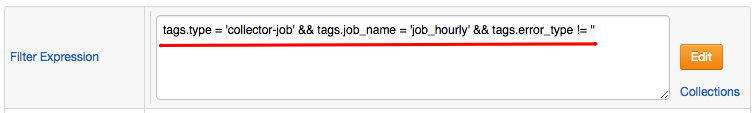

# Filters

## Overview

| **Name** | **Description** |
| --- | --- |
| Calendar | Discards commands if current server time doesn't match the specified cron calendar expression. |
| Metric | Discards commands with metric name not equal to the metric name specified in the rule. |
| Time | Discards commands with time that deviates by more than the specified interval from the current server time. |
| Previous Value | Discards commands timestamped earlier than the time of the last (most recent) event in a given window. |
| Entity | Discards commands for an entity not equal to one of entities specified in the rule. |
| Entity Group | Discards commands for entities that do not belong to one of entity groups specified in the rule. |
| Command | Discards commands for which the filter expression specified in the rule evaluates to false. |

## Calendar Filter

The calendar filter can include a simple or composite cron expression to control when the rule is active.

* The rule is active by default if no cron expressions are defined.
* The schedule is evaluated based on local server time.
* Multiple cron expressions can be combined using `AND` and `OR` operators, and each expression must be enclosed within single quotes.
* Cron fields are specified in the following order: `minute hour day-of-month month day-of-week`.

| **Name** | **Example** | **Description** |
| --- | --- | --- |
| cron | `* 8-18 * * MON-FRI` | Active between [08:00 and 19:00) on workdays. |
| cron AND | `'* 8-10 * * MON-WED' AND '* 16-18 * * SAT'` | Active between [08:00 and 11:00) on Monday, Tuesday, Wednesday and between [16:00 and 19:00) on Saturday.
| cron OR | `'* 0-7,19-23 * * MON-FRI' OR '* * * * SUN, SAT'` | Active during non-working hours and on weekends. |

## Metric Filter

To match the rule, the incoming command must have the same metric name as the one specified in the Rule Editor.

* For `message` commands, the metric name is pre-defined as `message`.
* for `property` commands, the metric name is pre-defined as `property`.

## Time Filter

If set to a positive value, the filter discards commands with a timestamp that deviates by more than specified 'grace' interval from the current server time. The filter is commonly used to ignore historical data.

## Previous Value Filter

The filter discards commands timestamped earlier than the time of the last (most recent) event in the given window. This filter is typically used to ignore out-of-order commands.

## Entity Filter

The filter discards commands for an entity not equal to one of entities specified in the rule. If no entity list is established in the rule, the filter is not applied.

## Entity Group Filter

The filter discards commands for entities that do not belong to one of entity groups specified in the rule. If no entity group list is established in the rule, the filter is not applied.

## Command Filter

The filter evaluates the filter expression and discard values of the filter expression which evaluate to `FALSE`.

