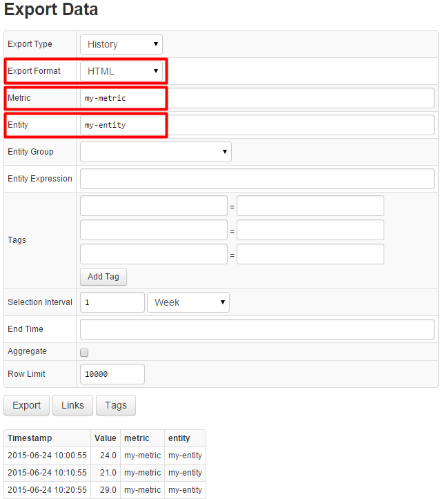
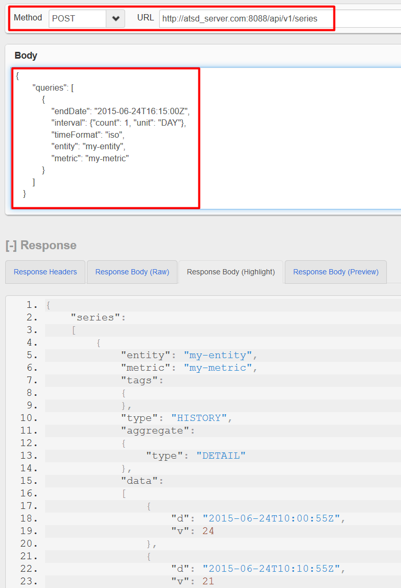

##### Step 8:

Open the [Export Page](https://axibase.com/products/axibase-time-series-database/exporting-data/data-export/) located on the main navigation bar, export data for the my-entity and my-metric into a CSV file, and try display it as HTML: [http://atsd_server.com:8088/export](http://nur.axibase.com:8088/export)



##### Step 9:

Test [ATSD API](/docs/api/README.md) by installing a RestClient and executing a sample [series query](../api/data/series/query.md) request for my-entity and my-metric.

[RestClient for Google Chrome.](https://chrome.google.com/webstore/detail/postman-rest-client/fdmmgilgnpjigdojojpjoooidkmcomcm?hl=en)

[RestClient for Firefox.](https://addons.mozilla.org/ru/firefox/addon/restclient/)

Method: POST

URL: `http://atsd_server.com:8088/api/v1/series`

In the request be sure to specify:

* endDate – end of the selection interval. Specified in ISO format or using [endtime](../end-time-syntax.md) syntax.

* interval – duration of the selection interval. Specified as unit and count.

* timeFormat – response time format. Possible values: iso, milliseconds. Default value: milliseconds.

* metric – my-metric.

* entity – my-entity.

Request:

```json
  {
        "queries": [
            {
                "endDate": "2015-06-24T16:00:00Z",
                "interval": {"count": 1, "unit": "DAY"},
                "timeFormat": "iso",
                "entity": "my-entity",
                "metric": "my-metric"
            }
        ]
    }
```

Response:

```json
 {
    "series": [
        {
            "entity": "my-entity",
            "metric": "my-metric",
            "tags": {},
            "type": "HISTORY",
            "aggregate": {
                "type": "DETAIL"
            },
            "data": [
                {
                    "d": "2015-06-24T10:00:55Z",
                    "v": 24
                },
                {
                    "d": "2015-06-24T10:10:55Z",
                    "v": 21
                }
            ]
        }
    ]
}
```



[Continue to Next Page](getting-started-4.md)
