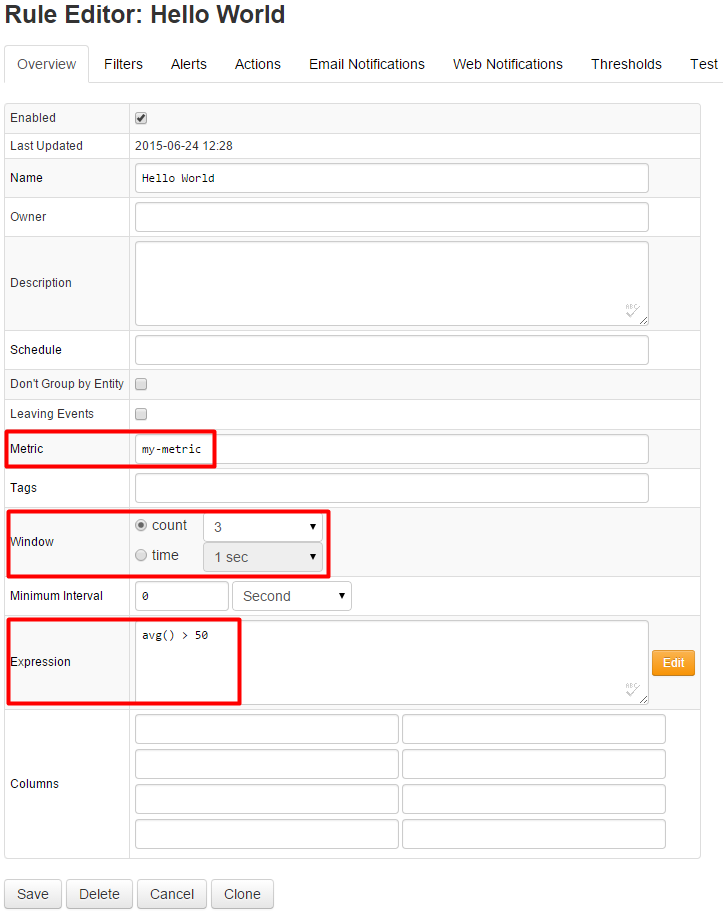

##### Step 10:

Open **Configuration -> Rules** page to create an alert rule for my-entity and my-metric using the build in [Rule Engine](/rule-engine).

The following expression and settings will raise an alert if the average of the last 3 values is above 50:

```
avg() > 50
```



##### Step 11:

Enter at least 3 values above 50 on the Data Entry page and observe an alert raised on the Alerts page located on the main menu bar: [https://atsd_server:8443/rules/all-alerts.xhtml](http://atsd_server:8088/rules/all-alerts.xhtml)


##### Congratulations! You have reached the end of the Hello World introduction to Axibase Time Series Database.

You can continue learning about ATSD on the following pages:

[API](/docs/api#axibase-time-series-database-api)

[Writing Data](https://axibase.com/products/axibase-time-series-database/writing-data/)

[Reading Data](/docs/api#api-clients)

[Exporting Data](https://axibase.com/products/axibase-time-series-database/exporting-data/)

[Visualization](https://axibase.com/products/axibase-time-series-database/visualization/)

[Rule Engine](/rule-engine)
