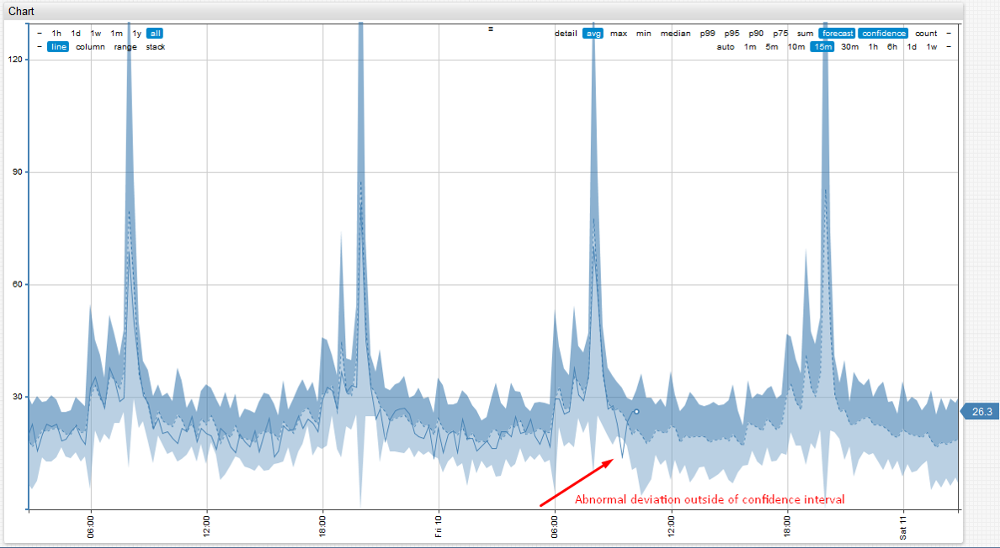
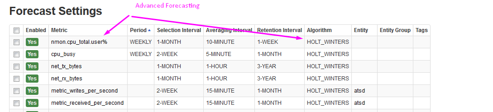

# Data Forecasting

- Axibase Time Series Database (ATSD) includes built-in forecasting algorithms that can predict abnormalities based on historical data.
- The accuracy of predictions and the percentage of false positives/negatives depends on the frequency of data collection, the retention interval, and algorithms.
- Built-in auto-regressive time series extrapolation algorithms (Holt-Winters, ARIMA, etc.) in ATSD can predict failures at early stages.
- Dynamic predictions eliminate the need to set manual thresholds.

#### Forecasting Example with Abnormal Deviation:

#### Forecast Settings:

- Forecasting settings can be left in their default, automatic mode for easy setup.
- ATSD selects the most accurate forecasting algorithm for each time series separately based on a ranking system.
- The winning algorithm is used to compute forecasts for the next day, week, or month.
- Pre-computed forecasts can be used in the rule engine.
- Basic automatic ad hoc forecasting can be used directly in graphs and widgets, and forecasts will be calculated for 1 week with automatic settings.

#### Key Advanced Settings:

| Setting | Description | 
| --- | --- | 
|  Enabled  |  The forecast is enabled. New forecasts will be calculated automatically every 24 hours.  | 
|  Metric  |  The metric to be forecasted, for example `cpu_busy`.  | 
|  Entity  |  The entity that will be used. Exclusive with Entity Group.  | 
|  Entity Group  |  The Entity Group selected from a dropdown. A forecast will be calculated for all entities contained within the Entity Group.  | 
|  Selection Interval  |  Amount of historical data analyzed when calculating the forecast.  | 
|  Full Scan  |  Full Scan of historical data for when there is no fresh data for the past 24 hours from the current entity and metric. If Full Scan is not set, then ATSD will automatically look for metric keys from the past 24 hours. Set to true when forecasting historical data is no longer collected or when generating a forecast using "End Time".  | 
|  Averaging Interval  |  Interval over which the data is normalized. When using the ARIMA algorithm, the averaging interval cannot be set to less than 1 hour.  | 
|  Retention Interval  |  Duration for which the forecast is stored. Forecasts older than the retention interval will be deleted.  | 
|  Store Interval  |  Forecast timespan. Duration into the future the data is forecast.  | 
|  Auto Parameters  |  Automatic settings used by ATSD to select the best forecast.  | 
|  Auto Averaging  |  Automatic averaging interval determined by ATSD.  | 
|  Algorithm  |  Holt-Winters or Arima algorithms.  | 
|  End Time  |  Used to calculate the forecast from an exact point in time. Useful when calculating a forecast for data that is not frequently updated. Possible values described on the [End Time](https://axibase.com/products/axibase-time-series-database/visualization/end-time/) page. Important to select "Full Scan" when forecasting historical data that is no longer collected. If "Full Scan" is not set, then ATSD will automatically look for metric keys from the past 24 hours.  | 
|  Name  |  Unique forecast identifier.  | 

