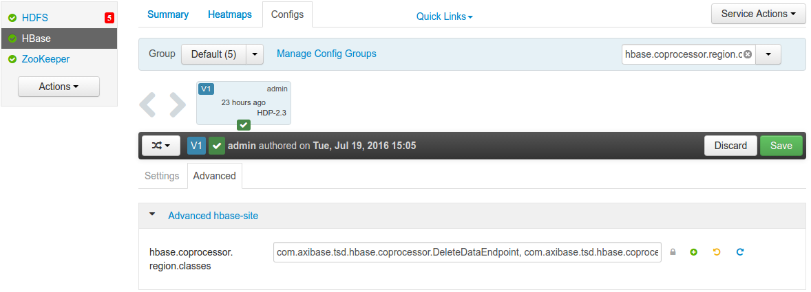

# Installation on Distributed HBase Cluster using Apache Ambari

## Create `axibase` user

```
sudo adduser axibase
```

## Install Java

Install Oracle JDK or Open JDK on the server where ATSD will be running.

### Oracle JDK Installation

http://www.oracle.com/technetwork/java/javase/downloads/jdk7-downloads-1880260.html

### Open JDK Installation

* RHEL/CentOS

```
sudo yum install java-1.7.0-openjdk-devel.x86_64
```

* Ubuntu/Debian

```
sudo apt-get update
sudo apt-get install openjdk-7-jdk
```

### Verify Java Installation

```
java -version
java version "1.7.0_101"
OpenJDK Runtime Environment (rhel-2.6.6.1.el7_2-x86_64 u101-b00)
OpenJDK 64-Bit Server VM (build 24.95-b01, mixed mode)
```

Add the `JAVA_HOME` path to the `axibase` user environment in `.bashrc`.

```
sudo su axibase
echo "export JAVA_HOME=${absolute path to JDK 7 home directory}" >> ~/.bashrc
exit
```

## Verify Zookeeper Connectivity

Check connection from the ATSD server to the Zookeeper service.

```
telnet zookeeper-host 2181
Trying 10.102.0.6...
Connected to zookeeper-host.
Escape character is '^]'.
```

The Zookeeper client port is specified in:

* Zookeeper host: `/usr/hdp/{hdp_version}/etc/zookeeper/conf.dist/zoo.cfg` > `clientPort` setting
* HBase host: `/usr/hdp/{hdp_version}/hbase/conf/hbase-site.xml` > `hbase.zookeeper.property.clientPort` setting

## Download ATSD EE

```
curl -O https://www.axibase.com/public/atsd_ee_hbase_1.2.2.tar.gz
```

> The above version has been tested on Stack Version - HDP (Horton Data Platform) 2.3.x.

## Extract Files

```
sudo tar -xzvf atsd_ee_hbase_1.2.2.tar.gz -C /opt
sudo chown -R axibase:axibase /opt/atsd
```

## Configure HBase Connection

Open the `hadoop.properties` file.

```
nano /opt/atsd/atsd/conf/hadoop.properties
```

Set `hbase.zookeeper.quorum` to Zookeeper hostname `zookeeper-host`

If Zookeeper client port is different from 2181, set `hbase.zookeeper.property.clientPort` accordingly.

Set Zookeeper Znode parent according to the setting `zookeeper.znode.parent` configured on `HBase host` > `/usr/hdp/{hdp_version}/hbase/conf/hbase-site.xml`.

```
hbase.zookeeper.quorum = zookeeper-host
hbase.zookeeper.property.clientPort = 2181
zookeeper.znode.parent = /hbase-unsecure
hbase.rpc.timeout = 120000 
hbase.client.scanner.timeout.period = 120000
```

## Request License Key

To obtain the license key, contact Axibase support with the following information from the machine where ATSD will be installed.

* Output of the `ip addr` command.

```
[axibase@NURSWGVML007 ~]$ ip addr
1: lo: <LOOPBACK,UP,LOWER_UP> mtu 16436 qdisc noqueue state UNKNOWN
    link/loopback 00:00:00:00:00:00 brd 00:00:00:00:00:00
    inet 127.0.0.1/8 scope host lo
    inet6 ::1/128 scope host
       valid_lft forever preferred_lft forever
2: eth1: <BROADCAST,MULTICAST,UP,LOWER_UP> mtu 1500 qdisc pfifo_fast state UP qlen 1000
    link/ether 00:50:56:b9:35:31 brd ff:ff:ff:ff:ff:ff
    inet 10.102.0.6/24 brd 10.102.0.255 scope global eth1
    inet6 2a01:4f8:140:53c6::7/64 scope global
       valid_lft forever preferred_lft forever
    inet6 fe80::250:56ff:feb9:3531/64 scope link
       valid_lft forever preferred_lft forever
```

* Output of the `hostname` command.

```
[axibase@NURSWGVML007 ~]$ hostname
NURSWGVML007
```

Email output of the above commands to Axibase support and copy the provided key to `/opt/atsd/atsd/conf/license/key.properties`.

## Configure HBase Region Servers

### Deploy ATSD coprocessors 

Copy `/opt/atsd/hbase/lib/atsd.jar` to the `/usr/hdp/{hdp_version}/hbase/lib/` directory on each HBase region server.

### Enable ATSD Coprocessors

Open Services tab in Ambari UI, select the target HBase cluster, open Configs tab, search for the setting `hbase.coprocessor.region.classes`, and enter the following names separated by comma. 

```
com.axibase.tsd.hbase.coprocessor.CompactRawDataEndpoint, com.axibase.tsd.hbase.coprocessor.DeleteDataEndpoint, com.axibase.tsd.hbase.coprocessor.MessagesStatsEndpoint
```



### Restart HBase Region Servers

## Check for Port Conflicts

```
sudo netstat -tulpn | grep "8081\|8082\|8084\|8088\|8443"
```

If some of the above ports are taken, open the `/opt/atsd/atsd/conf/server.properties` file and change ATSD listening ports accordingly.

```
http.port = 8088
input.port = 8081
udp.input.port = 8082
pickle.port = 8084
https.port = 8443
```

## Start ATSD

```
/opt/atsd/atsd/bin/start-atsd.sh
```

Review the start log for any errors:

```
tail -f /opt/atsd/atsd/logs/atsd.log
```

You should see a **ATSD start completed** message at the end of the `start.log`.

Web interface is accessible on port 8088 (http) and 8443 (https).

## Enable ATSD Autostart

To configure ATSD for automated restart on server reboot, add the following line to `/etc/rc.local` before the `return 0` line.

```
su - axibase -c /opt/atsd/atsd/bin/start-atsd.sh
```

## Troubleshooting

* Review [troubleshooting guide](troubleshooting.md).

## Validation

* [Verify database installation](verifying-installation.md).

## Post-installation Steps

* [Basic configuration](post-installation.md).
* [Getting Started guide](../tutorials/getting-started.md).
