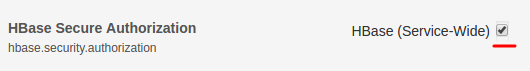
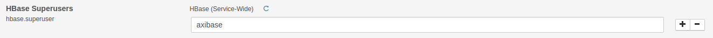
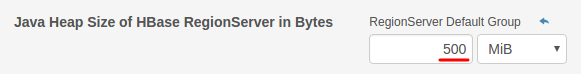
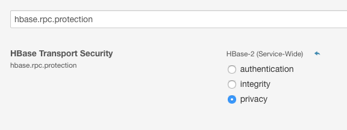

# Installation on Distributed HBase Cluster using Cloudera Manager

## Create `axibase` user

Create an `axibase` user on the server where ATSD will be running.

```
sudo adduser axibase
```

## Install Java

[Install Oracle JDK or Open JDK.](../administration/migration/install-java-8.md)

Add the `JAVA_HOME` path to the `axibase` user environment in `.bashrc`.

```
sudo su axibase
jp=`dirname "$(dirname "$(readlink -f "$(which javac || which java)")")"`; sed -i "s,^export JAVA_HOME=.*,export JAVA_HOME=$jp,g" ~/.bashrc ; echo $jp
exit
```

## Verify Zookeeper Connectivity

Check connection from the ATSD server to the Zookeeper service.

```
telnet zookeeper-host 2181
Trying 10.102.0.6...
Connected to zookeeper-host.
Escape character is '^]'.
```

The Zookeeper client port is specified in:

* Zookeeper host: `/etc/zookeeper/conf.dist/zoo.cfg` > `clientPort` setting
* HBase host: `/etc/hbase/conf.dist/hbase-site.xml` > `hbase.zookeeper.property.clientPort` setting

## Download ATSD EE

### CDH (Cloudera Distribution Hadoop) 5.5.x

```
curl -O https://www.axibase.com/public/atsd_ee_hbase_1.0.3.tar.gz
```

## Extract Files

```
sudo tar -xzvf atsd_ee_hbase_1.0.3.tar.gz -C /opt
sudo chown -R axibase:axibase /opt/atsd
```

## Request License Key

To obtain a license key, contact Axibase support with the following information from the machine where ATSD will be installed.

* Output of the `ip addr` command.

```
[axibase@NURSWGVML007 ~]$ ip addr
1: lo: <LOOPBACK,UP,LOWER_UP> mtu 16436 qdisc noqueue state UNKNOWN
    link/loopback 00:00:00:00:00:00 brd 00:00:00:00:00:00
    inet 127.0.0.1/8 scope host lo
    inet6 ::1/128 scope host
       valid_lft forever preferred_lft forever
2: eth1: <BROADCAST,MULTICAST,UP,LOWER_UP> mtu 1500 qdisc pfifo_fast state UP qlen 1000
    link/ether 00:50:56:b9:35:31 brd ff:ff:ff:ff:ff:ff
    inet 10.102.0.6/24 brd 10.102.0.255 scope global eth1
    inet6 2a01:4f8:140:53c6::7/64 scope global
       valid_lft forever preferred_lft forever
    inet6 fe80::250:56ff:feb9:3531/64 scope link
       valid_lft forever preferred_lft forever
```

* Output of the `hostname -f` command.

```
[axibase@NURSWGVML007 ~]$ hostname -f
NURSWGVML007
```

Email output of the above commands to Axibase support and copy the provided key to `/opt/atsd/atsd/conf/license/key.properties`.


## Configure HBase Connection

Open the `hadoop.properties` file.

```
nano /opt/atsd/atsd/conf/hadoop.properties
```

Set `hbase.zookeeper.quorum` to Zookeeper hostname `zookeeper-host`

If Zookeeper client port is different from 2181, set `hbase.zookeeper.property.clientPort` accordingly.

If Zookeeper Znode parent is not `/hbase`, set `zookeeper.znode.parent` to the actual value.

```ls
hbase.zookeeper.quorum = zookeeper-host
hbase.zookeeper.property.clientPort = 2181
zookeeper.znode.parent = /hbase
hbase.rpc.timeout = 120000
hbase.client.scanner.timeout.period = 120000
```

## Kerberos Authentication

ATSD can be enabled for Kerberos authentication with Zookeeper and Hadoop services by following these steps.

### Generate `keytab` File for `axibase` Principal

Create an `axibase` principal and generate a corresponding `keytab` on the Cloudera Manager server, or on the machine where KDC service is installed.

Replace realm `HADOOP.AXIBASE.COM` with the actual value specified in the `/etc/krb5.conf` file on the Cloudera Manager server.

```ls
kadmin.local <<eoj
addprinc -pw PASSWORD axibase@HADOOP.AXIBASE.COM
ktadd -k axibase.keytab axibase@HADOOP.AXIBASE.COM
eoj
```

Copy the `axibase.keytab` file to the `/opt/atsd/atsd/conf` directory on the ATSD server.

### Authorize `axibase` Principal

Check the HBase Secure Authorization settings in the Cloudera HBase configuration.



If the HBase Secure Authorization is disabled you can access HBase as is. Proceed to [Kerberos Settings](#kerberos-settings).

Otherwise, you need to allow the newly created `axibase` principal to access HBase using one of the following options:

1. Add the `axibase` principal to the HBase superusers via HBase Configuration. 

> Don't forget to deploy updated configuration and restart HBase.

 

2. Grant **RWXC** (read,write,execute,create) permissions to the `axibase` principal.

Login into the HMaster server and locate the `hbase.keytab` file.

```bash
find / -name "hbase.keytab" | xargs ls -la
-rw------- 1 hbase        hbase        448 Jul 29 16:44 /var/run/cloudera-scm-agent/process/30-hbase-MASTER/hbase.keytab
```

Obtain the fully qualified hostname of the HMaster server.

```bash
hostname -f
```

Authenticate with Kerberos using the `hbase.keytab` file and HMaster full hostname.

```bash
kinit -k -t /var/run/cloudera-scm-agent/process/30-hbase-MASTER/hbase.keytab hbase/{master_full_hostname}
```

Open HBase shell and execute the `grant` command to grant **RWXC** permissions to `axibase` principal.

```bash
echo "grant 'axibase', 'RWXC'" | hbase shell  
```

### Configure Kerberos Configuration Information in `krb5.conf` File

Copy the `/etc/krb5.conf` file from an HBase Master server to the ATSD server at the same location: `/etc/krb5.conf`.

```ls
[libdefaults]
default_realm = HADOOP.AXIBASE.COM
dns_lookup_kdc = true
dns_lookup_realm = false
ticket_lifetime = 86400
renew_lifetime = 604800
forwardable = true
default_tgs_enctypes = rc4-hmac arcfour-hmac aes256-cts-hmac-sha1-96 des3-hmac-sha1 des-cbc-md5 des-cbc-crc aes256-cts aes128-cts des-hmac-sha1 aes128-cts-hmac-sha1-96
default_tkt_enctypes = rc4-hmac arcfour-hmac aes256-cts-hmac-sha1-96 des3-hmac-sha1 des-cbc-md5 des-cbc-crc aes256-cts aes128-cts des-hmac-sha1 aes128-cts-hmac-sha1-96
permitted_enctypes = rc4-hmac arcfour-hmac aes256-cts-hmac-sha1-96 des3-hmac-sha1 des-cbc-md5 des-cbc-crc aes256-cts aes128-cts des-hmac-sha1 aes128-cts-hmac-sha1-96
udp_preference_limit = 1
verify_ap_req_nofail = false

[logging]
 default = FILE:/var/log/krb5libs.log
 kdc = FILE:/var/log/krb5kdc.log
 admin_server = FILE:/var/log/kadmind.log

[realms]
HADOOP.AXIBASE.COM = {
kdc = nurswgkrb01.axibase.com
admin_server = nurswgkrb01.axibase.com
kdc = nurswgkrb02.axibase.com
}

[domain_realm]
.axibase.com = HADOOP.AXIBASE.COM
axibase.com  = HADOOP.AXIBASE.COM
.apps.axibase.com = HADOOP.AXIBASE.COM
apps.axibase.com = HADOOP.AXIBASE.COM
```

Make sure that the hostname specified in the `kdc` and `admin_server` properties above is resolvable on the ATSD server. Add it to `/etc/hosts` if necessary.

### Kerberos Settings

Specify the `axibase` principal and `keytab` path settings in the `/opt/atsd/atsd/conf/server.properties` file in ATSD:

```ls
# Kerberos principal, identified with username and realm.
kerberos.login=axibase@HADOOP.AXIBASE.COM
# Absolute path to Kerberos keytab file, containing encrypted key for the above principal.
kerberos.keytab.path=/opt/atsd/atsd/conf/axibase.keytab
```

> The `keytab` file needs to be updated whenever the password is changed.

> For added security, ensure that the `keytab` file has 400 permission (read by owner).

### `hbase-site.xml` File

Remove comments in the `/opt/atsd/atsd/conf/hbase-site.xml` file and replace the `HADOOP.AXIBASE.COM` realm with the actual value from the `krb5.conf` file.

```xml
<?xml version="1.0"?>
<?xml-stylesheet type="text/xsl" href="configuration.xsl"?>
<configuration>
  <property>
    <name>hbase.master.kerberos.principal</name>
    <value>hbase/_HOST@HADOOP.AXIBASE.COM</value>
  </property>
  <property>
    <name>hbase.regionserver.kerberos.principal</name>
    <value>hbase/_HOST@HADOOP.AXIBASE.COM</value>
  </property>
</configuration>
```

### Authentication Log Messages

```
2016-07-24 13:28:41,468;INFO;main;com.axibase.tsd.hbase.KerberosBean;Setting up kerberos auth: login:axibase@HADOOP.AXIBASE.COM keytab:/opt/atsd/atsd/conf/axibase.keytab
2016-07-24 13:28:41,723;INFO;main;com.axibase.tsd.hbase.KerberosBean;Login user from keytab starting...
2016-07-24 13:28:41,811;INFO;main;org.apache.hadoop.security.UserGroupInformation;Login successful for user axibase@HADOOP.AXIBASE.COM using keytab file /opt/atsd/atsd/conf/axibase.keytab
2016-07-24 13:28:41,811;INFO;main;com.axibase.tsd.hbase.KerberosBean;Login user from keytab successful
2016-07-24 13:28:42,879;INFO;main;com.axibase.tsd.hbase.SchemaBean;Checking ATSD schema
2016-07-24 13:28:42,973;INFO;main;org.apache.hadoop.hbase.zookeeper.RecoverableZooKeeper;Process identifier=hconnection-0x14aa12c3 connecting to ZooKeeper ensemble=nurswgvml303.axibase.com:2181
```

### Debugging Kerberos

Debugging for Kerberos authentication can be enabled by changing the ATSD start script `/opt/atsd/atsd/bin/start-atsd.sh`.

```ls
#uncomment to enable kerberos debug
DParams="$DParams -Dsun.security.krb5.debug=true"

#uncomment to enable atsd output logging, comment out the default command
"$java_command" -server  -Xmx512M -XX:+HeapDumpOnOutOfMemoryError -XX:HeapDumpPath="$atsd_home"/logs $DParams -classpath "$atsd_home"/conf:"$atsd_executable""${lib_jars}" com.axibase.tsd.Server >>${outLog} 2>>${errorLog} &
```

Kerberos client debug output will be redirected to the `${outLog}` file, which is set to `/opt/atsd/atsd/logs/out.log` by default.

```
5921 [main] INFO  com.axibase.tsd.hbase.KerberosBean - Setting up kerberos auth: login:axibase@HADOOP.AXIBASE.COM keytab:/opt/atsd/atsd/conf/axibase.keytab
Java config name: null
Native config name: /etc/krb5.conf
Loaded from native config
6085 [main] WARN  o.a.hadoop.util.NativeCodeLoader - Unable to load native-hadoop library for your platform... using builtin-java classes where applicable
6213 [main] INFO  com.axibase.tsd.hbase.KerberosBean - Login user from keytab starting...
Java config name: null
Native config name: /etc/krb5.conf
Loaded from native config
>>> KdcAccessibility: reset
>>> KdcAccessibility: reset
>>> KeyTabInputStream, readName(): HADOOP.AXIBASE.COM
>>> KeyTabInputStream, readName(): axibase
...
>>> KrbAsReq creating message
>>> KrbKdcReq send: kdc=nurswgkrb01.axibase.com TCP:88, timeout=3000, number of retries =3, #bytes=137
>>> KDCCommunication: kdc=nurswgkrb01.axibase.com TCP:88, timeout=3000,Attempt =1, #bytes=137
>>>DEBUG: TCPClient reading 620 bytes
>>> KrbKdcReq send: #bytes read=620
>>> KdcAccessibility: remove nurswgkrb01.axibase.com
Added key: 1version: 2
Added key: 16version: 2
Added key: 23version: 2
Added key: 18version: 2
Ordering keys wrt default_tkt_enctypes list
default etypes for default_tkt_enctypes: 23 18.
>>> EType: sun.security.krb5.internal.crypto.ArcFourHmacEType
>>> KrbAsRep cons in KrbAsReq.getReply axibase
6246 [main] INFO  o.a.h.security.UserGroupInformation - Login successful for user axibase@HADOOP.AXIBASE.COM using keytab file /opt/atsd/atsd/conf/axibase.keytab
6247 [main] INFO  com.axibase.tsd.hbase.KerberosBean - Login user from keytab successful
```

## Configure HBase Region Servers

### Deploy ATSD Coprocessors

Copy `/opt/atsd/hbase/lib/atsd.jar` to the `/usr/lib/hbase/lib` directory on each HBase region server.

### Enable ATSD Coprocessors

Open Cloudera Manager, select the target HBase cluster/service, open Configuration tab, search for the setting `hbase.coprocessor.region.classes` and enter the following names.

* com.axibase.tsd.hbase.coprocessor.CompactRawDataEndpoint
* com.axibase.tsd.hbase.coprocessor.DeleteDataEndpoint
* com.axibase.tsd.hbase.coprocessor.MessagesStatsEndpoint


### Increase Maximum Heap Size on Region Servers



### Restart HBase Service

## Check for Port Conflicts

```
sudo netstat -tulpn | grep "8081\|8082\|8084\|8088\|8443"
```

If some of the above ports are taken, open the `/opt/atsd/atsd/conf/server.properties` file and change ATSD listening ports accordingly.

```ls
http.port = 8088
input.port = 8081
udp.input.port = 8082
pickle.port = 8084
https.port = 8443
```

## Disable HBase Compactions

By default ATSD triggers major HBase compaction of its key data tables on a daily schedule.

Since major compactions may overload the cluster, it is recommended to trigger them less frequently or to schedule them externally, for example via Cloudera Manager:


To disable built-in compaction of data tables, adjust the following settings on the **Admin > Server Properties** page:

```
#this will compact only 'entity' table once a week on Saturday
hbase.compaction.list = entity
hbase.compaction.schedule = 0 0 12 * * SAT
```

## Increase Memory

Configure Java Heap memory to ATSD java process as described [here](../administration/allocating-memory.md).

Increase the number of worker threads and maximum queue size the **Admin > Server Properties** page:

```ls
# maximum number of concurrent HBase storage worker threads, default: 4
series.queue.pool.size = 8
# maximum number of commands in queue
series.queue.limit = 500000
```

## RPC Encryption

To enable encryption of RPC traffic between ATSD and HBase, add the following property to the `/opt/atsd/atsd/conf/hbase-site.xml` file in ATSD:

```ls
<property>
        <name>hbase.rpc.protection</name>
        <value>privacy</value>
</property>
```

Similarly, enable the `hbase.rpc.protection` property on the HBase cluster:




## Start ATSD

```
/opt/atsd/atsd/bin/start-atsd.sh
```

Review the start log for any errors:

```
tail -f /opt/atsd/atsd/logs/atsd.log
```

You should see a **ATSD start completed** message at the end of the `start.log`.

Web interface is accessible on port 8088 (http) and 8443 (https).

## Enable ATSD Autostart

To configure ATSD for automated restart on server reboot, add the following line to `/etc/rc.local` before the `return 0` line.

```
su - axibase -c /opt/atsd/atsd/bin/start-atsd.sh
```

## Troubleshooting

* Review [troubleshooting guide](troubleshooting.md).

## Validation

* [Verify database installation](verifying-installation.md).

## Post-installation Steps

* [Basic configuration](post-installation.md).
* [Getting Started guide](../tutorials/getting-started.md).

## Updating ATSD

### Option 1. Co-processor Update is NOT Required.

- Login as an `axibase` user into the server where ATSD is installed.

- Download the latest ATSD release, or a specific version based on the link provided by Axibase support.

```bash
cd ~
curl -O https://axibase.com/public/atsd_ee_hbase_1.0.3.tar.gz
```

- Extract the files.

```bash
tar -xvf atsd_ee_hbase_1.0.3.tar.gz
```

- Stop the ATSD process.

```bash
/opt/atsd/atsd/bin/stop-atsd.sh
```

- Update start/script files. Required for ATSD installations older than revision 15060.

```bash
sed -i 's~^atsd_executable="$atsd_home/bin/atsd.*~atsd_executable=`ls $atsd_home/bin/atsd*.jar`~g' /opt/atsd/atsd/bin/stop-atsd.sh
sed -i 's~^atsd_executable="$atsd_home/bin/atsd.*~atsd_executable=`ls $atsd_home/bin/atsd*.jar`~g' /opt/atsd/atsd/bin/start-atsd.sh
```

- Delete previous ATSD jar files on the ATSD server.

```bash
rm /opt/atsd/atsd/bin/atsd*.jar
```

- Copy new ATSD jar files on the ATSD server.

```bash
cp atsd/atsd/bin/atsd*.jar /opt/atsd/atsd/bin/
```

- Compare atsd-hbase jar revision with the revision installed on HBase region servers

```bash
ls atsd/hbase/lib/atsd-hbase.*.jar
```

Compare the displayed revision with atsd-hbase file revision in `/usr/lib/hbase/lib` directory located on the HBase region servers. If the revision is the same, skip HBase region server upgrades. Otherwise, if the new file's revision is greater than what's installed on HBase region servers, shutdown each region server and replace old versions of the jar file with the current copy.

- Start ATSD process.

```bash
/opt/atsd/atsd/bin/start-atsd.sh
```
