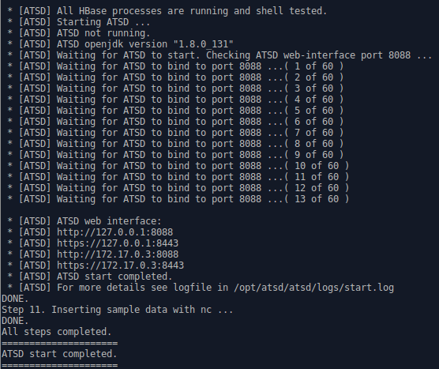
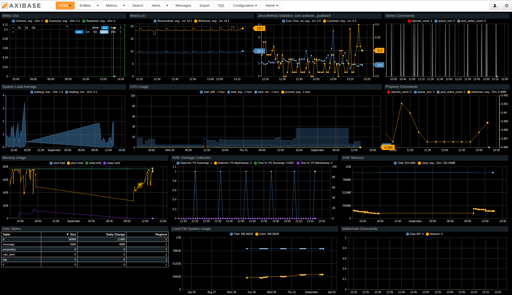

# Verifying Installation

At the end of the installation process, the script displays ATSD IP and ports. 

You can use them to access the ATSD web interface.

Depending on the hardware configuration, it can take another 15-20 minutes
for ATSD to start after the message below has been displayed.

To find the IP address of the target machine manually, enter the `ifconfig`
or `ip addr` command.

Open your browser and navigate to port `8088` on the target machine. 

When accessing the ATSD web interface for the first time, you will need to
setup an administrator account.

## Verifying Portals

Click on Portals tab in the ATSD web interface. A pre-defined **ATSD**
portal displays application, operating system, and usage metrics for the database itself
and the machine where it's installed.

> Note *Data Tables* chart  can be empty for a few minutes after start
