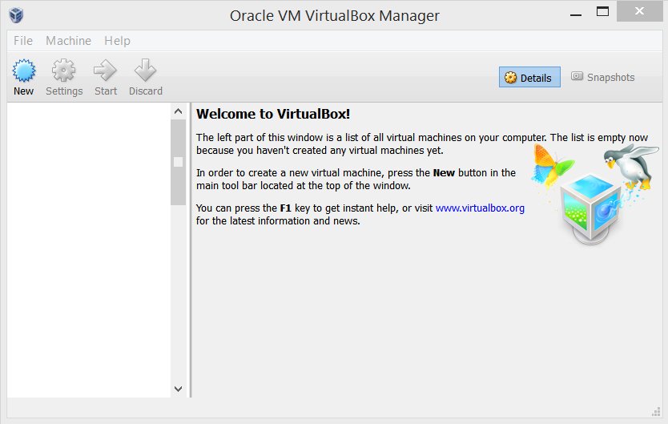

# ATSD Installation in Oracle VirtualBox

## Overview

ATSD can be installed by importing an `.ova` image in VirtualBox. This
method automatically creates a virtual machine running Ubuntu 14.04
64bit LTS with ATSD and dependencies pre-installed and fully configured.
The process takes a few minutes with minimal input required from the
user. This is the easiest and fastest way to install ATSD.

## Download

* [https://axibase.com/public/atsd_ce.ova](https://axibase.com/public/atsd_ce.ova)

## Prerequisites

To setup the ATSD virtual machine in VirtualBox you must have the
following resources available:

-   A 64-bit machine with a processor that supports virtualization. Note
    that not all 64-bit processors have this capability.
-   Have virtualization enabled in your BIOS. This is normally enabled
    by default, but in some cases you may have to enter in your system BIOS
    manually to enable virtualization.
-   At least 4 GB of RAM on the host machine and at least 1 GB of RAM
    allocated to the virtual machine.

[Download the latest version of VirtualBox
here.](https://www.virtualbox.org/wiki/Downloads)

## Installing ATSD in Oracle VirtualBox

​1. Open Oracle VirtualBox.



​2. Navigate to File –\> Import Appliance.


​3. Open the ATSD `.ova` file and click next. For example:
`atsd\_ce\_8760.ova`.


​4. Confirm the Appliance settings by clicking Import. Read the Software
License Agreement in the pop-up window. Select Agree to continue.


​5. Wait for the Appliance to be imported.


​6. Navigate to Settings –\> System to allocate at least 1 GB of RAM to
the virtual machine. Under the Processor tab allocate at least 1 CPU to
the virtual machine.


​7. Navigate to Settings –\> Network. Set Attached to: Bridged Adapter.
If the virtual machine does not start with this setting, then change
this setting to Host-only Adapter. Click on Generate new MAC Address to
generate a new MAC address for the virtual machine.


​8. Start the virtual machine. Wait for ATSD and components to start.


​9. Login to the virtual machine:

**username = `axibase`**

**password = `axibase`**

**`axibase` user is a sudoer.**


​10. Check the IP address of the virtual machine:

```sh
 ip addr                                                                  
```


​11. Use your browser to navigate to `atsd_hostname:8088`. For example:
`192.168.1.191:8088`. Login to ATSD, username = axibase and password =
axibase.


## Validation

* [Verify database installation](verifying-installation.md).

## Post-installation Steps

* [Basic configuration](post-installation.md).
* [Getting Started guide](/tutorials/getting-started.md).
