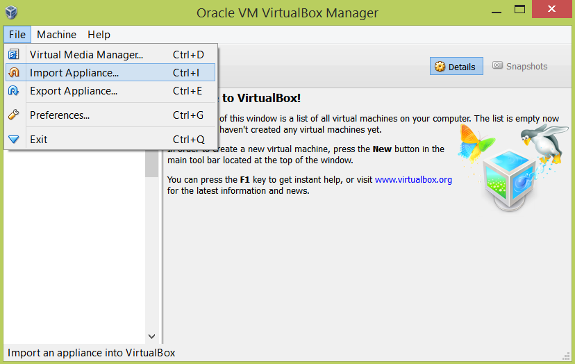
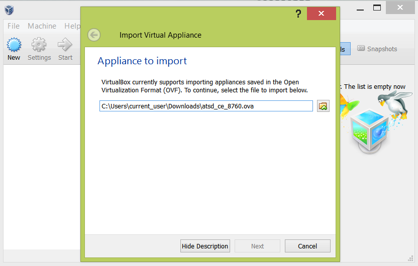
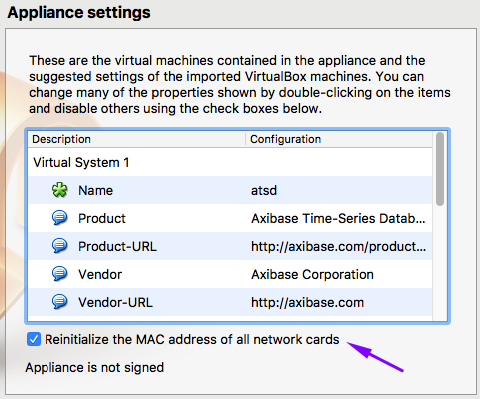
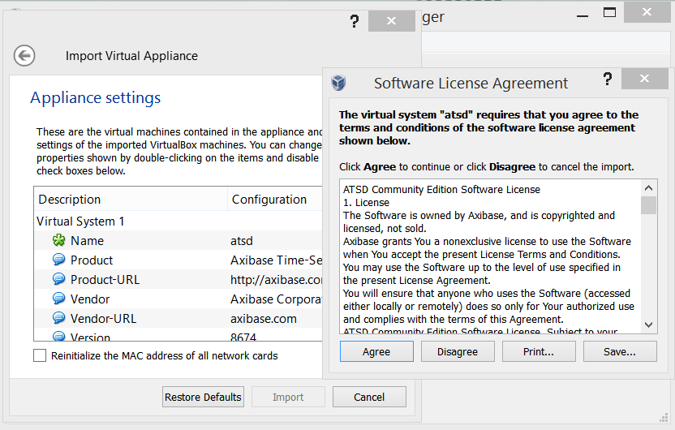
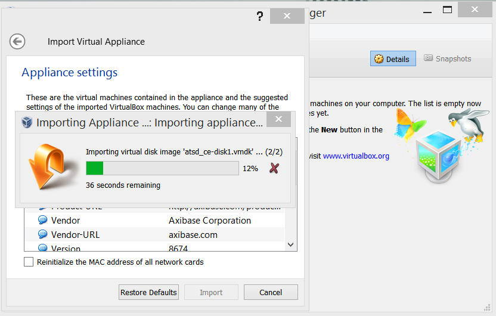
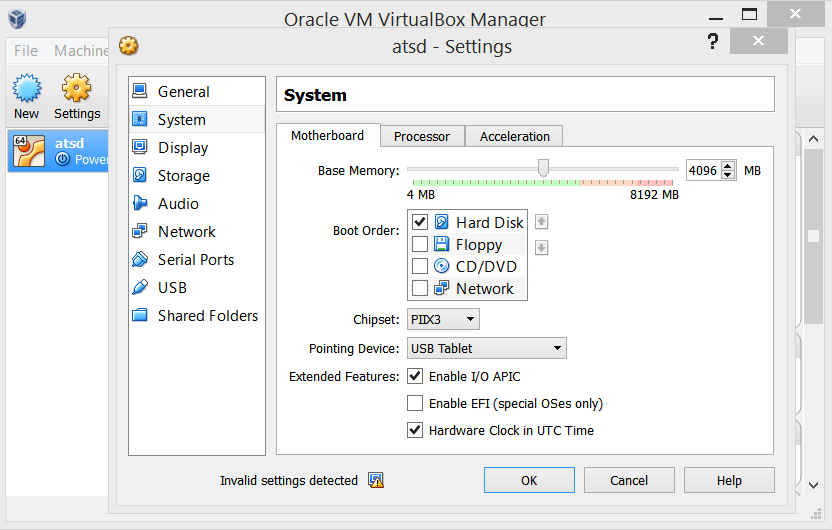
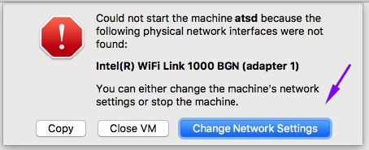
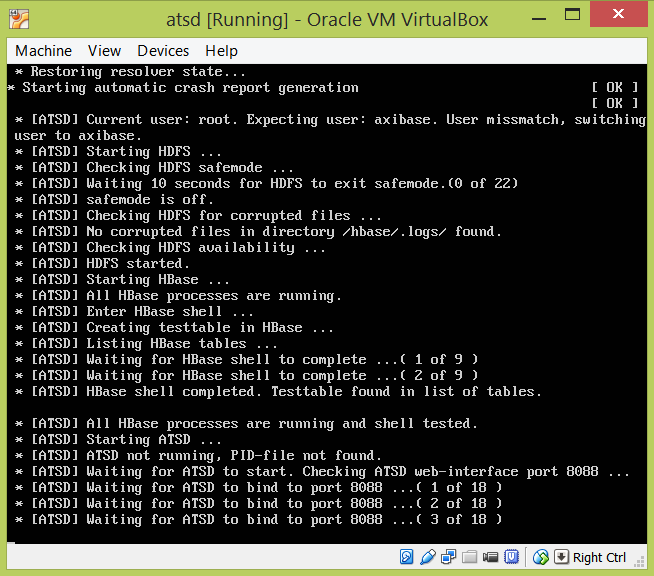
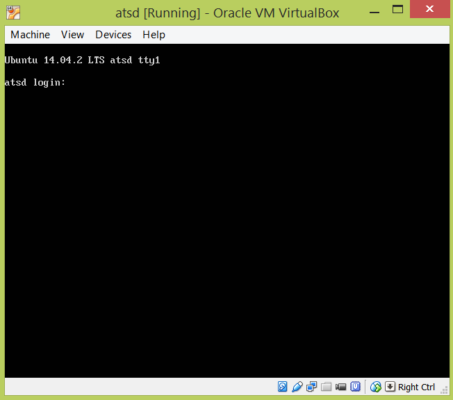
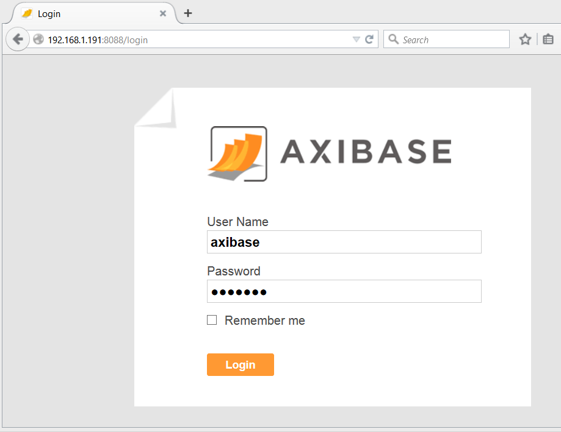

# ATSD Installation on Oracle VirtualBox

## Overview

ATSD can be installed by importing an `.ova` image in [Oracle VirtualBox](https://www.virtualbox.org/). This
method creates a virtual machine with the latest ATSD Community Edition pre-installed.
The process takes a few minutes with minimal input required from the user.

## Download

* Download the latest version of [Oracle VirtualBox](https://www.virtualbox.org/wiki/Downloads), if necessary.
* Download the latest ATSD OVA image from [https://axibase.com/public/atsd_ce.ova](https://axibase.com/public/atsd_ce.ova)

## Requirements

* A 64-bit host machine with a processor that supports virtualization.
* At least 2 GB of RAM on the host machine and at least 1 GB of RAM allocated to the virtual machine.

## Virtual Machine Details

* Operating System: Ubuntu 14.04 LTS 64-bit
* RAM: 1 GB
* Disk: 30 GB

## Installing ATSD in Oracle VirtualBox

1. Launch Oracle VirtualBox.

2. Open **File > Import Appliance**.



3. Select the downloaded ATSD `atsd_ce_*.ova` file and click **Next**.



4. Confirm the Appliance settings by clicking **Import**.

  - Enable the 'Reinitialize the MAC Address' option.



  - Review the license agreement. Click **Agree** to continue.



5. Wait for the Appliance to be imported.



6. Open **Settings > System**.

Allocate at least 1 GB of RAM and 1 virtual CPU to the virtual machine.



7. Open **Settings > Network** and verify that the network is set to **Bridged Adapter**.


8. Start the virtual machine.

If the VM does not start, open Network Settings and generate a new MAC address for the VM. Restart the virtual machine.



Wait for ATSD to initialize.



9. Login to the virtual machine console using the credential below.



10. Determine the external IP address of the virtual machine, if necessary:

```sh
 ip addr
```


11. Open ATSD web interface on `https://atsd_ip_address:8443` or `http://atsd_ip_address:8088`.

12. Create an administrative account in ATSD and re-login. The installation is complete.



## User Credentials

* Username: `axibase`
* Password: `axibase`
* The 'axibase' user account is a member of the sudo group.

## Validation

* [Verify database installation](verifying-installation.md).

## Post-installation Steps

* [Basic configuration](post-installation.md).
* [Getting Started guide](../tutorials/getting-started.md).
