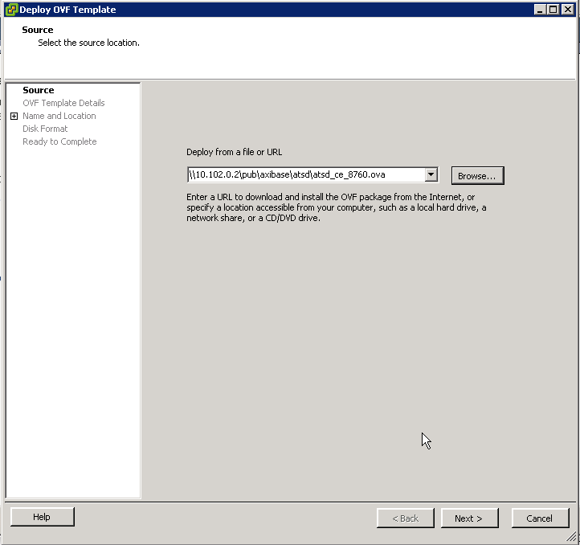
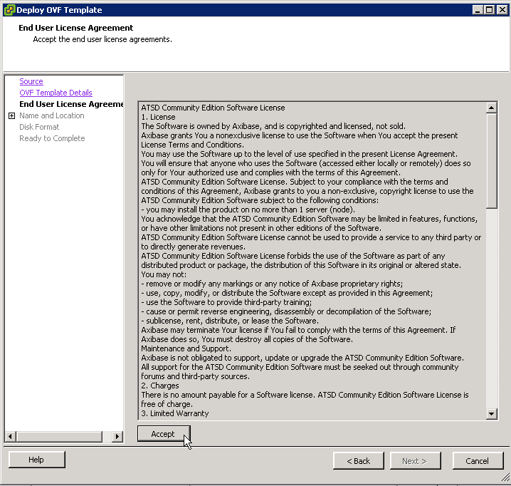
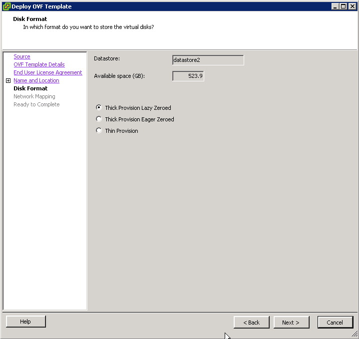
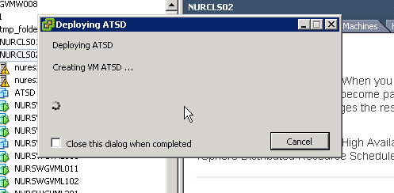
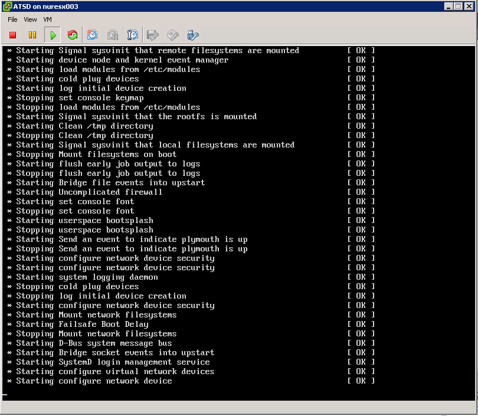
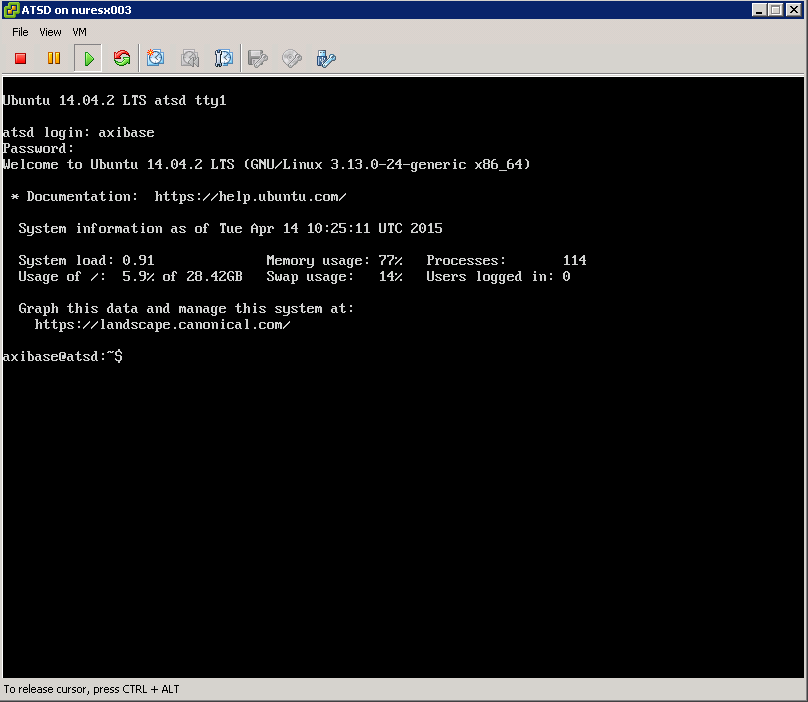
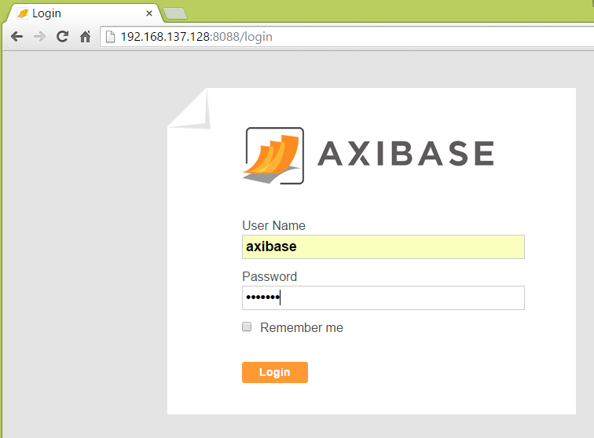

# ATSD Installation on VMware ESXi Server/vSphere

## Overview

ATSD can be installed by importing an `.ova` image in VMware ESXi Server,
VMware vSphere Hypervisor, VMware Fusion, VMware Workstation, and VMware
Player. This method automatically creates a virtual machine running
Ubuntu 14.04 64bit LTS with ATSD and with dependencies pre-installed and
fully configured.

[If you will be installing ATSD in VMware player, please use our
separate guide for this installation
method.](vmware.md)

## Download

* [axibase.com](https://axibase.com/public/atsd_ce.ova)

## Prerequisites

To setup the ATSD virtual machine in VMware you must have the following
resources available:

-   A 64-bit machine with a processor that supports virtualization. Note
    that not all 64-bit processors have this capability.
-   Have virtualization enabled in your BIOS. This is normally enabled
    by default, but in some cases you may have to enter your system BIOS
    manually to enable virtualization.
-   At least 2 GB of RAM allocated to the virtual machine.

## Installing ATSD in VMware ESXi Server/vSphere

​1. Connect to a vCenter Server with the vSphere Web Client. Navigate to ##File –\> Deploy OVF Template##.

​2. Click on Browse, and then select the `atsd\_ce\_8760.ova` file.

​3. Click next on the OVF Template Details window. Read and accept
the End User License Agreement.

​4. Give a name to the virtual machine and select the inventory
location.

​5. Select a host name for the virtual machine from the list.

​6. Select Disk Format. We recommend either Thick Provision Lazy Zeroed
or Thick Provision Eager Zeroed.

​7. Choose the Network Mapping, which is the network to which the adapter of the
virtual machine will be attached to.

​8. Confirm the virtual machine configuration.

​9. Wait for the virtual machine to be created.

​10. Power on the virtual machine.

​11. Wait for ATSD and Components to start.

ATTENTION: The machine is configured to receive the IP address by DHCP.
If there is no DHCP server in the network, the loading will slow down at
this point. This is normal since DHCP was not used. After loading is
complete, you will need to setup a static IP in `/etc/network/interfaces`.

​12. Login to the virtual machine:

**username = `axibase`**

**password = `axibase`**

**`axibase` user is a sudoer.**

​13. Use your browser to navigate to `atsd_hostname:8088`. For example:
`192.168.137.128:8088`. Login to ATSD, username = axibase and password =
axibase.

## Validation

* [Verify database installation](verifying-installation.md).

## Post-installation Steps

* [Basic configuration](post-installation.md).
* [Getting Started guide](../tutorials/getting-started.md).
