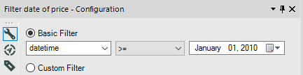
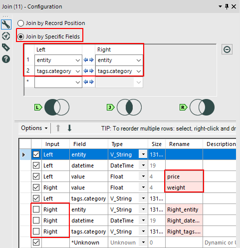

# Alteryx Designer

- [Sample dataset](#sample-dataset)
- [Create database connection](#create-database-connection)
- [Build SQL query to database](#build-sql-query-to-database)
- [Calculate and store derived series](#calculate-and-store-derived-series)

## Sample dataset

In this instruction we use [this dataset](../spss/resources/commands.txt)
as example. One of the ways to load it into ATSD is described
[here](../spss/README.md#load-data)

## Create database connection

- Add the **Input Data** tool to your workflow

  

- Choose **Other Databases→ODBC...** in Input Data configuration, you will see
  **ODBC Connection** dialog.

  

  

- In case you haven't configured ODBC connection with ATSD before you need to
  follow instructions in [ODBC-JDBC Bridge](../odbc/README.md), and in order to
  complete the [Configure ODBC Data Source](../odbc/README.md#configure-odbc-data-source)
  step of these instructions you can open the **ODBC Data Source Administrator**
  window by pressing **ODBC Admin** button in the **ODBC Connection** dialog. You will
  want to use the `tables` connection property in DSN URL set to some
  value. It allows you choose a table from the metrics list that satisfy some pattern.
  For example if we use this URL
  ```text
  jdbc:axibase:atsd:http://atsd_host:8088/api/sql;tables=*
  ```
  then we will be able to view all the metrics available in the ATSD instance at
  `atsd_host` host.
  Read more about the `table` property in [JDBC driver](https://github.com/axibase/atsd-jdbc#jdbc-connection-properties-supported-by-driver) documentation.
  Also you need to check **Strip Quote** flag in DSN Setup dialog.

  

  When you're done, choose the name you specified for DSN during bridge
  configuration from **Data Source Name** list and press **OK**.

> **Note:**
> In this example `tables=inflation.*`

## Build SQL query to database

After creating a connection you will see the **Choose Table or Specify Query** dialog.


It allows you to build the query to database by choosing table or specifying
it's text manually.

- All the metric names you see in the **Tables** tab satisfy `tables` pattern from
  your DSN URL. To be sure, that this list is the most current version, click
  the **Refresh** button.

  

- In the **Visual Query Tab** you can select the columns that you need, add initial
  sorting, grouping, etc. It might be useful to prepare your
  data before processing it in workflow. Below is shown builder configuration
  that corresponds to SQL query

  ```sql
   Select
      inflation.cpi.categories.price.datetime,
      Sum(inflation.cpi.categories.price.value) As Sum_value
   From inflation.cpi.categories.price
   Group By inflation.cpi.categories.price.datetime
   Having Sum(inflation.cpi.categories.price.value) > 1010
   Order By inflation.cpi.categories.price.datetime
  ```

  

- In **SQL Editor** you can review and edit the query that was built or write
  your own query. To check connection press **Test Query**

  > **Note:**
  > Don't use **Test Query** to validate the query since it checks only `SELECT` part
  > of the query, so if it has errors in another part, they won't be reported.

  

Press **OK** when your query to ATSD is ready.

### Check query result

Optionally, to see result of the query press **Run Workflow**.


## Calculate and store derived series

It is a demonstration of creating an Alteryx Designer workflow that uses
series from ATSD to create new series and store them back to ATSD.

The final arrangement of the tools in the workflow will be:


We will go through each node, in order we add them into workflow

1. **Input Data** tool.
   Repeat steps in previous section for this tool choose
   `inflation.cpi.categories.price` table. Select `datetime`,
   `value` columns and manually add `tags.category` as shown below.

   

2. **Input Data** tool. Same as previous? but with
   `inflation.cpi.categories.weight` table.

3. **Filter** tool. Here we specifiy condition `>= January 1st, 2010`
   and use the **T** (_true_) node output. It means, that we leave only
   records (series) after 2009 year.

   

   

4. **Filter** tool. Same as previous.

5. **Join** tool. Here it joins by `entity` and `tags.category` fields.
   Some fields are exluded from thee join results. `value` fields for
   `inflation.cpi.categories.price` and `inflation.cpi.categories.weight`
   are renamed to `price` and `weight` respectively.

   

   > **Note**
   >
   > To check input or output of any node, _run the workflow_ and click its
   > input/output. You will see something like this
   >
   > 

6. **Formula** tool. Its input should be connected to the **J** (_inner join_)
   output of the 3rd node. Next, you need to create a new column to store result.
   Name it `value`. Fill in the expression to calculate it, and don't
   forget to specify the correct resultant data type.

   

   

7. **Summarize** tool. Select fields from above to get the actions list as shown
   below on the image. Be careful, **Output Field Name** for the computed field
   must be `value` here.

   

8. **Sort** tool. We use it to make data appear in chronological order.

   

9. **Formula** tool. So store our new series to ATSD we need to add `entity`
   column. It is done by **Formula** tool. There entity is `bls.gov`

   

10. **Output Data** tool. Choose ODBC Connection as before and enter a name for
    the _existing_ metric, where we will store the result, in this case
    `inflation.cpi.composite.price`, and edit **Output Options** and
    **Table/FieldName SQL Style** options in configuration dialog.

    

    

11. **Browse** tool. We add it for convenience to quickly view the final result.

When your workflow is finished, press **Run Workflow**.
The data will be fetched, processed, and new data stored. As said before, you can
see the output of any node, or see the final result by clicking to **Browse** node.

   
