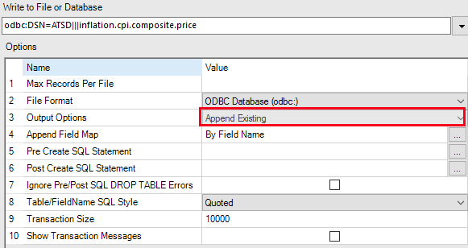

# Alteryx Designer

- [Create connection](#create-connection)
- [Build SQL query to database](#build-sql-query-to-database)
- [Calculate and store derived series](#calculate-and-store-derived-series)

## Create database connection

- Add **Input Data** tool to your workflow

  

- Choose **Other Databases→ODBC...** in Input Data configuration, you will see
  **ODBC Connection** dialog.

  

  

- In case you haven't configured ODBC connection with ATSD you follow
- instructions in [ODBC-JDBC Bridge](../odbc/README.md), and for completing
  [Configure ODBC Data Source](../odbc/README.md#configure-odbc-data-source)
  step of this instuction you can open **ODBC Data Source Administrator** window
  by pressing **ODBC Admin** button in **ODBC Connection** dialog. Apparently
  you'll want to have `tables` connection property in DSN URL set to some
  value. It allows you choose table from metrics list that satisfy some pattern.
  Read about it in [JDBC driver](https://github.com/axibase/atsd-jdbc#jdbc-connection-properties-supported-by-driver) documentation.
  When you're done, choose the name you specified for DSN during bridge
  configuration from **Data Source Name** list and press **OK**.

> **Note:**
> In this example `tables=*`

## Build SQL query to database

After creating connection you'll see **Choose Table or Specify Query** dialog.

It allows you to build query by choosing table or specifying it's text
manually.

- All the metric names you see at **Tables** tab satisfy `tables` pattern in
  your DSN URL. To be sure, that this list is in it's actual state, click
  **Refresh** button.

  

- At **Visual Query Tab** you can select columns that you need, add initial
  sorting, grouping, etc.

  

- In **SQL Editor** you can review and edit the query that was built or write
  your own query. To check that the query is valid you can press **Test Query**

  

Press **OK** when your query to ATSD is ready.

### Check query result

Optionally, to see result of the query press **Run Workflow**.

## Calculate and store derived series

The example is based on this [data](../spss/resources/commands.txt)

In this example you'll need these tools on the image:

The final arrangement of the tools in workflow will be:

We will go through each node, in order we add them into workflow

1. **Input Data** tool with `inflation.cpi.categories.price` as table.
2. **Input Data** tool with `inflation.cpi.categories.weight` as table.
3. **Join** tool. Here it joins by `entity` and `tags.category` fields.
   Some fields are exluded from join result. `value` fields for
   `inflation.cpi.categories.price` and `inflation.cpi.categories.weight`
   are renamed to `price` and `weight` respectively.

   

4. **Formula** tool. It's input should be connected to **J** (_inner join_) output of 3rd
   node. Next, you need to create new column to store result. Name
   it `cpi_index`. Fill in the expression to calculate it's value, and don't
   forget to specify the right resulting data type.

   

   

5. **Summarize** tool. Select fields from above to get actions list as in below
   on the image. Be careful, **Output Field Name** for computed field must be
   `value` here.

   

6. Choose ODBC Connection as before and enter name for new metric, where we will
   store result, in this case `bls.gov`, and edit **Output Options** and
   **Table/FieldName SQL Style** options in configuration dialog.

   

   

And again, if you want to see final result, connect **Browse** tool to the output of **Summarize** node.
When your workflow is finished, press **Run Workflow**.

   
