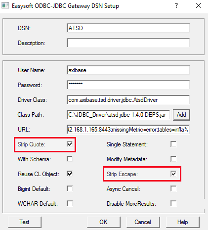

# Alteryx Designer


## Overview

Alteryx Designer is a graphical design environment to create and edit ETL
(Extract, Transform, Load) workflows. The following guide includes examples of
loading time series data from the Axibase Time Series Database (ATSD),
calculating derived time series in Alteryx and storing the results back in ATSD.

## Sample Dataset

For the purpose of instruction, we will use [sample series commands](resources/commands.txt).
The series contain the Consumer Price Index (CPI) for each category
of items in a consumer's basket as well as a weight for each category in the CPI
basket. The weights are stored as fractions of 1000. The CPI is tracked from 2013 to
2017 and uses Year 2016 values as the baseline. Weight values are available only for
year 2017.

To load the data into ATSD, login into the database web interface and submit
these commands on the **Metrics > Data Entry** page.


## Prerequisites

- Install [Alteryx Designer](https://www.alteryx.com/products/alteryx-designer), version 11.x.
- Install [ODBC-JDBC gateway](../odbc/README.md).

## Create Database Connection

- Create a new Alteryx Designer workflow.

- Add the **Input Data** tool to your workflow.

  

- Choose **Other Databases > ODBC...** in the 'Input Data' configuration window.
- Open **ODBC Connection** dialog.

  

  

- Open the **ODBC Data Source Administrator** window by pressing the **ODBC Admin** button in the **ODBC Connection** dialog.

- Configure the [datasource](../odbc/README.md#configure-odbc-data-source).

- Add the [`missingMetric=error`](https://github.com/axibase/atsd-jdbc#jdbc-connection-properties-supported-by-driver) property to the DSN URL to ensure that the driver functions properly.

  ```text
    jdbc:atsd://ATSD_HOST:8443;missingMetric=error
  ```

- If the target ATSD installation contains more than 10000 metrics, consider adding the `tables` property to the DSN URL to filter metrics by name in the Query Builder. For example, `tables=infla*` shows only metrics that start with the characters 'infla'. 

  ```text
    jdbc:atsd://ATSD_HOST:8443;missingMetric=error;tables=infla%
  ```

> Refer to the [JDBC driver](https://github.com/axibase/atsd-jdbc#jdbc-connection-properties-supported-by-driver) documentation for additional details.

- Check (enable) the **Strip Quote** and **Strip Escape** options, press **OK**.

  

- Select the name you specified for DSN during bridge configuration from the **Data
  Source Name** list and press **OK**.

  

## Building Queries

After creating a connection you will see the **Choose Table or Specify Query** dialog.


This allows you build a query by choosing a table or entering query
text manually.

- Table names visible in the **Tables** tab satisfy the `tables` pattern
  specified in the DSN URL. Click the **Refresh** button to reload the list, if
  necessary.

  

- In the **Visual Query Tab**, you can specify particular columns in the `SELECT` expression as well as add optional
  sorting and grouping to prepare your
  data before processing it in the workflow. Below is an SQL query and corresponding
  configuration.

  ```sql
   SELECT datetime, sum(value) AS sum_value
     FROM inflation.cpi.categories.price
   GROUP BY datetime
     HAVING sum_value > 1010
   ORDER BY datetime
  ```

  

- The **SQL Editor** allows you to review and modify pre-built queries or write
  your own.

- The **Test Query** button truncates the query after the `FROM` clause and sends only the remaining
  `SELECT ... FROM ...` expression to the database for validation.

  

Press **OK** when the query is ready for processing.

### Check Query Results

Press **Run Workflow**, to see the result of the query.


## Calculate and Store Derived Series

This section describes how to create a workflow that retrieves existing
data from ATSD to produce new series in Designer and then store these series back in ATSD.
To calculate a weighted inflation index, we multiply the CPI of each category by
its weight divided by 1000 and sum the products.

The resulting workflow will be implemented as follows:


You can download [this workflow](resources/atsd-workflow.yxmd) for review in your own Alterix Designer installation.

The workflow consists of the following steps (nodes):

1. **Input Data** tool.
   Repeat the steps in the [Create Database Connection](#create-database-connection) section for this tool, choose
   `inflation.cpi.categories.price` table. Select `datetime`,
   `value` columns and manually add `tags.category` as shown below.

   

2. **Input Data** tool. Follow the same procedure as above for the
   `inflation.cpi.categories.weight` table.

3. **Filter** tool. Specify the condition `>= January 1st, 2010`
   and use the **T** (_true_) node output to retrieve the series created after 2010 only.

   

   

4. **Filter** tool. Follow the same procedure as above.

5. **Join** tool. Join prices and weights by `tags.category` field. Deselect
   fields as shown on the image. Rename `value` fields for
   `inflation.cpi.categories.price` and `inflation.cpi.categories.weight` to
   `price` and `weight` respectively, `inflation.cpi.categories.price.datetime` to `datetime` and `inflation.cpi.categories.price.tags.category` to `tags.category`.

   

   > **Note**
   >
   > To check input or output of any node, _run the workflow_ and click its
   > input/output.
   >
   > 

6. **Formula** tool. Connect its input to the **J** (_inner join_)
   output of the **Join** node. Next, create a new column named `value` to
   store the result. Fill in the expression to calculate it, and specify the
   correct data type.

   

   

7. **Summarize** tool. Select fields from above to get the actions list as shown
   below on the image. Input `value` into  **Output Field Name**.

   

8. **Sort** tool. Apply it to sort records by date.

   

9. **Formula** tool. Сreate a new column named `entity` with the **Formula** tool. Name it
   `"bls.gov`. 

   

10. **Output Data** tool. Choose ODBC Connection as before and enter a name for
    the new metric, in this case `inflation.cpi.composite.price`.
    Edit **Output Options** in the configuration dialog.

    

    

11. **Browse** tool. View the final result.

Press **Run Workflow**.

The data will be retrieved from the database and processed in Designer by the workflow
with the new series stored back in the database.

Click on the **Browse** node to view the results.

   
