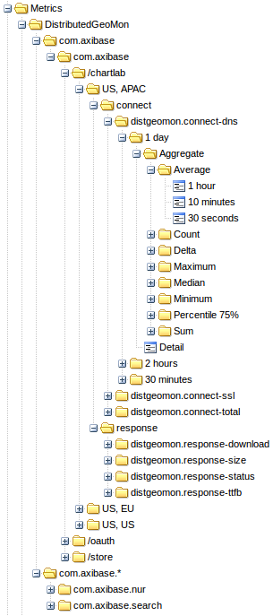
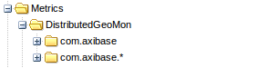
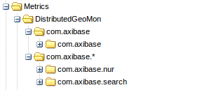
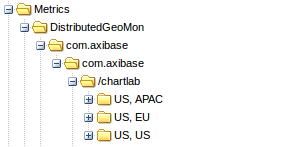
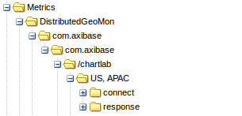
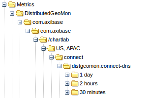
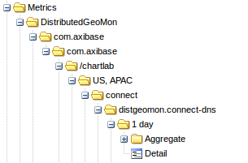
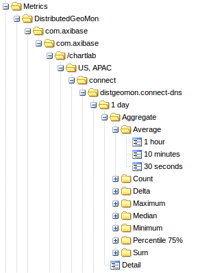

# Storage Finder

ATSD Storage Finder is an alternative to the default Graphite storage finder.

[More information about Graphite storage finders can be found here.](https://graphite.readthedocs.org/en/latest/storage-backends.html)

[Graphite and ATSD Storage Finder installation instructions can be found here.](installation.md)

ATSD Storage Finder configuration parameters are set in the `local_settings.py` file.

The configurations are set under `ATSD_CONF`.

There are two versions of the ATSD Storage Finder:


- ATSD Storage Finder Default – allows you to view metrics as they are stored in ATSD
- ATSD Storage Finder Virtual – allows you to create custom paths to entities, metrics and tags


ATSD Storage Finder settings in `local_settings.py`:

```
STORAGE_FINDERS = (
    'atsd_finder.AtsdFinder',
    'atsd_finder.AtsdFinderV',
    'graphite.finders.standard.StandardFinder',
)
```

ATSD Storage Finder and ATSD Storage Finder Virtual can be used together (their settings can be combined in `ATSD_CONF`).

#### ATSD Storage Finder Default

```
STORAGE_FINDERS = (
    'atsd_finder.AtsdFinder',
)
```

`local_settings.py` settings:

| Setting | Description | Default Value | 
| --- | --- | --- | 
|  <p>url</p>  |  <p>ATSD hostname or IP</p>  |  <p>localhost:8088</p>  | 
|  <p>username</p>  |  <p>ATSD user username</p>  |  <p>–</p>  | 
|  <p>password</p>  |  <p>ATSD user password</p>  |  <p>–</p>  | 
|  <p>entity_folders</p>  |  <p>list of folders for grouping entities by name.</p>  <p>Grouping is done according to the beginning of each entity name,</p>  <p>if it is matched to a folder name, then it will be visible in that folder.</p>  <p>For example if an entity name begins with</p>  <p>`com` (like `com_axibase`),</p>  <p>then it will be placed into the folder called `'com'`.</p>  <p>If entity name does not satisfy any of the listed folder names,</p>  <p>then it will be placed into the `"_"` folder by default.</p>  |  <p>`'entity_folders' : 'abcdefghijklmnopqrstuvwxyz_'`</p>  <p>Will result in folders from a to z, iterates through the string.</p>  | 
|  <p>metric_folders</p>  |  <p>list of folders for grouping metrics by name.</p>  <p>Grouping is done according to the beginning of each metric name,</p>  <p>if it is matched to a folder name, then it will be visible in that folder.</p>  <p>For example if a metric name begins with</p>  <p>`statsd` (`statsd_cpuload_avg5`),</p>  <p>then it will be placed into the folder called `'statsd'`.</p>  <p>If metric name does not satisfy any of the listed folder names,</p>  <p>then it will be placed into the `"_"` folder by default.</p>  |  <p>`'entity_folders' : 'abcdefghijklmnopqrstuvwxyz_'`</p>  <p>Will result in folders from a to z, iterates through the string.</p>  | 
|  <p>aggregators</p>  |  <p>list of aggregators.</p>  |  <p>`'aggregators' : {</p>  <p>                'avg'               : 'Average',</p>  <p>                'min'               : 'Minimum',</p>  <p>                'max'               : 'Maximum',</p>  <p>                'sum'               : 'Sum',</p>  <p>                'count'             : 'Count',</p>  <p>                'first'             : 'First value',</p>  <p>                'last'              : 'Last value',</p>  <p>                'percentile_999'    : 'Percentile 99.9%',</p>  <p>                'percentile_99'     : 'Percentile 99%',</p>  <p>                'percentile_995'    : 'Percentile 99.5%',</p>  <p>                'percentile_95'     : 'Percentile 95%',</p>  <p>                'percentile_90'     : 'Percentile 90%',</p>  <p>                'percentile_75'     : 'Percentile 75%',</p>  <p>                'median'            : 'Median',</p>  <p>                'standard_deviation': 'Standard deviation',</p>  <p>                'delta'             : 'Delta',</p>  <p>                'wavg'              : 'Weighted average',</p>  <p>                'wtavg'             : 'Weighted time average'</p>  <p>}`</p>  | 


If you use an underscore at the beginning of a setting value (entity_folders or metric_folders) then all folders that do not satisfy any other setting will be placed there.

For example:

`'_other'`

ATSD Storage Finder `local_settings.py` example:

```
ATSD_CONF = {
    'url': 'http://atsd_server:8088',
    'username': 'atsd_user',
    'password': 'secrect_pwd',
    'entity_folders': ['_other',
                       'com_',
                       'nur',
                       'dkr',
                       'us',
                       'emea-1',
                       'emea-2'],
    'metric_folders': ['_other',
                       'nmon',
                       'collectd',
                       'statsd',
                       'vmware',
                       'wordpress'],
    'aggregators':    {'avg' : 'Average',
                       'min' : 'Minimum',
                       'max' : 'Maximum',
                       'median' : 'Median',
                       'delta' : 'Delta'}
}
```

#### ATSD Storage Finder Virtual

```
STORAGE_FINDERS = (
    'atsd_finder.AtsdFinderV',
)
```

ATSD Storage Finder Virtual only has one extra setting, “`views`“.

Under `views` use `type` to control which folders and in what order you would like for them to appear in the graphite-web interface.

| Type | Description | 
| --- | --- | 
|  <p>`'type': 'entity folder'`</p>  |  <p>Node representing entity filters</p>  | 
|  <p>`'type': 'entity'`</p>  |  <p>Node representing entities</p>  | 
|  <p>`'type': 'tag'`</p>  |  <p>Node representing tag values</p>  | 
|  <p>`'type': 'metric folder'`</p>  |  <p>Node representing metric filters</p>  | 
|  <p>`'type': 'metric'`</p>  |  <p>Node representing metrics</p>  | 
|  <p>`'type': 'interval'`</p>  |  <p>Node representing selection intervals</p>  | 
|  <p>`'type': 'collection'`</p>  |  <p>Node representing different types of nodes</p>  | 
|  <p>`'type': 'aggregator'`</p>  |  <p>Node representing statistics</p>  | 
|  <p>`'type': 'period'`</p>  |  <p>Node representing statistics periods</p>  | 


`local_settings.py` example with “views”:

```
ATSD_CONF = {
 
    'views': {'DistributedGeoMon': [{'type': 'entity folder',
                                     'value': [{'com.axibase'  : 'com.axibase'},
                                               {'com.axibase.*': 'com.axibase.*'}]},
 
                                    {'type': 'entity',
                                     'value': ['*']},
 
                                    {'type': 'tag',
                                     'value': ['path'],
                                     'global': [{'type': 'metric',
                                                 'value': ['distgeomon.connect-dns']}]},
 
                                    {'type': 'tag',
                                     'value': ['geo-target', 'geo-source']},
 
                                    {'type': 'metric folder',
                                     'value': [{'distgeomon.response*': 'response'},
                                               {'distgeomon.connect*' : 'connect'}]},
 
                                    {'type': 'metric',
                                     'value': ['*']},
 
                                    {'type': 'interval',
                                     'value': [{'count': '30',
                                                'unit': 'minute',
                                                'label': '30 minutes'},
                                               {'count': '2',
                                                'unit': 'hour',
                                                'label': '2 hours'},
                                               {'count': '1',
                                                'unit': 'day',
                                                'label': '1 day'}]},
 
                                    {'type': 'collection',
                                     'value': [{'type': 'aggregator',
                                                'value': [{'detail': 'Detail'}],
                                                'is leaf': True},
 
                                               {'type': 'const',
                                                'value': ['Aggregate']}]},
 
                                    {'type': 'aggregator',
                                     'value': [{'count'        : 'Count'},
                                               {'min'          : 'Minimum'},
                                               {'max'          : 'Maximum'},
                                               {'avg'          : 'Average'},
                                               {'median'       : 'Median'},
                                               {'sum'          : 'Sum'},
                                               {'percentile_75': 'Percentile 75%'},
                                               {'delta'        : 'Delta'}]},
 
                                    {'type': 'period',
                                     'value': [{'count': '30',
                                                'unit': 'second',
                                                'label': '30 seconds'},
                                               {'count': '10',
                                                'unit': 'minute',
                                                'label': '10 minutes'},
                                               {'count': '1',
                                                'unit': 'hour',
                                                'label': '1 hour'}],
                                     'is leaf': True}]}
```



##### “views” example breakdown:



```
{'type': 'entity folder',
 'value': [{'com.axibase'  : 'com.axibase'},
           {'com.axibase.*': 'com.axibase.*'}]}
```

Two entity folders, one filters out only entity com.axibase, and the other one filters out entities that start with ‘com.axibase.’.



```
{'type': 'entity',
 'value': ['*']}
```

List of entities, filtered by the folder they’re in.


```
{'type': 'tag',
 'value': ['path'],
 'global': [{'type': 'metric',
             'value': ['distgeomon.connect-dns']}]}
```

Values of the tag path. To retrieve tags we need a metric, and it hasn’t been established yet. So we can make a global token inside this one to make the metric be distgeomon.connect-dns until stated otherwise.



```
{'type': 'tag',
 'value': ['geo-target', 'geo-source']}
```

Values of tags geo-target and geo-source separated by a comma.



```
{'type': 'metric folder',
 'value': [{'distgeomon.response*': 'response'},
           {'distgeomon.connect*' : 'connect'}]}
```

Two metric folders.


```
{'type': 'metric',
 'value': ['*']}
```

List of metrics.



```
{'type': 'interval',
 'value': [{'count': 30,
            'unit': 'minute',
            'label': '30 minutes'},
           {'count': 2,
            'unit': 'hour',
            'label': '2 hours'},
           {'count': 1,
            'unit': 'day',
            'label': '1 day'}]}
```

List of aggregation intervals.



```
{'type': 'collection',
 'value': [{'type': 'aggregator',
            'value': [{'detail': 'Detail'}],
            'is leaf': True},
 
           {'type': 'const',
            'value': ['Aggregate']}]}
```

If we want to make two different types of tokens at the same level, e.g. a leaf and a branch, like we do here, we can make a collection. In this collection there is a detail aggregator, which is a leaf, so we can click on it and see the plot, and a constant folder Aggregate, which will lead us further into the tree.


```
{'type': 'aggregator',
 'value': [{'count'        : 'Count'},
           {'min'          : 'Minimum'},
           {'max'          : 'Maximum'},
           {'avg'          : 'Average'},
           {'median'       : 'Median'},
           {'sum'          : 'Sum'},
           {'percentile_75': 'Percentile 75%'},
           {'delta'        : 'Delta'}]}
```

A list of aggregators. First we define an ATSD aggregator we want to use and then assign any name we want to it.



```
{'type': 'period',
 'value': [{'count': 30,
            'unit': 'second',
            'label': '30 seconds'},
           {'count': 10,
            'unit': 'minute',
            'label': '10 minutes'},
           {'count': 1,
            'unit': 'hour',
            'label': '1 hour'}],
 'is leaf': True}
```

Final leaf representing possible aggregation periods.

When the storage finder is enabled, metrics from ATSD become available for visualization in the Graphite-web application.

ATSD metrics visualization in Graphite-web application:


