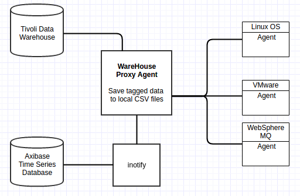
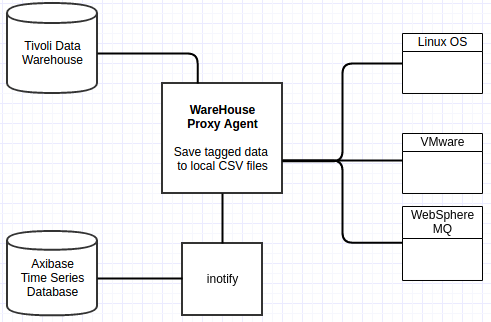

# IBM Tivoli Monitoring

## Overview

In order to offload detailed data from ITM infrastructure with minimal latency you need to enable ITM Warehouse Proxy Agent to dump incoming analytical data into CSV files on the local file system. The dump directory will be continously monitored by an `inotify` script which will upload new CSV files into ATSD as soon as they are created.

This enables ATSD to serve as a long-term repository of historical data that is typically deleted after a few months by ITM in order to minimize the disk space usage in Tivoli Data Warehouse.

Since statistics from ITM agents will be received by ATSD without any delay, the integration can be used for real-time analytics and peformance dashboards.



## Installation steps

## Configure ITM Warehouse Proxy Agent

* Configure WPA to store analytical data received from agents into CSV files on the local file system as described [here](http://www-01.ibm.com/support/knowledgecenter/SSATHD_7.7.0/com.ibm.itm.doc_6.3fp2/adminuse/history_analytics_scenarios.htm "WPA")

* Set `hd.ini` settings to activate private history streaming:

    * Change to /opt/ITM directory and append the following settings to `config/hd.ini` file:

        ```ini
        KHD_CSV_OUTPUT_ACTIVATE=Y
        KHD_CSV_OUTPUT=/tmp/itm/csv
        KHD_CSV_OUTPUT_TAGGED_ONLY=Y
        KHD_CSV_ISO_DATE_FORMAT=Y
        KHD_CSV_MAXSIZE=400
        KHD_CSV_EVAL_INTERVAL=60
        ```
    * Restart WareHouse Proxy agent:

        ```sh
        bin/itmcmd stop hd
        bin/itmcmd start hd
        ```

## Configure ITM Agents

* Download situations configuration files for the following products:

    - [Linux OS](csv-configs/agents/lz_sutiations.xml)
    - [VMware](csv-configs/agents/vm_sutiations.xml)
    - [WebSphere MQ](csv-configs/agents/mq_sutiations.xml)

* Copy configuration file to localconfig/${PRODUCT_CODE}/ directory on the agent machine, where `${PRODUCT_CODE}` is the agent product code. You can lookup commonly used product codes [here](http://www-01.ibm.com/support/docview.wss?uid=swg21265222).

    > Agent situation files adhere to the following naming convention: ${PRODUCT_CODE}_situations.xml

* Restart the agent
    
    ```sh
    bin/itmcmd stop ${PRODUCT_CODE}
    bin/itmcmd start ${PRODUCT_CODE}
    ```

## download CSV Parsers for UX, VM, and MQ product codes

   - [Linux OS](csv-configs/atsd/klz-csv-configs.xml)
   - [VMware](csv-configs/atsd/kvm-csv-configs.xml)
   - [WebSphere MQ](csv-configs/atsd/mq-csv-configs.xml)

## Upload CSV Parsers into ATSD

- Login into ATSD web interface
- Open `Configuration->CSV:Parsers` page.
- Click 'Import' button.
- upload CSV parser xml files that you downloaded previously.

## Configure `inotify` script to read CSV files and upload them into ATSD

* Download [inotify_sender](inotify_sender.sh) script to your WPA server

* Specify ATSD hostname by editing the following line:

    ```sh
    if [ "$url" = "" ]; then
        url="http://atsd_host:8088"
    fi
    ```

* Set permissions to execute the script:
    ```sh
    chmod a+x inotify_sender.sh
    ```

* Run the script with the following command:
    ```sh
    ./inotify_sender.sh
    ```
* Review script logs in `/tmp/itm/logs` directory.

* Add script to auto-start. The auto-start configuration is dependent on your operating system.

## Verifying Data in ATSD

* Login into ATSD
* Click on Metrics tab and filter metrics by following prefixes:

 - `klz`
  

 - `lnx`
  

 - `mq`
  

## Viewing Data in ATSD

### Metrics

* List of collected [ITM metrics](metric-list.md)

### Entity Groups

- `ITM - Linux OS`

### Portals
- [ITM – Linux OS Portal](http://apps.axibase.com/chartlab/43f054ee)


