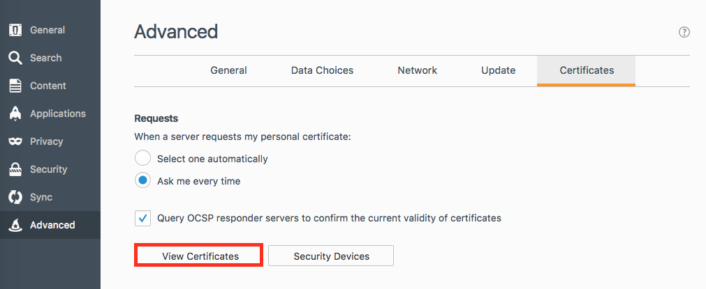
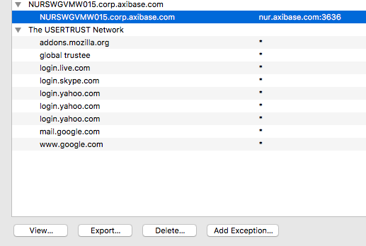
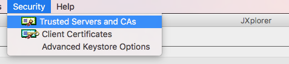
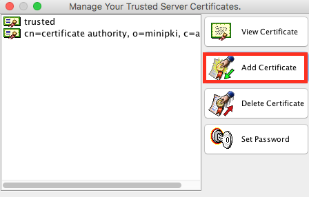

## Secure Connectiion to Active Directory 

In order to setup a secure connection between an Axibase Time Series Database server and an Active Directory (AD) server for the purpose of LDAP user authentication, you need to import an LDAP Server Certificate from the target AD server into ATSD.

There are several ways of obtaining the SSL server certificate:

1) Follow the steps as described in [Sun Java System Identity Synchronization for Windows 6.0 Installation and Configuration Guide](https://docs.oracle.com/cd/E19656-01/821-0422/aarjd/index.html)

2) Use a web browser such as Mozilla Firefox 

* Enter https, ldap hostname and SSL port in the browser address bar, for example `https://nur.axibase.com:636/`

* Press `Advanced` button and then `Add exception` to retrieve the certificate.


* Confirm the security exception.


* Open Firefox `Preferences` -> `Advanced` -> `Certificates` -> `View Certificates` 



* Select the Servers tab and click on the required AD server certificate to export it.



### Import certificate into JXplorer Keystore

* Open `Security` -> `Trusted Servers and CAs`



* Click `Add Certificate`, select the crt file and add it to the keystore.



NB. Note that the cacerts keystore file has a default password of `changeit` (see [jxplorer docs](http://jxplorer.org/help/Setting_a_Keystore_Password.htm)).

### Import certificate into the ATSD Keystore File

* Execute the following command in order to add `servername.corp.company.com.crt` certificate: 


    ```keytool -importcert -keystore /opt/atsd/atsd/conf/server.keystore -storepass atsd_sec_pwd -keyalg "RSA" -trustcacerts -file servername.corp.company.com.crt```
