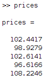
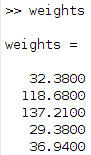
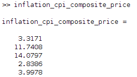

# MATLAB

- [Install ATSD Driver](#install-atsd-driver)
- [Configure ATSD Connection](#configure-atsd-connection)
- [Verify Connection](#verify-connection)
- [Review Tables in Database Explorer](#review-tables-in-database-explorer)
- [Load Data](#load-data)
- [Write Data](#write-data)
- [Calculate Derived Series](#calculate-derived-series)

## Install ATSD driver

There's two ways of connecting ATSD JDBC driver to MatLab: static and dynamic

### Static:
- Run the `prefdir` command in the Command Window. The output of this command is a file path to a folder on your computer.


- Close MatLab if it is running.
- Navigate to the folder (output of `prefdir` command) and create a file called `javaclasspath.txt` in the folder.
- Open javaclasspath.txt. Add the full path to the database driver JAR file in `javaclasspath.txt`. The full path includes the path to the folder where you downloaded the JAR file from the database provider and the JAR file name. For example, `/home/alex/Downloads/atsd-jdbc-1.2.22-SNAPSHOT-DEPS.jar`
- Save and close `javaclasspath.txt`.
- Restart MatLab.

### Dynamic:
- Run the javaaddpath(dpath) command in the Command Window, where dpath is a path to database driver JAR file.

Example:


## Configure ATSD Connection

### ATSD connection via Database Explorer

- Click New - JDBC.
- Vendor - OTHER.
- Driver is a class path of ATSD JDBC driver (com.axibase.tsd.driver.jdbc.AtsdDriver).
- URL is a JDBC URL like ```jdbc:axibase:atsd:https://ATSD_HOSTNAME:8443/api/sql;catalog=atsd;tables="WANTED_METRIC";expandTags=true;trustServerCertificate=true```
- Leave Username and Password fields empty -- there are only for test connection.
- Now connect to ATSD using "Data source name" and login with password to open Database Browser window.

Example:


ATSD_HOSTNAME is a hostname address of ATSD instance you want connect to

TABLE_NAME_FILTER is a metric template (metrics that meet pattern requirement will be displayed in Database Browser)

TABLE_NAME_FILTER examples:
- `*java*` for metrics that contains word `java`
- `custom.metric*` for metrics which name starts with `custom.metric`
- `*2017` for metrics which name ends with `2017`

URL for http connection example:  
```jdbc:axibase:atsd:http://ATSD_HOSTNAME:8088/api/sql;catalog=atsd;tables="TABLE_NAME_FILTER";expandTags=true```

### ATSD connection via Command Window

Example of https connection to ATSD:

```matlab
driver = 'com.axibase.tsd.driver.jdbc.AtsdDriver';
url = 'jdbc:axibase:atsd:https://ATSD_HOSTNAME:8443/api/sql;trustServerCertificate=true';
username = 'USERNAME';
password = 'PASSWORD';
conn_atsd = database('', username, password, driver, url);
```

Example of http conenction to ATSD:

```matlab
driver = 'com.axibase.tsd.driver.jdbc.AtsdDriver';
url = 'jdbc:axibase:atsd:https://ATSD_HOSTNAME:8088/api/sql';
username = 'USERNAME';
password = 'PASSWORD';
conn_atsd = database('', username, password, driver, url);
```

## Verify Connection

ATSD connection via Command Window can be verified using `SELECT 1` query. `data` should be 1.
Assuming you have `conn_atsd` variable set up:

```matlab
sqlquery = 'SELECT 1';
curs = exec(conn_atsd, sqlquery);
res = fetch(curs);
data = res.Data
```

Expected result:


## Review Tables in Database Explorer

For example let WANTED_METRIC be `*java*`. So Database Browser would look like that (one metric table is opened for example):


Any number of columns may be picked -- then Data Preview window will be opened, having first N rows of resultset (N=25 by default).

Example with datetime, value and text fields selected:


Full resultset can be imported via interface button Import (that one with green arrow).

## Load Data

Example of simple sql request to ATSD and importing resultset into MatLab variable (assuming `conn_atsd` is set already):

```matlab
sqlquery = 'SELECT * FROM gc_time_percent LIMIT 50';
curs = exec(conn_atsd, sqlquery);
res = fetch(curs);
data = res.Data;
```

## Write Data

`data` example:


Example of inserting data into ATSD (assuming `conn_atsd` is set already and `data` variable has needed values):

```matlab
colnames = {'datetime', 'entity', 'value'};
insert(conn_atsd, 'METRIC_NAME', colnames, data);
```

`colnames` is a cell array which describes names and order of columns in payload

## Calculate Derived Series

Calculation of inflation index in MatLab (importing data via ATSD):

Creating connection to ATSD:

```matlab
driver = 'com.axibase.tsd.driver.jdbc.AtsdDriver';
url = 'jdbc:axibase:atsd:https://ATSD_HOSTNAME:8443/api/sql;trustServerCertificate=true';
username = 'USERNAME';
password = 'PASSWORD';
conn_atsd = database('', username, password, driver, url);
```

Load prices data from ATSD to MatLab:

```matlab
% sql query to get prices for 2017 year
sqlquery = 'SELECT datetime, tags.category, value FROM inflation.cpi.categories.price WHERE datetime BETWEEN "2013-01-01T00:00:00Z" AND "2017-01-01T00:00:00Z" ORDER BY 1, 2';
% getting cursor from ATSD
curs = exec(conn_atsd, sqlquery);
% fetching data from cursor
res = fetch(curs);
% fetching prices resultset from data as cell array
prices_resultset = res.Data;
% fetching first two columns from prices (which contains Datetime and Category fields)
time_and_categories = prices_resultset(:,1:2);
% fetching second column from prices resultset (which contains value field)
% converting column to numeric array
prices = cell2mat(prices_resultset(:,3));
```



Load weights data from ATSD to MatLab:

```matlab
% sql query to get weights for 2017 year
sqlquery = 'SELECT tags.category, value FROM inflation.cpi.categories.weight WHERE datetime = "2017-01-01T00:00:00Z" ORDER BY 1';
% getting cursor from ATSD
curs = exec(conn_atsd, sqlquery);
% fetching data from cursor
res = fetch(curs);
% fetching weights resultset from data as cell array
weights_resultset = res.Data;
% fetching second column from weights resultset (which contains value field)
% converting column to numeric array
weights = cell2mat(weights_resultset(:,2));
% repeating weights column for 2017 values (5,1 means that resulting matrix will increase in height 5 times)
weights = repmat(weights, 5, 1);
```



Calculation of derived series:

```matlab
% element wise multiplication of 2 columns (1000 value is here because weights is a propotrion out of 1000)
inflation_cpi_composite_price = prices .* weights / 1000;
```



Creating payload cell-matrix and inserting it into ATSD:

```matlab
% appending Category and Inflation columns
payload = [time_and_categories, num2cell(inflation_cpi_composite_price)];
% colnames is a cell array which describes names and order of columns in payload
colnames = {'datetime', 'tags.category', 'value'};
% inserting data into ATSD
insert(conn_atsd, 'inflation.cpi.composite.price', colnames, payload);
```

Used MATLAB functions:
- [database](https://www.mathworks.com/help/database/ug/database.html)
- [exec](https://www.mathworks.com/help/database/ug/exec.html)
- [fetch](https://www.mathworks.com/help/database/ug/fetch.html)
- [cell2mat](https://www.mathworks.com/help/matlab/ref/cell2mat.html)
- [repmat](https://www.mathworks.com/help/matlab/ref/repmat.html)
