# MATLAB

- [Prerequisites](#prerequisites)
- [Configure Database Connection](#configure-database-connection)
- [Verify Connection](#verify-connection)
- [Review Tables in Database Explorer](#review-tables-in-database-explorer)
- [Load Data](#load-data)
- [Write Data](#write-data)
- [Calculate Derived Series](#calculate-derived-series)

## Prerequisites

### Install MatLab

- Install [MatLab](https://www.mathworks.com/products/matlab.html) R2017b with Database Toolbox

### Load Sample Data

To complete this exercise, sample data must be available in your ATSD instance.

1. Log into the ATSD web interface
2. Open **Metrics > Data Entry**, select the 'Commands' tab.
3. Copy the [series commands](resources/commands.txt) into the form and click Submit/Send.


The commands contain the Consumer Price Index (CPI) for each category of items in a consumer's basket as well as a weight for each category in the CPI basket. The weights are stored as fractions of 1000. The CPI is tracked from 2013 to 2017 and uses Year 2016 values as the baseline. Weight values are available only for 2017. The underlying data is available in the following [Excel file](resources/eng_e02.xls).

To calculate a weighted inflation index we need to multiply the CPI of each category by its weight divided by 1000 and sum the products.

### Install ATSD Driver

Download the ATSD [JDBC driver](https://github.com/axibase/atsd-jdbc/releases) with dependencies.

There are two ways of enabling the ATSD JDBC driver in MatLab: static and dynamic

#### Static

- Run the `prefdir` command in the MatLab Command Window. This command displays the path to a directory used in subsequent steps.

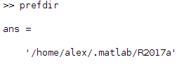
- Close MatLab if it's running.
- Navigate to the `prefdir` directory above and create a file named `javaclasspath.txt`.
- Open the `javaclasspath.txt` file. Add the full path to the ATSD driver JAR file, for example, `/home/user/MATLAB/atsd-jdbc-1.2.22-DEPS.jar`
- Save and close `javaclasspath.txt`.
- Restart MatLab.

#### Dynamic

- Run the `javaaddpath('dpath')` command in the MatLab Command Window, where `'dpath'` is the full path to the ATSD driver JAR file.

Example:


## Configure Database Connection

### Connect in Database Explorer

- **Apps > Database Explorer**
- Click **Configure Data Source > Configure JDBC Data Source**
- Select **Vendor > OTHER**.
- Set the Driver field to `com.axibase.tsd.driver.jdbc.AtsdDriver`
- Specify a JDBC URL like `jdbc:atsd://ATSD_HOSTNAME:8443;expandTags=true`
[Information about ATSD JDBC URL parameters](https://github.com/axibase/atsd-jdbc/blob/master/README.md)
- Click **Test**, specify ATSD login and password
- If connection is successful click **Save** and close _JDBC Data Source Configuration_ window

Example:

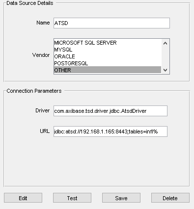

`ATSD_HOSTNAME` is the hostname address of the ATSD instance you want to connect to.

### Connect to the MatLab Command Window

Example of https connection to ATSD:

```matlab
driver = 'com.axibase.tsd.driver.jdbc.AtsdDriver';
url = 'jdbc:atsd://ATSD_HOSTNAME:8443';
username = 'USERNAME';
password = 'PASSWORD';
conn_atsd = database('', username, password, driver, url);
```

## Verify Connection

ATSD connection to Command Window can be verified using the `SELECT 1` query. The returned `data` should be 1.
Assuming `conn_atsd` is defined:

```matlab
sqlquery = 'SELECT 1';
curs = exec(conn_atsd, sqlquery);
res = fetch(curs);
data = res.Data
```

Expected result:

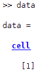

## Review Tables in the Database Explorer

- Specify a JDBC URL like `jdbc:atsd://ATSD_HOSTNAME:8443;tables=%jvm%` at _JDBC Data Source Configuration_ window
- Click **New Query**, select _ATSD_ at _Data Source_ drop-down, specify ATSD login and password

The _Database Browser_ would display a set of tables matching the expression:

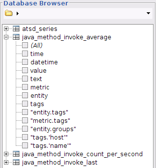

Select one or more columns to open the Data Preview window displaying the first N rows of the resultset (10 by default).

An example with the datetime, value, and text fields selected:

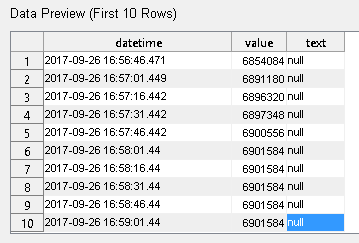

The complete resultset can be imported with the Import button, highlighted with a green arrow.

## Load Data

Execute the SQL query to import the resultset into a MatLab variable:

```matlab
sqlquery = "SELECT * FROM gc_time_percent LIMIT 50";
curs = exec(conn_atsd, sqlquery);
res = fetch(curs);
data = res.Data;
```

## Write Data

`data` example:

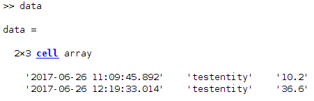

To insert data into ATSD (assuming the `data` variable has required values):

```matlab
colnames = {'datetime', 'entity', 'value'};
insert(conn_atsd, 'METRIC_NAME', colnames, data);
```

`colnames` is a cell array which describes the names and order of columns in the request.

`METRIC_NAME` is the name of a metric under which the rows in `data` should be inserted.

## Calculate Derived Series

### Establish a connection to ATSD

```matlab
driver = 'com.axibase.tsd.driver.jdbc.AtsdDriver';
url = 'jdbc:atsd://ATSD_HOSTNAME:8443';
username = 'USERNAME';
password = 'PASSWORD';
conn_atsd = database('', username, password, driver, url);
```

### Load pricing data into the variable `prices`

```matlab
% SQL query to get prices for a date range
sqlquery = "SELECT datetime, tags.category, value FROM inflation.cpi.categories.price WHERE datetime BETWEEN '2013-01-01T00:00:00Z' AND '2017-01-01T00:00:00Z' ORDER BY 1, 2";
% get cursor from ATSD
curs = exec(conn_atsd, sqlquery);
% fetch data from cursor
res = fetch(curs);
% initialize resultset from data as cell array
prices_resultset = res.Data;
```

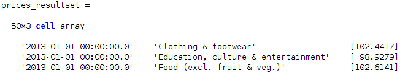

```matlab
% fetch datetime column
datetimes = prices_resultset(:,1);
```

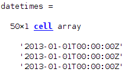

```matlab
% get every 10th record from datetimes to form list of years
datetimes = datetimes(1:10:length(datetimes));
```

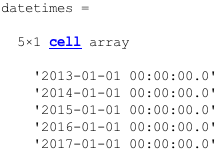

```matlab
% fetch third column from prices resultset (value field)
% convert column to numeric array
prices = cell2mat(prices_resultset(:,3));
```

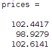

### Load weights data into the variable `weights`

```matlab
% SQL query to get weights
sqlquery = "SELECT tags.category, value FROM inflation.cpi.categories.weight WHERE datetime = '2017-01-01T00:00:00Z' ORDER BY 1";
% get cursor from ATSD
curs = exec(conn_atsd, sqlquery);
% fetch data from cursor
res = fetch(curs);
% initialize weights resultset from data as cell array
weights_resultset = res.Data;
% fetch second column from weights resultset (value field)
% convert column to numeric array
weights = cell2mat(weights_resultset(:,2));
% repeat weights column for 2017 values (5,1 means that resulting matrix will increase in height 5 times)
weights = repmat(weights, 5, 1);
```

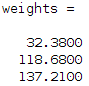

### Calculate Weighted Index

```matlab
% element-wise multiply of 2 columns (1000 value is here because weights is a proportion out of 1000)
inflation_cpi_price = prices .* weights / 1000;
```
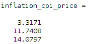

```matlab
% sum inflation prices for each year
inflation_cpi_composite_price = sum(reshape(inflation_cpi_price, 10, 5));
% transponse vector (transform row to column)
inflation_cpi_composite_price = inflation_cpi_composite_price';
```

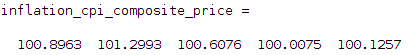

### Create cell-matrix to insert into ATSD

```matlab
% form list of entities for result payload
entity = 'bls.gov';
entities = repmat(cellstr(entity), size(datetimes, 1), 1);
```

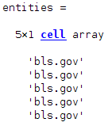

```matlab
% append Entity, Datetime and Inflation columns
payload = [entities, datetimes, num2cell(inflation_cpi_composite_price)];
```

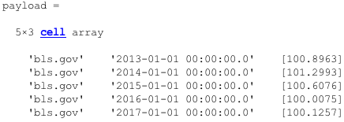

```matlab
% define colnames which is a cell array describing names and order of columns in payload
colnames = {'entity', 'datetime', 'value'};
% insert data into ATSD
insert(conn_atsd, 'inflation.cpi.composite.price', colnames, payload);
```

### MatLab script file

- [Link to file](resources/script.m) that contains all the steps

## Reference

MATLAB functions:

- [database](https://www.mathworks.com/help/database/ug/database.html)
- [exec](https://www.mathworks.com/help/database/ug/exec.html)
- [fetch](https://www.mathworks.com/help/database/ug/fetch.html)
- [cell2mat](https://www.mathworks.com/help/matlab/ref/cell2mat.html)
- [repmat](https://www.mathworks.com/help/matlab/ref/repmat.html)
- [sum](https://www.mathworks.com/help/matlab/ref/sum.html)
- [reshape](https://www.mathworks.com/help/matlab/ref/reshape.html)
- [cellstr](https://www.mathworks.com/help/matlab/ref/cellstr.html)
- [datestr](https://www.mathworks.com/help/matlab/ref/datestr.html)
