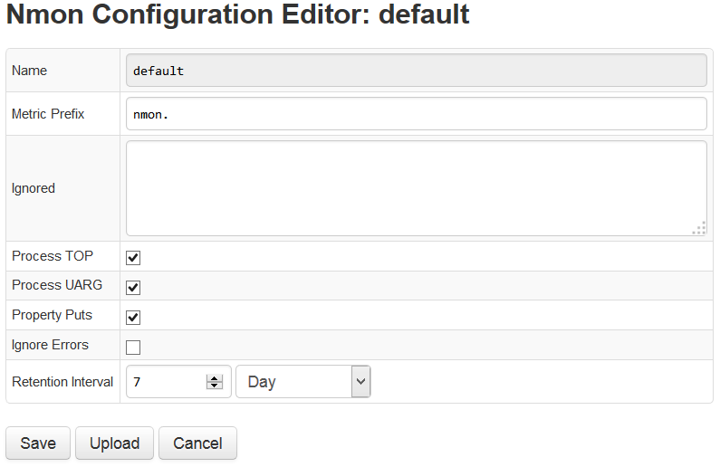

# Parser

The nmon parser ingests raw nmon files and converts them to properties and metrics in ATSD.

During the installation of ATSD, a default nmon parser is created for ingesting standard nmon files. Settings of the default parser are shown in the table below.

#### Parser Settings

| Setting | Description | Default Parser Settings | 
| --- | --- | --- | 
|  
Name
  |  
Name of the current parser.
  |  
default
  | 
|  
Metric Prefix
  |  
Prefix to be added before each nmon metric in order to distinguish and sort metrics with same or similar names. For example: using the prefix nmon will convert the metric `cpu_total.busy` to `nmon.cpu_total.busy`.
  |  
nmon
  | 
|  
Ignored
  |  
nmon metrics to be ignored. Metrics listed here will not be imported. Acts as a filter.
  |  
none
  | 
|  
Process TOP
  |  
Ingest TOP data.
  |  
Yes
  | 
|  
Process UARG
  |  
Ingest user and arg columns.
  |  
Yes
  | 
|  
Enable Properties
  |  
Store entity properties and configurations in ATSD from the nmon file.
  |  
Yes
  | 
|  
Ignore Errors
  |  
Ignore all errors. Parses only known metrics and properties.
  |  
No
  | 
|  
Retention Interval
  |  
How long the uploaded nmon file will be stored on the ATSD server. 2 days by default.
  |  
2 days
  |

