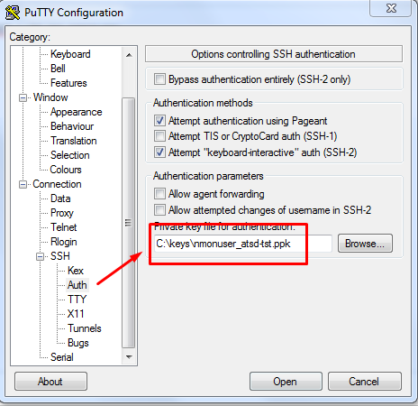

# SSH Tunnel Setup

#### User Guide for Setting up an SSH Tunnel

For this guide you will require an atsdreadonly account and an SSH key, which are created automatically during the ATSD installation process. If you have chosen not to setup an atsdreadonly account during ATSD installation, while running the `install_sudo.sh` script please start by executing our [User Account Setup Guide](http://axibase.com/products/axibase-time-series-database/writing-data/nmon/user-account/).

The guide uses atsd-tst as the hostname of the ATSD server.

The guide uses `nurswgvml001` as the hostname of the remote system.

In the guide, `-p` specifies the port of the ATSD machine. Indicate the correct available port. For example: `-p 22`.

Copy the `/opt/atsd/id_rsa_atsdreadonly` key generated during ATSD installation (or the one created using our [User Account Setup Guide](http://axibase.com/products/axibase-time-series-database/writing-data/nmon/user-account/)) to a remote system into the directory `/opt/nmon`.

Add the ATSD host to known hosts on the target machine:

```
ssh-keyscan -H atsd-tst >> ~/.ssh/known_hosts
```

On Unix systems, the permissions to the key file must not allow any access to world and group. You can achieve this with the command `chmod 0600`. If the permissions are less strict, the file will be ignored and the SSH tunnel will fail to start.

Set the permissions and ownership for the user account that administers nmon on remote machines. It does not have to be a root user.

Ensure you have the ownership rights for the ssh key:

```
ls -l /opt/nmon/id_rsa_atsdreadonly
```

Change ownership:

```
sudo chown {currentuser} /opt/nmon/id_rsa_atsdreadonly
```

Change permissions:

```
sudo chmod 0600 /opt/nmon/id_rsa_atsdreadonly
```

#### Test SSH connection:

```
ssh atsdreadonly@atsd-tst -i /opt/nmon/id_rsa_atsdreadonly -p 22
```

#### Open SSH tunnel:

```
ssh -fN -L `hostname`:10000:localhost:8081 atsdreadonly@atsd-tst -i /opt/nmon/id_rsa_atsdreadonly -p 22
```

In the above example, the tunnel is established between local port 10000 on the remote system and local port 8081 on the ATSD server.

If the tunnel is not established, check if you can ping the ATSD server to see if the port is available and if the username and ssh key are set correctly.

##### Verify that the SSH tunnel is active:

```
ps -ef | grep ssh
```

The output should contain the following line:

```
user001 31326 1 0 17:30 ? 00:00:00 ssh -fN -L nurswgvml001:10000:localhost:8081 atsdreadonly@atsd-tst -i /opt/nmon/id_rsa_atsdreadonly
```

This output means that the SSH tunnel was successfully established.

##### Stop the SSH tunnel (using the pid from the output above):

```
kill 31326
```

#### Verify the connectivity from a Windows machine (optional step):

##### Load `id_rsa_atsdreadonly` into the puttygen program:


##### Click on Save private key button and save the file in `*.ppk` format to the local disk.

##### Open the putty client and connect it to the ATSD server under atsdreadonly with the ppk file.



##### Copy private key to remote systems:

Distribute the generated private key `/opt/atsd/id_rsa_atsdreadonly` to remote systems from which you will be establishing tunnels.

##### Disable login by ssh:

This step disables the remote shell for atsdreadonly; however, it retains the tunneling capability.

```
sudo nano /etc/passwd
```

##### Search for nmonuser entry and replace the shell command as follows:

```
atsdreadonly:x:1004:1004:,,,:/home/atsdreadonly:/bin/bash
```

```
atsdreadonly:x:1004:1004:,,,:/home/atsdreadonly:/bin/false
```

##### Verify that you are no longer able to login into the ATSD server with nmonuser credentials:

```
ssh atsdreadonly@atsd-tst -i /opt/nmon/id_rsa_atsdreadonly -p 22
```

##### If the atsdreadonly shell environment is not available, then the remote login was successfully disabled.
