## ODBC-JDBC Bridge

### Overview

This document describes how to install an ODBC-JDBC bridge on a Windows machine. The bridge serves as a data link between the Axibase Time Series Database and Windows applications that do not support [JDBC](https://docs.oracle.com/javase/tutorial/jdbc/overview/) driver technology.

The bridge intercepts SQL queries from the client applications via the Microsoft [ODBC](https://docs.microsoft.com/en-us/sql/odbc/microsoft-open-database-connectivity-odbc) protocol and transmits the queries into ATSD using the [ATSD JDBC driver](https://github.com/axibase/atsd-jdbc).

### Prerequisites

* Windows 7, 8, 10 operating system, **64-bit edition**.
* Java 7.
* [ODBC-JDBC](http://www.easysoft.com/products/data_access/odbc_jdbc_gateway/#section=tab-1) bridge.

### Downloads

1. Download and install **Java 7**. Note that **Java 8** is not fully supported by the ODBC-JDBC bridge vendor.
2. [Register](http://www.easysoft.com/cgi-bin/account/register.cgi) an account with the bridge vendor. The account is required for trial license activation.
3. [Download](http://www.easysoft.com/products/data_access/odbc_jdbc_gateway/#section=tab-1) the trial version of the ODBC-JDBC bridge.
4. [Download](https://github.com/axibase/atsd-jdbc/releases) ATSD JDBC driver with dependencies.

### Bridge Installation

Install and activate the bridge:

* Run the installer under an Administrator account

  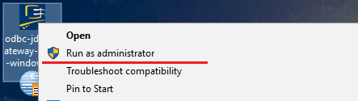

* Skip the welcome page

  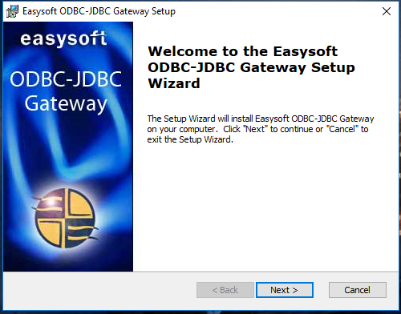

* Accept the license agreement

  

* Choose an installation path

  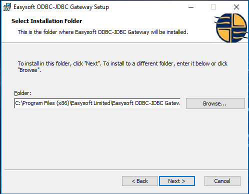

* Confirm the installation

  

* Check the **License Manager** box and finish

  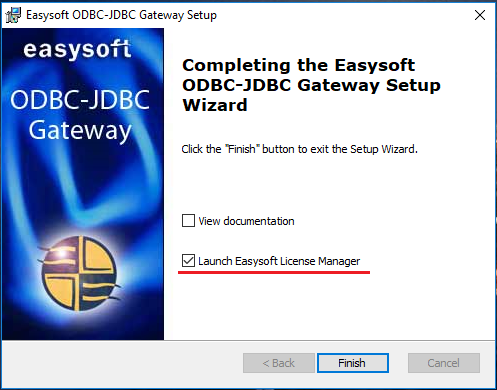

### License Activation

A license manager window will appear after exiting from the installation wizard. If the window fails to appear go to **Start** and search for **License Manager**. Fill out the form fields as entered in the registered account and click **Request License**

  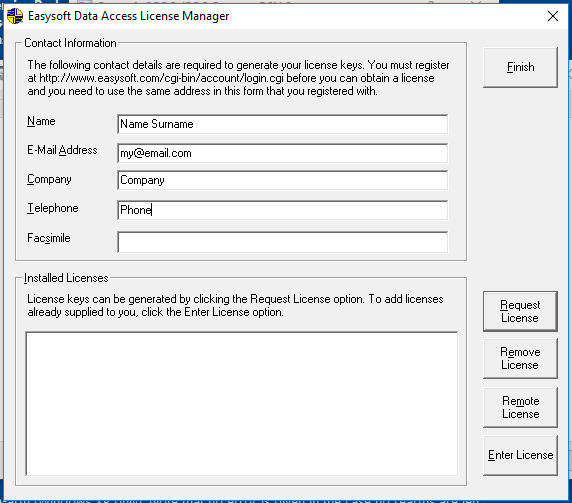

* Choose **Trial**, click Next

  

* Choose **ODBC JDBC Gateway**, click Next

  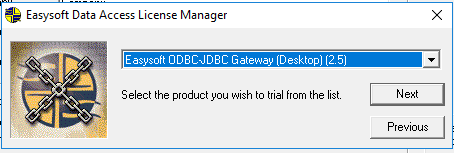

* Click **Online request**

  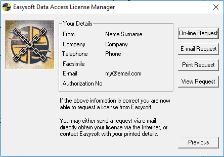

* If the activation succeeds, a pop-up window will appear

  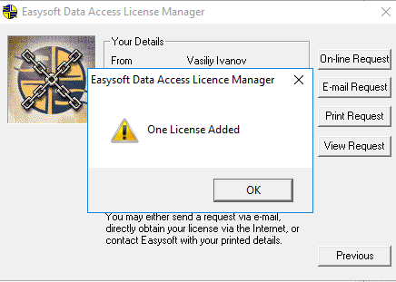

* Also a window with the new license will be displayed in the License Manager

  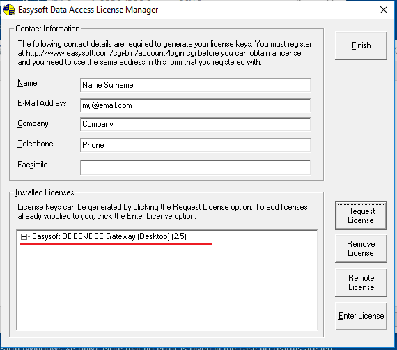

### Configure ODBC Data Source

* Go to **Start**, type `ODBC` and launch ODBC Data Source Manager under an Administrator account.

  

* Open **System DSN** tab, click **Add...**.

  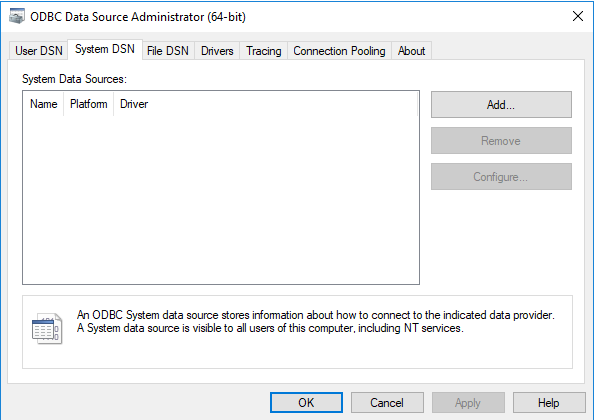

* Choose the **ODBC-JDBC Gateway**, click **Finish**.

  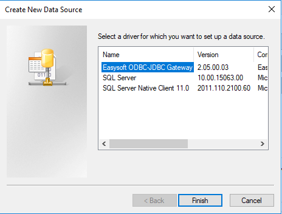

* Enter the following settings in the DSN Setup window:

```
DSN         :   ATSD
User name   :   <atsd username>
Password    :   <atsd password>
Driver class:   com.axibase.tsd.driver.jdbc.AtsdDriver
Class Path  :   <path to ATSD driver, e.g. C:\drivers\atsd-jdbc-1.3.2-DEPS.jar>
URL         :   jdbc:atsd://atsd_hostname:8443
```

Refer to ATSD JDBC [documentation](https://github.com/axibase/atsd-jdbc#jdbc-connection-properties-supported-by-driver)  for additional details about the URL format and the driver properties.

 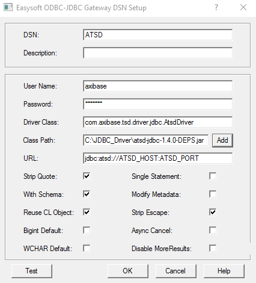

* Check (enable) **'Strip Quote'** option to remove the quotes from table and column names.

* Check (enable) **'Strip Escape'** option to remove [ODBC escape sequences](https://docs.microsoft.com/en-us/sql/odbc/reference/appendixes/odbc-escape-sequences). 

* Click **Test** to verify the settings. If result is correct, save the settings. 

> In case of 'Unable to create JVM' error, run a Repair task in Windows Program for the bridge program. The error may occur if the bridge was installed prior to Java installation.

* The System DSN tab should now display the new data source.

  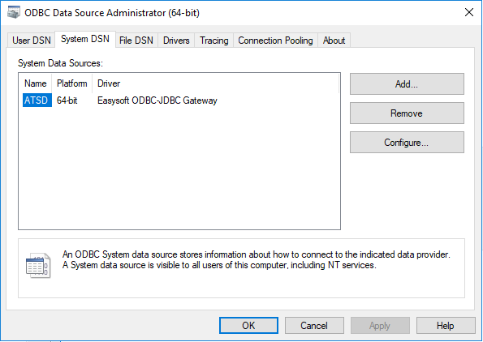
