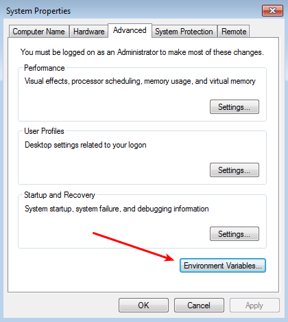
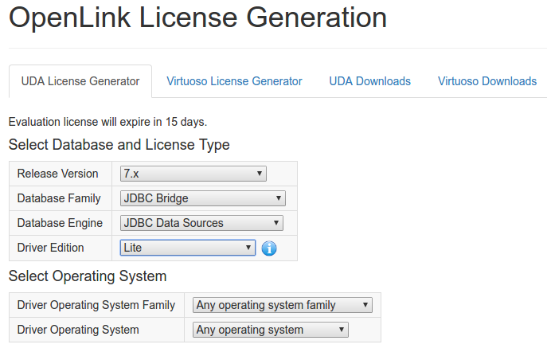
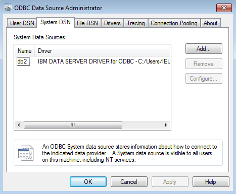
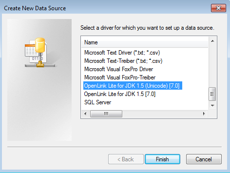
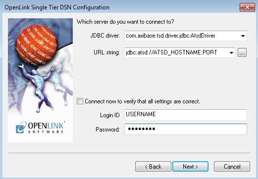
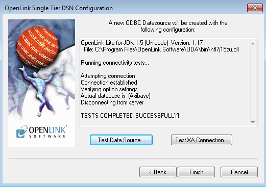

## OpenLink ODBC-JDBC Bridge

### Overview

This document describes how to install an ODBC-JDBC bridge on a Windows machine. The purpose of the bridge is to serve as a data link between the Axibase Time Series Database and Windows applications that do not support [JDBC](https://docs.oracle.com/javase/tutorial/jdbc/overview/) driver technology.

The bridge intercepts SQL queries from the client applications via the Microsoft [ODBC](https://docs.microsoft.com/en-us/sql/odbc/microsoft-open-database-connectivity-odbc) protocol and transmits the queries into ATSD using the [ATSD JDBC driver](https://github.com/axibase/atsd-jdbc).

### Downloads and Prerequisites

- Download and install Java Runtime Environment 7 for the Windows Operating System.
- [Download](https://github.com/axibase/atsd-jdbc/releases) ATSD JDBC driver with dependencies.
- Add Windows Environment variable `Classpath` containing the path to the ATSD JDBC driver 'jar' file.
Open **Environment variables**, click the **New** button under the **System variables** list.
Type `Classpath` as **Variable name** and the path to the ATSD JDBC driver 'jar' file as **Variable value**.



- [Register](https://shop.openlinksw.com/license_generator/login.vsp) an account with the ODBC-JDBC Bridge vendor. The account is required for trial license activation.
- [Generate license](https://shop.openlinksw.com/license_generator/) for the bridge program as displayed:



- Choose the desired OS version
- You will receive the installation link and license files via email.

### Install Bridge

Install and activate the bridge as follows:

- Skip the welcome page.
- Accept the license agreement.
- Choose the directory containing the downloaded license file.
- Select the **Complete** option.
- Confirm and finish the installation.

### Configure ODBC Data Source

Open **Start**, type `ODBC` and launch the ODBC Data Source Manager from an Administrator account.


Open **System DSN** tab, click **Add...**



Choose the **OpenLink Lite for JDK 1.5 (Unicode)** option, click **Finish**



Enter a new connection name into the `Name` field and click **Next**.

Enter the following settings in the DSN Configuration window:

```
JDBC driver:   com.axibase.tsd.driver.jdbc.AtsdDriver
URL string :   <ATSD URL, for example jdbc:atsd://ATSD_HOST:ATSD_PORT>
Login ID   :   <atsd login>
Password   :   <atsd password>
```

Refer to ATSD JDBC [documentation](https://github.com/axibase/atsd-jdbc#jdbc-connection-properties-supported-by-driver)  for additional details about the URL format and the driver properties.



Click **Next** until the last page to skip the remaining configuration steps.

Click **Test Data Source** button to verify the connection.


