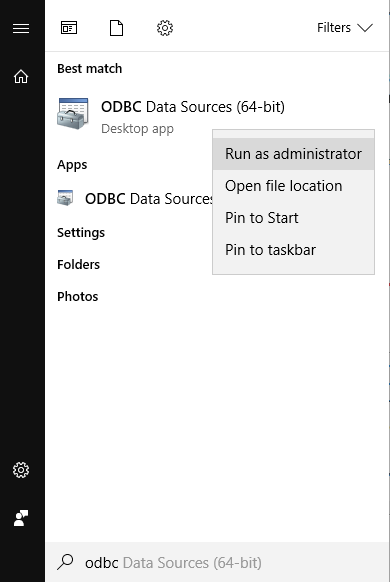
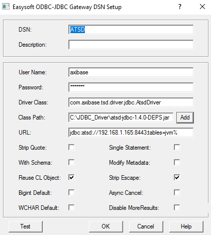

## Re-configure ODBC Data Source


This document describes how to reconfigure the ODBC datasource if the list of tables displayed in a client application needs to be updated.

- Click on **Start** button, type `ODBC` and launch ODBC Data Source Manager under an Administrator account



- Open **System DSN** tab, select ATSD data source and click **Configure...**


- Modify or append `tables` property to the DSN URL to filter metrics by name in the Query
  Builder. For example, `tables=*` displays all ATSD metrics as tables whereas `tables=infla*`
  shows only metrics that start with the characters 'infla'. 

  ```text
    jdbc:atsd://ATSD_HOST:8443;tables=*
    jdbc:atsd://ATSD_HOST:8443;tables=infla*
    jdbc:atsd://ATSD_HOST:8443;tables=infla*,*finance*
  ```
  


> Refer to the [JDBC driver](https://github.com/axibase/atsd-jdbc#jdbc-connection-properties-supported-by-driver) documentation for additional details.

- Click **OK** and exit the wizard
