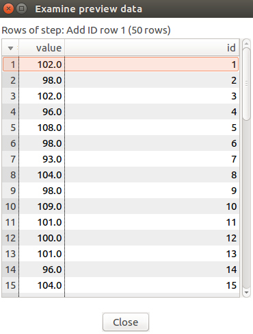
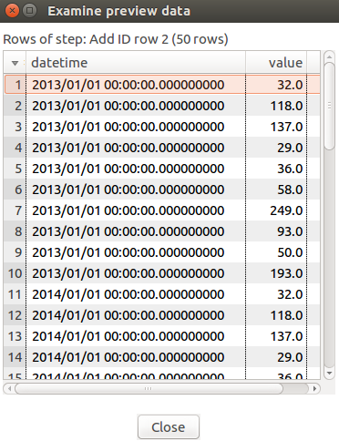

# Pentaho Data Integration

- [Prerequisites](#prerequisites)
- [Install ATSD Driver](#install-atsd-driver)
- [Configure Database Connection](#configure-database-connection)
- [View Schema](#view-schema)
- [Load data](#load-data)
- [Calculate Derived Series](#calculate-derived-series)

## Prerequisites

Install Pentaho Data Integration 7.1

## Install ATSD Driver

- Download ATSD [JDBC driver](https://github.com/axibase/atsd-jdbc/releases) with dependencies
- Copy the driver JAR file into the `lib` directory in the Data Integration installation directory
- Restart the Data Integration

## Configure Database Connection

- Create new `Transformation` via File -> New -> Transformation
- Open `View` pane of new `Transformation`


- Click with right mouse button on `Database connections` -> New
- Select `General` in the left menu
- Select `Generic database` as Connection Type
- Select `Native (JDBC)` as Access

### Configure ATSD connection properties

- Enter JDBC URL into the `Custom Connection URL` field, for example:

  `jdbc:axibase:atsd:https://ATSD_HOSTNAME:8443/api/sql;tables=inflation*;expandTags=true;trustServerCertificate=true`

> `ATSD_HOSTNAME` is the hostname of the target ATSD instance
> Review ATSD JDBC [URL parameters](https://github.com/axibase/atsd-jdbc/blob/master/README.md) for additional details.

- Set Custom Driver Class Name field to `com.axibase.tsd.driver.jdbc.AtsdDriver`
- Set `User Name` and `Password` fields to your ATSD Username and Password
- Set `Connection Name` to `ATSD Connection`


> Click 'Test' to verify connection to ATSD

## View Schema

- Edit `Custom Connection URL` field in ATSD Connection properties
- Edit `tables="TABLE_NAME_FILTER"` in `Custom Connection URL` field
- SET `TABLE_NAME_FILTER` to your table name filter

`TABLE_NAME_FILTER` is a list of comma-separated metrics or metric expressions to be displayed as tables in the MatLab Database Browser.

`TABLE_NAME_FILTER` examples:
- `*java*` for metrics that contains word `java`
- `custom.metric*` for metrics whose name starts with `custom.metric`
- `*2017` for metrics whose name ends with `2017`

Click on `Explore` button to view ATSD Schema:


## Load Data

- Drag and Drop `ATSD Connection` from `View` pane (Database connections folder)
- Set `Step name` to a unique name in this `Transformation`
- Write SQL query which result will be taken as an `Table input` for this `Transformation`
> Click `Preview` if you want to see SQL query results

Example:


## Calculate Derived Series

To calculate the weighted CPI for each year, the CPI value for a given category must be multiplied by its weight and divided by 1000. The resulting products are summed to give the value of the weighted CPI.

### Load data from ATSD

- Create 3 `Table input` from ATSD (`Prices`, `Datetimes` and `Weights`):
> `Prices` has weighted prices for categories from 2013-2017 for 10 categories. SQL query:

```sql
SELECT value
FROM 'inflation.cpi.categories.price'
ORDER BY datetime, tags.category
```

> `Datetimes` has datetime timestamps for 2013-2017 years. SQL query:

```sql
SELECT datetime
FROM 'inflation.cpi.categories.price'
GROUP BY datetime
ORDER BY datetime
```

> `Weights` has weights for 10 categories for 2017 year. SQL query:

```sql
SELECT value
FROM 'inflation.cpi.categories.weight'
ORDER BY datetime, tags.category
```

Example of `Datetimes`:


### Duplicating Weights values

In that step we will get `Weights` values repeated for each year from 2013 to 2017

- Open `Design` pane and find `Join Rows (cartesian product)` in `Joins` category. Drag and drop it to `Transformation` pane.
- Connect your `Join Rows (cartesian product)` with `Datetimes` and `Weights` using `Input Connection` button. That button shows when you hover your mouse pointer over `Join Rows` or any item inside `Transformation` pane


> After that by "connect" we will be meaning that way of conenction

Diagram example:


Preview of `Join Rows (cartesian product)`:


### Merging two tables into one

In that step we will append two tables to perform calculations inside one table. For appending these tables we need to add column with unique identificators, because of Join operations in Pentaho Data Integration work that way.

- Open `Design` pane and find `Add sequence` in `Transform` category. Drag and drop it to `Transformation` pane
- Set `Step name` to `Add ID row 1`
- Set `Name of value` to `id`
- Set `Counter name` to `id_1`
- Connect `Add ID row 1` to `Prices`
> That operation will add column `id` to input (unique integer identificator)

Preview of `Add ID row 1`:



- Open `Design` pane and find `Add sequence` in `Transform` category. Drag and drop it to `Transformation` pane
- Set `Step name` to `Add ID row 2`
- Set `Name of value` to `id`
- Set `Counter name` to `id_2`
- Connect `Add ID row 2` to `Join Rows (cartesian product)`
> That operation will add column `id` to input (unique integer identificator)

Preview of `Add ID row 2`:



- Open `Design` pane and find `Merge Join` in `Joins` category. Drag and drop it to `Transformation` pane
- Connect `Merge Join` to `Add ID row 1` and choose `Right hand side stream of the join`
- Connect `Merge Join` to `Add ID row 2` and choose `Left hand side stream of the join`
- Configure `Merge Join` as shown in the screenshot below:
> That operation will join 2 tables into one table


Preview of `Merge Join`:


Diagram example:


### Calculations

- Open `Design` pane and find `Calculator` in `Transform` category. Drag and drop it to `Transformation` pane
- Connect `Calculator` to `Merge Join`
- Configure `Calculator` as shown in the screenshot below:
> That operation will calculate new field `P*W` (price multiplied by weight)


Preview of `Price * Weight`:


- Open `Design` pane and find `Add constants` in `Transform` category. Drag and drop it to `Transformation` pane
- Connect `Add constants` to `Price * Weight`
- Configure `Add constants` as shown in the screenshot below:
> That operation will add new column `1000` that have value `1000` for each row


Preview of `1000`:


- Open `Design` pane and find `Calculator` in `Transform` category. Drag and drop it to `Transformation` pane
- Connect `Calculator` to `1000`
- Configure `Calculator` as shown in the screenshot below:
> That operation will calculate new field `P*W/1000` (price multiplied by weight and divided by 1000)


Preview of `1000`:


- Open `Design` pane and find `Group by` in `Statistics` category. Drag and drop it to `Transformation` pane
- Connect `Group by` to `/1000`
- Configure `Group by` as shown in the screenshot below:
> That operation will group records by datetime and will calculate sum of `P*W/1000` values for each group


Preview of `Group by`:


- Open `Design` pane and find `Add constants` in `Transform` category. Drag and drop it to `Transformation` pane
- Connect `Add constants` to `Group by`
- Configure `Add constants` as shown in the screenshot below:
> That operation will add new column `entity` that have value `bls.gov` for each row


Preview of `Entity`:


### Load derived series to ATSD

- Open `Design` pane and find `Insert / Update` in `Output` category. Drag and drop it to `Transformation` pane
- Connect `Insert / Update` to `Entity`
- Configure `Insert / Update` as shown in the screenshot below:
> That operation will insert calculated data as new metric in ATSD


> For INSERT operation Data Integration require ATSD to have that metric be created!

Diagram example:


### Check results

You can check the results with that SQL query:

```sql
SELECT * 
FROM 'inflation.cpi.composite.price' 
```

```ls
| entity  | datetime                 | value              |
|---------|--------------------------|--------------------|
| bls.gov | 2013-01-01T00:00:00.000Z | 100.89632897771745 |
| bls.gov | 2014-01-01T00:00:00.000Z | 101.29925299205442 |
| bls.gov | 2015-01-01T00:00:00.000Z | 100.60762066801131 |
| bls.gov | 2016-01-01T00:00:00.000Z | 100.00753061641115 |
| bls.gov | 2017-01-01T00:00:00.000Z | 100.12572021999999 |
```

## Reference

Used Data Integration modules:
- [Join Rows (cartesian product](http://wiki.pentaho.com/display/EAI/Join+Rows+%28Cartesian+product%29)
- [Merge Join](http://wiki.pentaho.com/display/EAI/Merge+Join)
- [Calculator](http://wiki.pentaho.com/display/EAI/Calculator)
- [Insert / Update](http://wiki.pentaho.com/display/EAI/Insert+-+Update)
- [Group by](http://wiki.pentaho.com/display/EAI/Group+By)
- [Add constants](http://wiki.pentaho.com/display/EAI/Add+Constants)
- [Add sequence](http://wiki.pentaho.com/display/EAI/Add+sequence)
