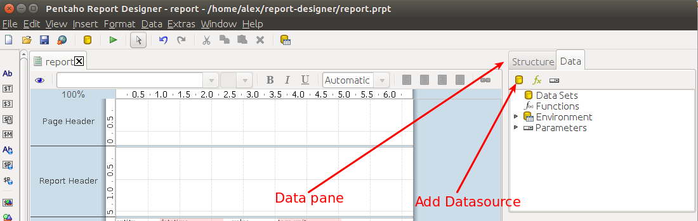
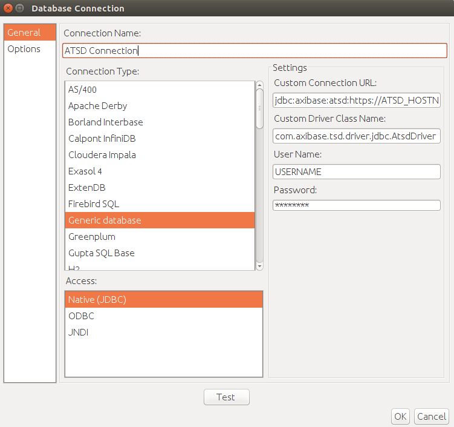
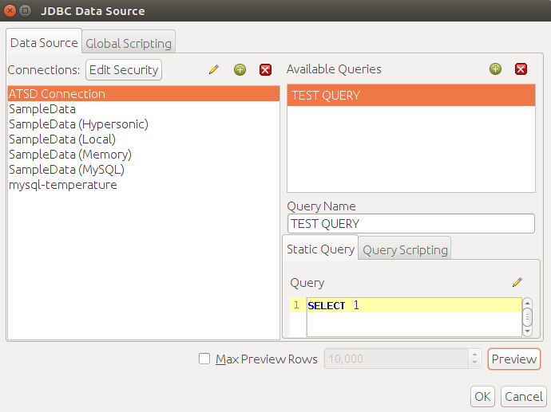
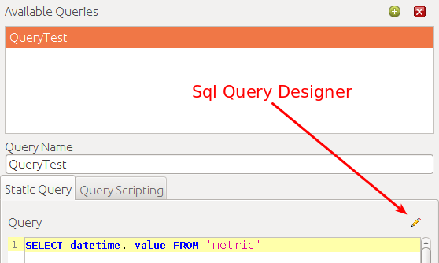
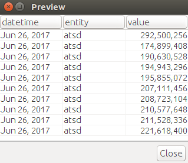
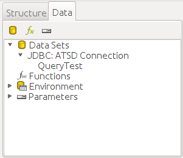
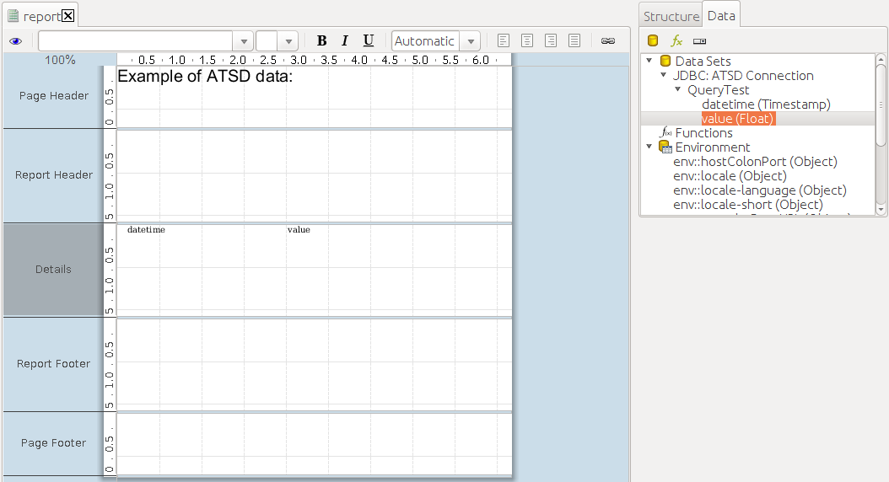
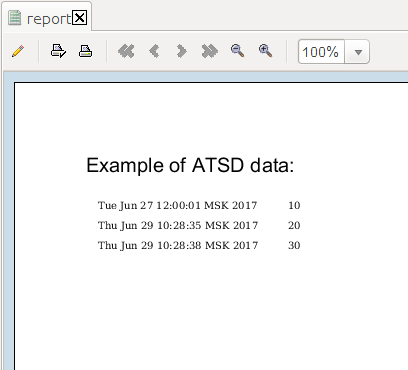

# Pentaho Report Designer

- [Prerequisites](#prerequisites)
- [Configure Database Connection](#configure-database-connection)
- [Import data from ATSD](#import-data-from-atsd)
- [Verify Connection](#verify-connection)
- [View Schema](#view-schema)
- [Import Data](#import-data)

## Prerequisites

### Install PRD

- Install [Pentaho Report Designer](http://community.pentaho.com/projects/reporting/) 7.1

### Install ATSD Driver

- Download ATSD [JDBC driver](https://github.com/axibase/atsd-jdbc/releases) with dependencies
- Copy the driver JAR file into the `lib/jdbc` directory in the Report Designer installation directory
- Restart the Report Designer

### Load Sample Data

To complete this exercise, sample data must be available in your ATSD instance.

1. Log into the ATSD web interface
2. Open **Metrics > Data Entry**, select the 'Commands' tab.
3. Copy the [series commands](resources/commands.txt) into the form and click Submit/Send.

The commands contain the Consumer Price Index (CPI) for each category of items in a consumer's basket as well as a weight for each category in the CPI basket. The weights are stored as fractions of 1000. The CPI is tracked from 2013 to 2017 and uses Year 2016 values as the baseline. Weight values are available only for 2017. The underlying data is available in the following [Excel file](resources/eng_e02.xls).

To calculate a weighted inflation index we need to multiply the CPI of each category by its weight divided by 1000 and sum the products.

## Configure Database Connection

- Select the 'Data' tab in the properties pane on the right.

- Select 'Add Data Sources' button in the toolbar, click 'JDBC'.
- Select 'Add a new connection' (green plus icon).

- Select `General` in the left menu
- Select `Generic database` as Connection Type
- Select `Native (JDBC)` as Access

### Configure ATSD connection properties

- Enter JDBC URL into the `Custom Connection URL` field, for example:

  `jdbc:atsd://ATSD_HOSTNAME:8443;tables=inflation%;expandTags=true`

> `ATSD_HOSTNAME` is the hostname of the target ATSD instance
> Review ATSD JDBC [URL parameters](https://github.com/axibase/atsd-jdbc/blob/master/README.md) for additional details.

- Set Custom Driver Class Name field to `com.axibase.tsd.driver.jdbc.AtsdDriver`
- Set `User Name` and `Password` fields to your ATSD Username and Password
- Set `Connection Name` to `ATSD Connection`

## Verify Connection

ATSD connection can be verified using the SELECT 1 query. The returned data should be 1.

Example of `SELECT 1` test query:

- Select 'Add a new connection' (green plus icon).
- Input query row `SELECT 1` to the 'SQL Query Designer'.
- Click 'Preview'.

Result of `SELECT 1` test query:

## View Schema

- Edit `Custom Connection URL` field in ATSD Connection properties
- Edit `tables=TABLE_NAME_FILTER` in `Custom Connection URL` field
- SET `TABLE_NAME_FILTER` to your table name filter

`TABLE_NAME_FILTER` is a list of comma-separated metrics or metric expressions to be displayed as tables in the Pentaho Report Designer.

`TABLE_NAME_FILTER` examples:
- `%java%` for metrics that contains word `java`
- `custom.metric%` for metrics whose name starts with `custom.metric`
- `%2017` for metrics whose name ends with `2017`

ATSD Schema can be viewed in SQL Query Designer tool:

`SQL Query Designer` tool interface:

`SQL Query Designer` is used for visual building of a Query:

- Double click on the table that you want to include to Query (it will be shown in right pane of `SQL Query Designer`)
- Select fields inside the table (these fields will be included in `SELECT` clause of a Query)
- Optionally add `WHERE`, `GROUP BY` and `HAVING` or `ORDER BY`
- Click `OK` so your Query will be built and shown in text field
> Remove newline symbol after `SELECT` keyword  
> Remove quotes around column names

## Import Data

- Select 'Data' tab in the properties pane on the right
- Select 'Add Data Sources' button in the toolbar and choose `JDBC`
- Click on 'ATSD Connection'
- Click on 'Add Query' in the Available Queries list

- Enter an SQL query in the Query editor, for example `SELECT datetime, entity, value FROM jvm_memory_used LIMIT 10`
- Click on the 'Preview' button to review the resultset.

- It is possible to build a Query using the `SQL Query Designer`

- Click 'OK'. The list of queries will be added to the 'Data' pane.
- Right-click on the query and choose 'Select Query'. The tree view will now display query results and fields.

- Drag and drop these field into the report canvas.
- Click the `Preview` button in the top left corner (the eye icon) to view query results.

Example of report preview:

[File with example report](resources/report.prpt)
