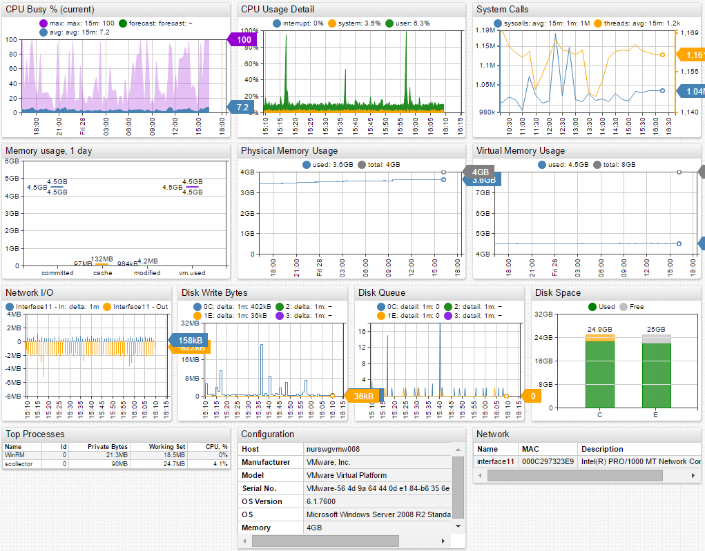
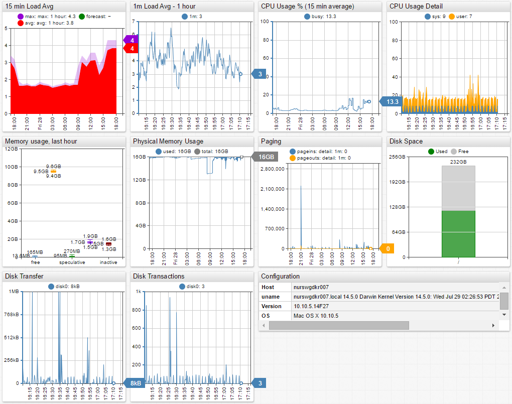
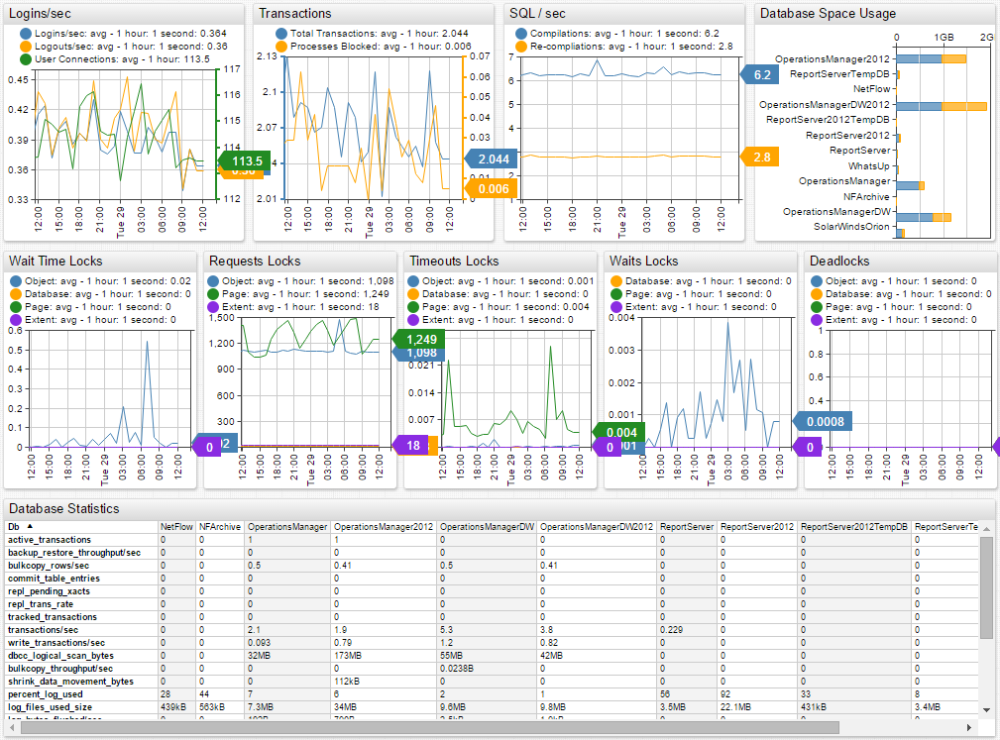
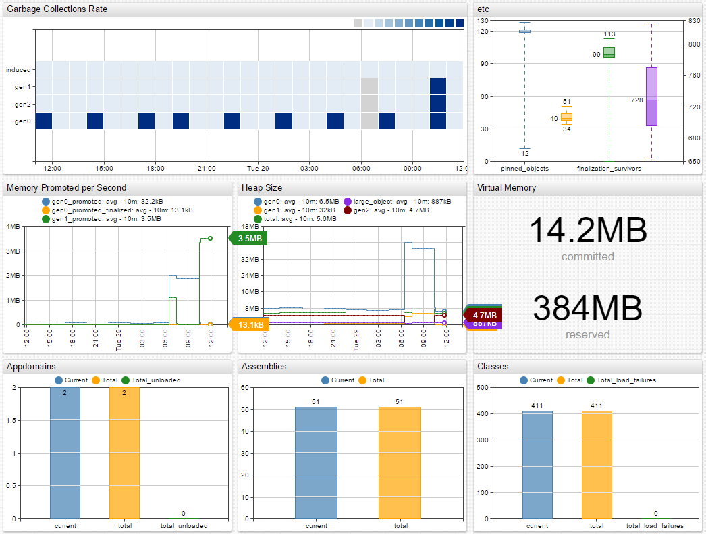
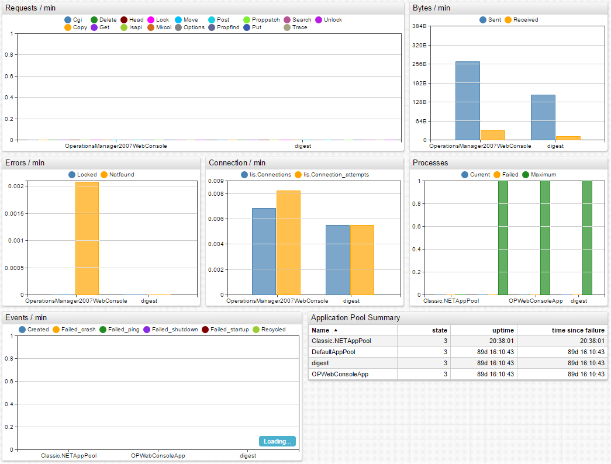

# scollector

scollector is a data collection framework for Linux, Windows and MacOS operating systems.

scollector can be configured to stream data into Axibase Time Series Database for storage, analysis, forecasting and visualization.

[To install and run scollector read the installation and configuration guide here.](scollector-startup.md)

By default, ATSD ignores two series tags collected by scollector: environment and role.

You can change this setting by editing the server.properties file:

```
/opt/atsd/atsd/conf/server.properties
```

Edit or comment out the following line:

```
scollector.ignore.tags = environment role
```

Restart ATSD for the changes to take effect.

#### Default entity groups and portals for scollector in ATSD

Entities collecting scollector data are automatically grouped in ATSD:

Entity Groups:


- `scollector-linux`
- `scollector-macos`
- `scollector-windows`
- `scollector-dotnet`
- `scollector-iis`
- `scollector-mssql`


Default portals are assigned to scollector entity groups.

Portals:


- `scollector-Linux`
- `scollector-MacOS`
- `scollector-Windows`
- `scollector-IIS`
- `scollector-.NET`
- `scollector-MS SQL`


##### scollector-Linux Portal:


Launch live scollector-Linux portal in Axibase Chart Lab.

[Launch](https://apps.axibase.com/chartlab/f595d570)


##### scollector-Windows Portal:


Launch live scollector-Windows portal in Axibase Chart Lab.

[Launch](https://apps.axibase.com/chartlab/db099fa9/2/)



##### scollector-MacOS Portal:



##### scollector-MS SQL Portal:


Launch live scollector-MS SQL portal in Axibase Chart Lab.

[Launch](https://apps.axibase.com/chartlab/1fc2721b)



##### scollector-.NET Portal:


Launch live scollector-.NET portal in Axibase Chart Lab.

[Launch](https://apps.axibase.com/chartlab/1fc2721b/2/)



##### scollector-IIS Portal:



#### Collected Metrics

#### Linux

```
linux.cpu
linux.cpu.clock
linux.cpu.percpu
linux.ctxt
linux.disk.block_size
linux.disk.bytes
linux.disk.fs.inodes_free
linux.disk.fs.inodes_total
linux.disk.fs.inodes_used
linux.disk.fs.space_free
linux.disk.fs.space_total
linux.disk.fs.space_used
linux.disk.ios_in_progress
linux.disk.msec_read
linux.disk.msec_total
linux.disk.msec_weighted_total
linux.disk.msec_write
linux.disk.part.ios_in_progress
linux.disk.part.msec_read
linux.disk.part.msec_total
linux.disk.part.msec_weighted_total
linux.disk.part.msec_write
linux.disk.part.read_merged
linux.disk.part.read_requests
linux.disk.part.read_sectors
linux.disk.part.time_per_read
linux.disk.part.time_per_write
linux.disk.part.write_merged
linux.disk.part.write_requests
linux.disk.part.write_sectors
linux.disk.read_merged
linux.disk.read_requests
linux.disk.read_sectors
linux.disk.time_per_read
linux.disk.time_per_write
linux.disk.write_merged
linux.disk.write_requests
linux.disk.write_sectors
linux.entropy_avail
linux.fs.open
linux.interrupts
linux.intr
linux.loadavg_15_min
linux.loadavg_1_min
linux.loadavg_5_min
linux.loadavg_runnable
linux.loadavg_total_threads
linux.mem.active
linux.mem.allocstall
linux.mem.anonhugepages
linux.mem.anonpages
linux.mem.bounce
linux.mem.buffers
linux.mem.cached
linux.mem.commitlimit
linux.mem.committed_as
linux.mem.compact_fail
linux.mem.compact_free_scanned
linux.mem.compact_isolated
linux.mem.compact_migrate_scanned
linux.mem.compact_stall
linux.mem.compact_success
linux.mem.directmap2m
linux.mem.directmap4k
linux.mem.dirty
linux.mem.hardwarecorrupted
linux.mem.htlb_buddy_alloc_fail
linux.mem.htlb_buddy_alloc_success
linux.mem.hugepagesize
linux.mem.inactive
linux.mem.kernelstack
linux.mem.kswapd_high_wmark_hit_quickly
linux.mem.kswapd_inodesteal
linux.mem.kswapd_low_wmark_hit_quickly
linux.mem.mapped
linux.mem.memfree
linux.mem.memtotal
linux.mem.mlocked
linux.mem.nfs_unstable
linux.mem.nr_active_anon
linux.mem.nr_active_file
linux.mem.nr_alloc_batch
linux.mem.nr_anon_pages
linux.mem.nr_anon_transparent_hugepages
linux.mem.nr_bounce
linux.mem.nr_dirtied
linux.mem.nr_dirty
linux.mem.nr_dirty_background_threshold
linux.mem.nr_dirty_threshold
linux.mem.nr_file_pages
linux.mem.nr_free_cma
linux.mem.nr_free_pages
linux.mem.nr_inactive_anon
linux.mem.nr_inactive_file
linux.mem.nr_isolated_anon
linux.mem.nr_isolated_file
linux.mem.nr_kernel_stack
linux.mem.nr_mapped
linux.mem.nr_mlock
linux.mem.nr_page_table_pages
linux.mem.nr_shmem
linux.mem.nr_slab_reclaimable
linux.mem.nr_slab_unreclaimable
linux.mem.nr_tlb_local_flush_all
linux.mem.nr_tlb_local_flush_one
linux.mem.nr_tlb_remote_flush
linux.mem.nr_tlb_remote_flush_received
linux.mem.nr_unevictable
linux.mem.nr_unstable
linux.mem.nr_vmscan_immediate_reclaim
linux.mem.nr_vmscan_write
linux.mem.nr_writeback
linux.mem.nr_writeback_temp
linux.mem.nr_written
linux.mem.numa_foreign
linux.mem.numa_hint_faults
linux.mem.numa_hint_faults_local
linux.mem.numa_hit
linux.mem.numa_huge_pte_updates
linux.mem.numa_interleave
linux.mem.numa_local
linux.mem.numa_miss
linux.mem.numa_other
linux.mem.numa_pages_migrated
linux.mem.numa_pte_updates
linux.mem.pageoutrun
linux.mem.pagetables
linux.mem.pgactivate
linux.mem.pgalloc_dma
linux.mem.pgalloc_dma32
linux.mem.pgalloc_movable
linux.mem.pgalloc_normal
linux.mem.pgdeactivate
linux.mem.pgfault
linux.mem.pgfree
linux.mem.pginodesteal
linux.mem.pgmajfault
linux.mem.pgmigrate_fail
linux.mem.pgmigrate_success
linux.mem.pgpg
linux.mem.pgrefill_dma
linux.mem.pgrefill_dma32
linux.mem.pgrefill_movable
linux.mem.pgrefill_normal
linux.mem.pgrotated
linux.mem.pgscan_direct_dma
linux.mem.pgscan_direct_dma32
linux.mem.pgscan_direct_movable
linux.mem.pgscan_direct_normal
linux.mem.pgscan_direct_throttle
linux.mem.pgscan_kswapd_dma
linux.mem.pgscan_kswapd_dma32
linux.mem.pgscan_kswapd_movable
linux.mem.pgscan_kswapd_normal
linux.mem.pgsteal_direct_dma
linux.mem.pgsteal_direct_dma32
linux.mem.pgsteal_direct_movable
linux.mem.pgsteal_direct_normal
linux.mem.pgsteal_kswapd_dma
linux.mem.pgsteal_kswapd_dma32
linux.mem.pgsteal_kswapd_movable
linux.mem.pgsteal_kswapd_normal
linux.mem.pswp
linux.mem.shmem
linux.mem.slab
linux.mem.slabs_scanned
linux.mem.sreclaimable
linux.mem.sunreclaim
linux.mem.swapcached
linux.mem.swapfree
linux.mem.swaptotal
linux.mem.thp_collapse_alloc
linux.mem.thp_collapse_alloc_failed
linux.mem.thp_fault_alloc
linux.mem.thp_fault_fallback
linux.mem.thp_split
linux.mem.thp_zero_page_alloc
linux.mem.thp_zero_page_alloc_failed
linux.mem.unevictable
linux.mem.unevictable_pgs_cleared
linux.mem.unevictable_pgs_culled
linux.mem.unevictable_pgs_mlocked
linux.mem.unevictable_pgs_munlocked
linux.mem.unevictable_pgs_rescued
linux.mem.unevictable_pgs_scanned
linux.mem.unevictable_pgs_stranded
linux.mem.vmallocchunk
linux.mem.vmalloctotal
linux.mem.vmallocused
linux.mem.writeback
linux.mem.writebacktmp
linux.mem.zone_reclaim_failed
linux.net.bytes
linux.net.carrier_errs
linux.net.collisions
linux.net.compressed
linux.net.conntrack.count
linux.net.conntrack.max
linux.net.conntrack.percent_used
linux.net.dropped
linux.net.errs
linux.net.fifo_errs
linux.net.frame_errs
linux.net.ifspeed
linux.net.ip_count
linux.net.multicast
linux.net.packets
linux.net.sockets.frag_in_use
linux.net.sockets.frag_mem
linux.net.sockets.raw_in_use
linux.net.sockets.tcp_allocated
linux.net.sockets.tcp_in_use
linux.net.sockets.tcp_mem
linux.net.sockets.tcp_orphaned
linux.net.sockets.tcp_time_wait
linux.net.sockets.udp_in_use
linux.net.sockets.udp_mem
linux.net.sockets.udplite_in_use
linux.net.sockets.used
linux.net.stat.icmp.inaddrmaskreps
linux.net.stat.icmp.inaddrmasks
linux.net.stat.icmp.incsumerrors
linux.net.stat.icmp.indestunreachs
linux.net.stat.icmp.inechoreps
linux.net.stat.icmp.inechos
linux.net.stat.icmp.inerrors
linux.net.stat.icmp.inmsgs
linux.net.stat.icmp.inparmprobs
linux.net.stat.icmp.inredirects
linux.net.stat.icmp.insrcquenchs
linux.net.stat.icmp.intimeexcds
linux.net.stat.icmp.intimestampreps
linux.net.stat.icmp.intimestamps
linux.net.stat.icmp.outaddrmaskreps
linux.net.stat.icmp.outaddrmasks
linux.net.stat.icmp.outdestunreachs
linux.net.stat.icmp.outechoreps
linux.net.stat.icmp.outechos
linux.net.stat.icmp.outerrors
linux.net.stat.icmp.outmsgs
linux.net.stat.icmp.outparmprobs
linux.net.stat.icmp.outredirects
linux.net.stat.icmp.outsrcquenchs
linux.net.stat.icmp.outtimeexcds
linux.net.stat.icmp.outtimestampreps
linux.net.stat.icmp.outtimestamps
linux.net.stat.icmpmsg.intype0
linux.net.stat.icmpmsg.intype11
linux.net.stat.icmpmsg.intype13
linux.net.stat.icmpmsg.intype3
linux.net.stat.icmpmsg.intype5
linux.net.stat.icmpmsg.intype8
linux.net.stat.icmpmsg.outtype0
linux.net.stat.icmpmsg.outtype14
linux.net.stat.icmpmsg.outtype3
linux.net.stat.icmpmsg.outtype8
linux.net.stat.ip.defaultttl
linux.net.stat.ip.forwarding
linux.net.stat.ip.forwdatagrams
linux.net.stat.ip.fragcreates
linux.net.stat.ip.fragfails
linux.net.stat.ip.fragoks
linux.net.stat.ip.inaddrerrors
linux.net.stat.ip.inbcastoctets
linux.net.stat.ip.inbcastpkts
linux.net.stat.ip.incepkts
linux.net.stat.ip.incsumerrors
linux.net.stat.ip.indelivers
linux.net.stat.ip.indiscards
linux.net.stat.ip.inect0pkts
linux.net.stat.ip.inect1pkts
linux.net.stat.ip.inhdrerrors
linux.net.stat.ip.inmcastoctets
linux.net.stat.ip.inmcastpkts
linux.net.stat.ip.innoectpkts
linux.net.stat.ip.innoroutes
linux.net.stat.ip.inoctets
linux.net.stat.ip.inreceives
linux.net.stat.ip.intruncatedpkts
linux.net.stat.ip.inunknownprotos
linux.net.stat.ip.outbcastoctets
linux.net.stat.ip.outbcastpkts
linux.net.stat.ip.outdiscards
linux.net.stat.ip.outmcastoctets
linux.net.stat.ip.outmcastpkts
linux.net.stat.ip.outnoroutes
linux.net.stat.ip.outoctets
linux.net.stat.ip.outrequests
linux.net.stat.ip.reasmfails
linux.net.stat.ip.reasmoks
linux.net.stat.ip.reasmreqds
linux.net.stat.ip.reasmtimeout
linux.net.stat.tcp.abortfailed
linux.net.stat.tcp.abortonclose
linux.net.stat.tcp.abortondata
linux.net.stat.tcp.abortonlinger
linux.net.stat.tcp.abortonmemory
linux.net.stat.tcp.abortontimeout
linux.net.stat.tcp.activeopens
linux.net.stat.tcp.arpfilter
linux.net.stat.tcp.attemptfails
linux.net.stat.tcp.backlogdrop
linux.net.stat.tcp.busypollrxpackets
linux.net.stat.tcp.challengeack
linux.net.stat.tcp.currestab
linux.net.stat.tcp.deferacceptdrop
linux.net.stat.tcp.delayedacklocked
linux.net.stat.tcp.delayedacklost
linux.net.stat.tcp.delayedacks
linux.net.stat.tcp.directcopyfrombacklog
linux.net.stat.tcp.directcopyfromprequeue
linux.net.stat.tcp.dsackignorednoundo
linux.net.stat.tcp.dsackignoredold
linux.net.stat.tcp.dsackoforecv
linux.net.stat.tcp.dsackofosent
linux.net.stat.tcp.dsackoldsent
linux.net.stat.tcp.dsackrecv
linux.net.stat.tcp.dsackundo
linux.net.stat.tcp.embryonicrsts
linux.net.stat.tcp.estabresets
linux.net.stat.tcp.fackreorder
linux.net.stat.tcp.fastopenactive
linux.net.stat.tcp.fastopencookiereqd
linux.net.stat.tcp.fastopenlistenoverflow
linux.net.stat.tcp.fastopenpassive
linux.net.stat.tcp.fastopenpassivefail
linux.net.stat.tcp.fastretrans
linux.net.stat.tcp.forwardretrans
linux.net.stat.tcp.fullundo
linux.net.stat.tcp.hpacks
linux.net.stat.tcp.hphits
linux.net.stat.tcp.hphitstouser
linux.net.stat.tcp.incsumerrors
linux.net.stat.tcp.inerrs
linux.net.stat.tcp.insegs
linux.net.stat.tcp.ipreversepathfilter
linux.net.stat.tcp.listendrops
linux.net.stat.tcp.listenoverflows
linux.net.stat.tcp.lockdroppedicmps
linux.net.stat.tcp.lossfailures
linux.net.stat.tcp.lossproberecovery
linux.net.stat.tcp.lossprobes
linux.net.stat.tcp.lossundo
linux.net.stat.tcp.lostretransmit
linux.net.stat.tcp.maxconn
linux.net.stat.tcp.md5notfound
linux.net.stat.tcp.md5unexpected
linux.net.stat.tcp.memorypressures
linux.net.stat.tcp.minttldrop
linux.net.stat.tcp.ofodrop
linux.net.stat.tcp.ofomerge
linux.net.stat.tcp.ofopruned
linux.net.stat.tcp.ofoqueue
linux.net.stat.tcp.outofwindowicmps
linux.net.stat.tcp.outrsts
linux.net.stat.tcp.outsegs
linux.net.stat.tcp.partialundo
linux.net.stat.tcp.passiveopens
linux.net.stat.tcp.pawsactive
linux.net.stat.tcp.pawsestab
linux.net.stat.tcp.pawspassive
linux.net.stat.tcp.prequeued
linux.net.stat.tcp.prequeuedropped
linux.net.stat.tcp.prunecalled
linux.net.stat.tcp.pureacks
linux.net.stat.tcp.rcvcoalesce
linux.net.stat.tcp.rcvcollapsed
linux.net.stat.tcp.rcvpruned
linux.net.stat.tcp.renofailures
linux.net.stat.tcp.renorecovery
linux.net.stat.tcp.renorecoveryfail
linux.net.stat.tcp.renoreorder
linux.net.stat.tcp.reqqfulldocookies
linux.net.stat.tcp.reqqfulldrop
linux.net.stat.tcp.retransfail
linux.net.stat.tcp.retranssegs
linux.net.stat.tcp.rtoalgorithm
linux.net.stat.tcp.rtomax
linux.net.stat.tcp.rtomin
linux.net.stat.tcp.sackdiscard
linux.net.stat.tcp.sackfailures
linux.net.stat.tcp.sackmerged
linux.net.stat.tcp.sackrecovery
linux.net.stat.tcp.sackrecoveryfail
linux.net.stat.tcp.sackreneging
linux.net.stat.tcp.sackreorder
linux.net.stat.tcp.sackshifted
linux.net.stat.tcp.sackshiftfallback
linux.net.stat.tcp.schedulerfailed
linux.net.stat.tcp.slowstartretrans
linux.net.stat.tcp.spuriousrtos
linux.net.stat.tcp.spuriousrtxhostqueues
linux.net.stat.tcp.synchallenge
linux.net.stat.tcp.syncookiesfailed
linux.net.stat.tcp.syncookiesrecv
linux.net.stat.tcp.syncookiessent
linux.net.stat.tcp.timeouts
linux.net.stat.tcp.timewaitoverflow
linux.net.stat.tcp.tsreorder
linux.net.stat.tcp.tw
linux.net.stat.tcp.twkilled
linux.net.stat.tcp.twrecycled
linux.net.stat.udp.incsumerrors
linux.net.stat.udp.indatagrams
linux.net.stat.udp.inerrors
linux.net.stat.udp.noports
linux.net.stat.udp.outdatagrams
linux.net.stat.udp.rcvbuferrors
linux.net.stat.udp.sndbuferrors
linux.net.stat.udplite.incsumerrors
linux.net.stat.udplite.indatagrams
linux.net.stat.udplite.inerrors
linux.net.stat.udplite.noports
linux.net.stat.udplite.outdatagrams
linux.net.stat.udplite.rcvbuferrors
linux.net.stat.udplite.sndbuferrors
linux.proc.char_io
linux.proc.cpu
linux.proc.io_bytes
linux.proc.mem.fault
linux.proc.mem.rss
linux.proc.mem.virtual
linux.proc.num_fds
linux.proc.num_fds_hlim
linux.proc.num_fds_slim
linux.proc.start_time
linux.proc.syscall
linux.proc.uptime
linux.processes
linux.procs_blocked
linux.uptime_now
linux.uptime_total
os.cpu
os.cpu.clock
os.disk.fs.percent_free
os.disk.fs.space_free
os.disk.fs.space_total
os.disk.fs.space_used
os.mem.free
os.mem.percent_free
os.mem.total
os.mem.used
os.net.bytes
os.net.dropped
os.net.errs
os.net.ifspeed
os.net.packets
os.system.uptime
scollector.collect.alloc
scollector.collect.dropped
scollector.collect.goroutines
scollector.collect.post.count
scollector.collect.post.duration_95
scollector.collect.post.duration_99
scollector.collect.post.duration_avg
scollector.collect.post.duration_count
scollector.collect.post.duration_max
scollector.collect.post.duration_median
scollector.collect.post.duration_min
scollector.collect.post.error
scollector.collect.post.restore
scollector.collect.post.total_duration
scollector.collect.queued
scollector.collect.sent
scollector.version
```

#### Windows

```
dsc.lcm.configured
os.cpu
os.cpu.clock
os.disk.fs.percent_free
os.disk.fs.space_free
os.disk.fs.space_total
os.disk.fs.space_used
os.mem.free
os.mem.percent_free
os.mem.total
os.mem.used
os.net.bytes
os.net.dropped
os.net.errs
os.net.packets
os.system.uptime
scollector.collect.alloc
scollector.collect.dropped
scollector.collect.goroutines
scollector.collect.post.count
scollector.collect.post.duration_95
scollector.collect.post.duration_99
scollector.collect.post.duration_avg
scollector.collect.post.duration_count
scollector.collect.post.duration_max
scollector.collect.post.duration_median
scollector.collect.post.duration_min
scollector.collect.post.error
scollector.collect.post.restore
scollector.collect.post.total_duration
scollector.collect.queued
scollector.collect.sent
scollector.collector.duration
scollector.collector.error
scollector.version
win.cpu
win.cpu.clock
win.cpu.clock_max
win.cpu.cores_logical
win.cpu.cores_physical
win.cpu.dpcs
win.cpu.interrupts
win.cpu.load
win.cpu.time_cstate
win.cpu.voltage
win.cpu_total
win.cpu_total.dpcs
win.cpu_total.interrupts
win.disk.bytes
win.disk.duration
win.disk.fs.percent_free
win.disk.fs.space_free
win.disk.fs.space_total
win.disk.fs.space_used
win.disk.ops
win.disk.percent_time
win.disk.queue
win.disk.spltio
win.mem.cache
win.mem.cache_peak
win.mem.committed
win.mem.committed_limit
win.mem.committed_percent
win.mem.faults
win.mem.free
win.mem.modified
win.mem.page_faults
win.mem.page_operations
win.mem.pagefile.size
win.mem.pagefile.usage_current
win.mem.pagefile.usage_peak
win.mem.pagefile.usage_percent
win.mem.pool.allocations
win.mem.pool.bytes
win.mem.total
win.mem.vm.free
win.mem.vm.total
win.net.bytes
win.net.dropped
win.net.errs
win.net.ifspeed
win.net.packets
win.net.tcp.active
win.net.tcp.established
win.net.tcp.failures
win.net.tcp.passive
win.net.tcp.reset
win.net.tcp.retransmit_pct
win.net.tcp.segments
win.proc.cpu
win.proc.cpu_total
win.proc.elapsed_time
win.proc.handle_count
win.proc.io_bytes
win.proc.io_operations
win.proc.mem.page_faults
win.proc.mem.pagefile_bytes
win.proc.mem.pagefile_bytes_peak
win.proc.mem.pool_nonpaged_bytes
win.proc.mem.pool_paged_bytes
win.proc.mem.vm.bytes
win.proc.mem.vm.bytes_peak
win.proc.mem.working_set
win.proc.mem.working_set_peak
win.proc.mem.working_set_private
win.proc.priority_base
win.proc.private_bytes
win.proc.thread_count
win.service.checkpoint
win.service.started
win.service.status
win.service.wait_hint
win.system.context_switches
win.system.cpu_queue
win.system.exceptions
win.system.handle_count
win.system.processes
win.system.syscall
win.system.threads
win.system.uptime
```

#### MacOS

```
darwin.cpu.idle
darwin.cpu.sys
darwin.cpu.user
darwin.disk.fs.free
darwin.disk.fs.inodes.free
darwin.disk.fs.inodes.total
darwin.disk.fs.inodes.used
darwin.disk.fs.total
darwin.disk.fs.used
darwin.disk.kilobytes_transfer
darwin.disk.megabytes
darwin.disk.transactions
darwin.loadavg_15_min
darwin.loadavg_1_min
darwin.loadavg_5_min
darwin.mem.vm.4kpages.active
darwin.mem.vm.4kpages.copy-on-write
darwin.mem.vm.4kpages.free
darwin.mem.vm.4kpages.inactive
darwin.mem.vm.4kpages.occupiedbycompressor
darwin.mem.vm.4kpages.purgeable
darwin.mem.vm.4kpages.purged
darwin.mem.vm.4kpages.reactivated
darwin.mem.vm.4kpages.speculative
darwin.mem.vm.4kpages.storedincompressor
darwin.mem.vm.4kpages.throttled
darwin.mem.vm.4kpages.wireddown
darwin.mem.vm.4kpages.zerofilled
darwin.mem.vm.pageins
darwin.mem.vm.pageouts
ntp.current_source
ntp.delay
ntp.jitter
ntp.offset
ntp.poll
ntp.reach
ntp.stratum
ntp.when
os.mem.free
os.mem.percent_free
os.mem.total
os.mem.used
scollector.collect.alloc
scollector.collect.dropped
scollector.collect.goroutines
scollector.collect.post.count
scollector.collect.post.duration_95
scollector.collect.post.duration_99
scollector.collect.post.duration_avg
scollector.collect.post.duration_count
scollector.collect.post.duration_max
scollector.collect.post.duration_median
scollector.collect.post.duration_min
scollector.collect.post.error
scollector.collect.post.restore
scollector.collect.post.total_duration
scollector.collect.queued
scollector.collect.sent
scollector.version
```

