## IBM SPSS Data Analysis.

[IBM SPSS Statistics](https://www.ibm.com/analytics/us/en/technology/spss/) is an advanced statistical analysis tool. The following guide describes the process of loading data from Axibase Time Series Database into SPSS for calculating derived (computed) series.

* [**Data preprocessing**](#data-preprocessing)
  * [**Execute and export SQL query from ATSD**](#execute-and-export-sql-query-from-atsd)
  * [**Intro to IBM SPSS GUI**](#intro-to-ibm-spss-gui)
  * [**Import data into IBM SPSS**](#spssimport)
  * [**Merge datasets**](#spssmerge)
* [**Data Analysis**](#data-analysis)
  * [**Create new column in dataset**](#compute)
  * [**Data Aggregation as example of analysis**](#aggr)
    * [Aggregation with Analyze block](#analyze)
    * [Aggregation with Data block](#dataaggr)
* [**Sample Data**](#sample-data)

### Data preprocessing

Before data analysis we must take datasets and preprocess them.

#### Execute and export SQL query from ATSD

Let we have one source, it's database server ATSD of Axibase Comp. [https://ATSD_SERVER:8433/](https://ATSD_SERVER:8433/).

Suppose we solve a problem of yearly consumer basket index calculation. We have two datasets:

 * dataset with weights for every marketing category (to 2017 year)

```sql
SELECT entity, datetime as timedate, value as weight, tags.category 
FROM inflation.cpi.categories.weight 
ORDER BY tags.category, datetime
```
 * dataset with prices in 5 years period (2013-2017), it shows average of yearly prices in all marketing categories

```sql
SELECT entity, datetime, value, tags.category 
FROM inflation.cpi.categories.price 
ORDER BY tags.category, datetime
```
Press `Execute` button to run these queries and export results to CSV files (for example, `prices.csv` and `weights.csv`).

Screenshot for dataset with prices
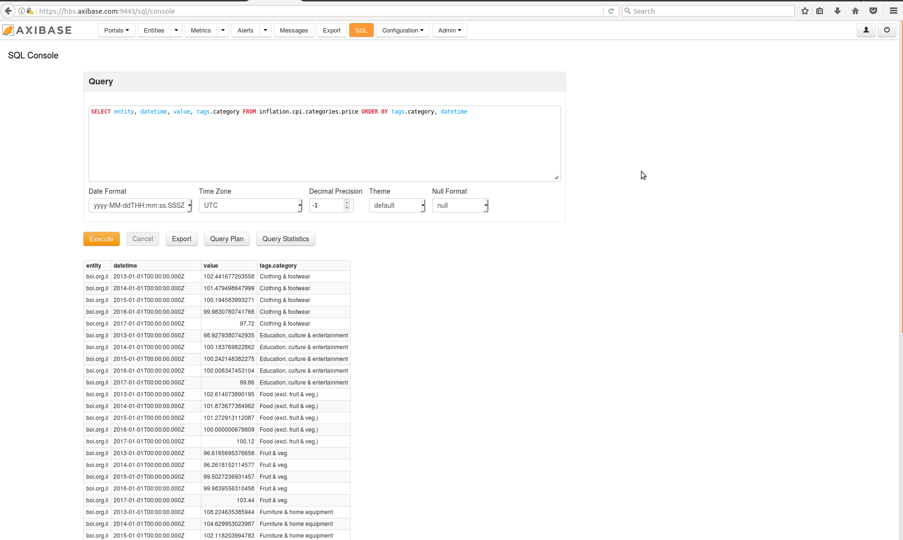
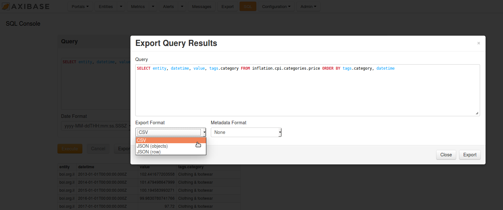

> Note SPSS makes merge of datasets by common columns. So, in the first query we have to write aliases for metric's value as `weight` and for datetime column as `timedate`. Otherwise, we would have got merged dataset with data only for 2017 year. On the other hand, you may try to exclude second `datetime` column before merge. But it should be better to give aliases for columns in SQL query.

#### Intro to IBM SPSS GUI

**Lets look at main menu items for work in the future:**
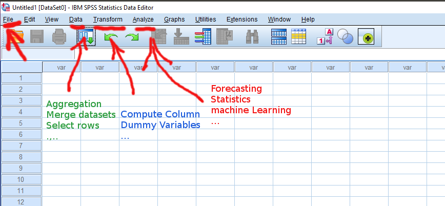
 * **File** has standard operations for any program: import data from Excel/CSV extensions, create own datasets with .sav extension, connect to OBDC server for data extraction, save files
 * **Data** includes common operations with datasets (select rows, aggregation, merge/split files etc.);
 * **Transform** gives opportunities for data transformation (calculating new variables, convert current dataset into time series or another data structure, turn ordinal variables into dummy variables etc.);
 * **Analyze** contains majority of statistical methods and machine learning algorithms (forecasting, regression, classification, neural networks etc.)

<a name="spssimport"/>**Import data to IBM SPSS**

Next step is importing of data.

* **File -> Import Data -> CSV Data...** Choose your CSV documents and check Open button.
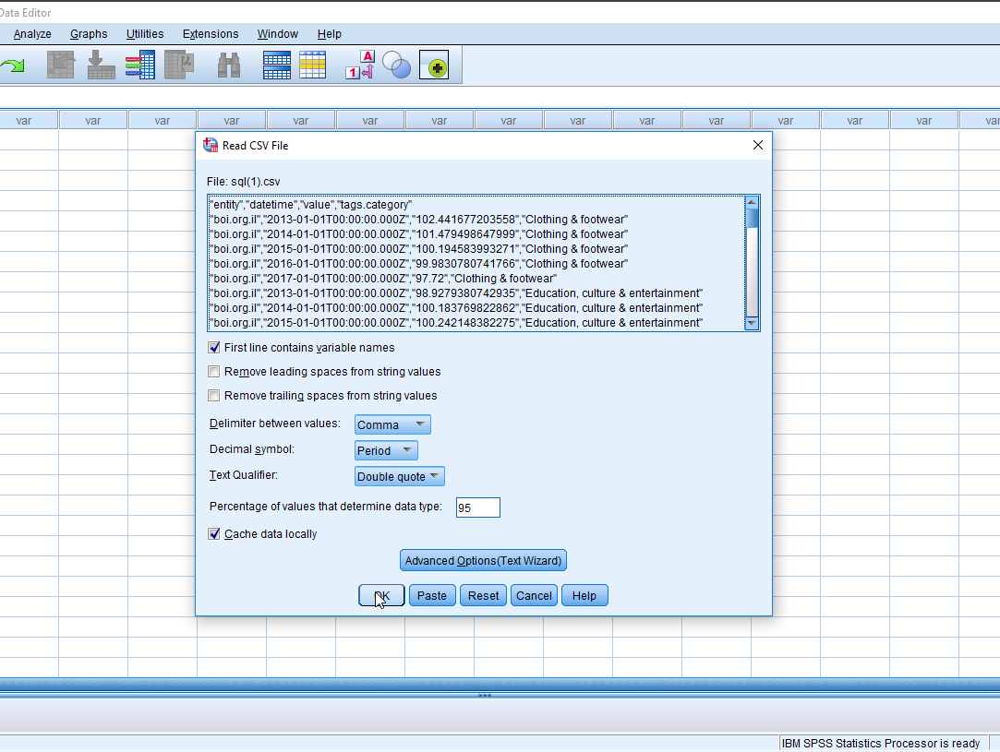

After importing of your CSV files save them as datasets `prices.sav` and `weights.sav`.

<a name="spssmerge"/>**Merge datasets**

In the end of data preprocessing, lets make merge of `.sav` files. In our case, we open `prices.sav` in SPSS and then add `weight` column from `weights.sav`.

* **Data -> Merge Files... -> Add Variables...**
  * Select file you want to merge with current (`weights.sav`)
  * Set lookup table you want to merge with current (table of weights)
  * Choose "One-to-Many" link and go to 'Variables' tab in dialogue window.
  * Move necessary columns (`datetime` from current dataset, `value`, `weight`) to included list, unnecessary columns (`timedate` from the second dataset) - to excluded list. 
  * To select join key move your column to the field 'Key Variables', in our case, join columns are `tags.category` and `entity`.

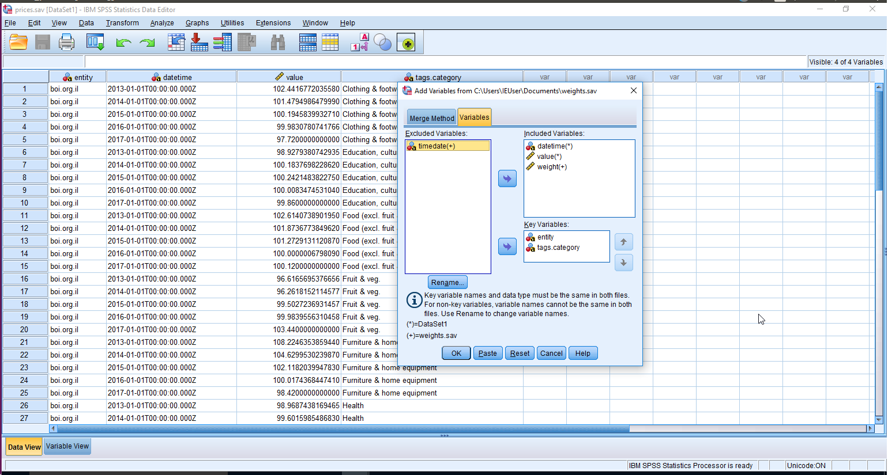

> Be careful during files union, don't forget about final count of observations and check correctness of merged data. For example, we have files with 10 lines and 27 lines. If you select file with 10 lines as the basic, the final file will contain only 10 lines with new column. Otherwise, final dataset would have 27 lines.

Then our merged file can be saved as `prices_merged.sav`


### Data Analysis

So, data preprocessing was over and we are ready to make various analysis with new dataset.

<a name="compute"/>**Create new column in dataset**

Again, we want to know common yearly index of customer basket. Let we compute new column with production of `value` and `(weight/1000)` and then get sum of products for yearly period. 

Open prices_merged.sav file and create new column `categ_ind`.

* **Transform -> Compute Variable...**  
  * Select columns from the left field into expression field and apply all operations you need. 
     > We selected `value` and `weight` columns, divided `weight` by 1000 and lastly get production of final partitive and `value`. 
  * Don't forget to give a name for new column!
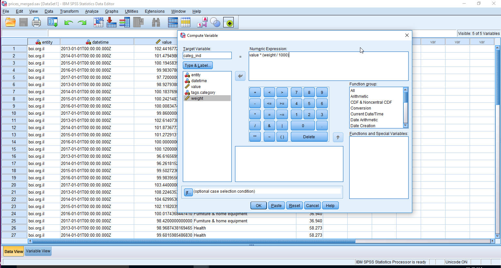

We have got `categ_ind` column on the right end of our table.


<a name="aggr"/>**Data Aggregation as example of analysis**

   There are several ways in SPSS for data aggregation.
  
   <a name="analyze"/>**Aggregation with Analyze block**

   In this case you don't need to create new data column. Analyze tools block allows you to publish all significant results in HTM report.
    
   * **Analyze -> Reports -> Report Summaries in Columns...** 
      * Move `categ_index` column to `Summary variables` field and select aggregation function SUM. 
      * Set `datetime` column as a break variable. You can format aggregation columns in dialogue window.
    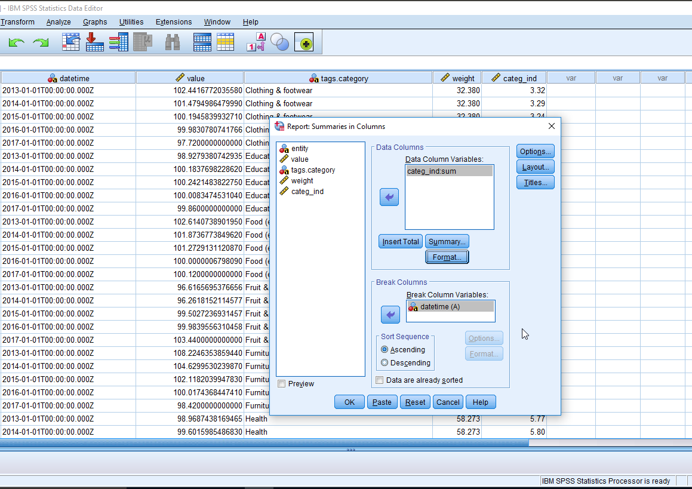
    
   To publish report click in Output window **File -> Export As a Web Report**.
    There will be log and main section with your calculations.
    
   It's example of SPSS output.
    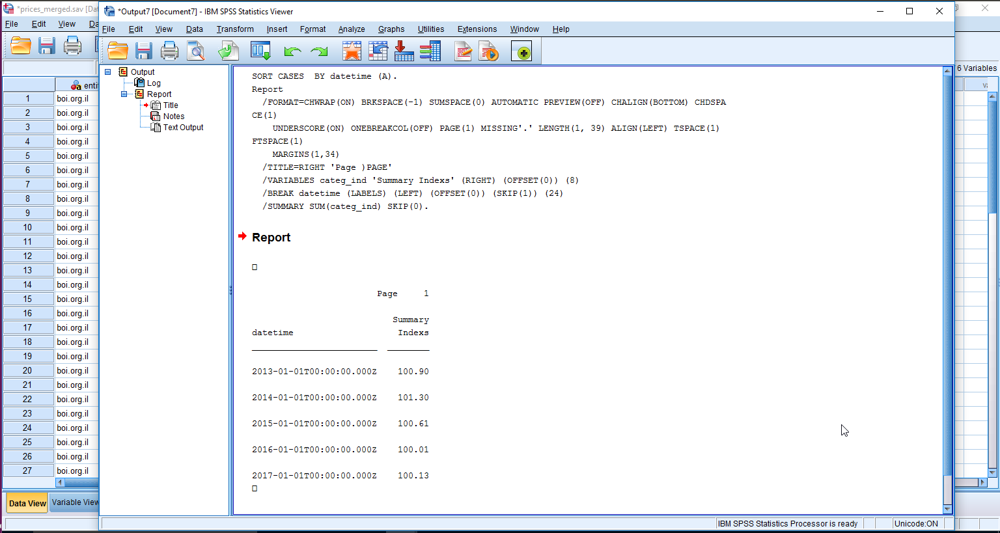
    
   It's screenshot of HTM report's version:
    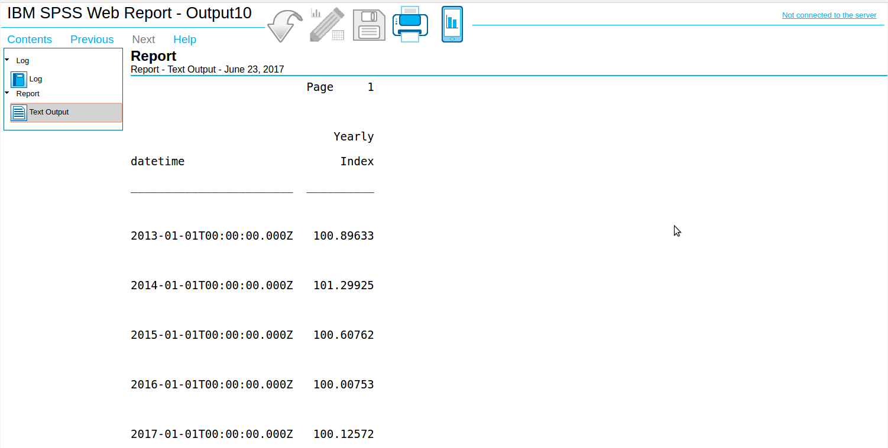
    
   HTM file: [Yearly Index Calculation](resources/index_calculation.htm)
    
   <a name="dataaggr"/>**Aggregation with Data block**
    
   Next way to calculate sum of indexes in year is aggregation function from Data tools block.
    
   * **Data -> Aggregate...** 
      * Set `categ_ind` as summary variable and assign SUM function 
      * Set `datetime` as break variable (like GROUP BY in SQL)
      * Column formatting and output writing possibilities are available here too
    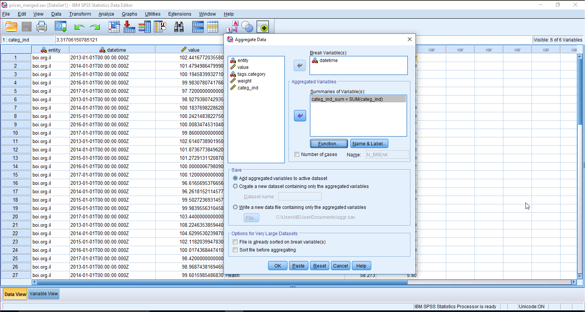
    
   The last column `categ_ind_sum` on the right demonstrates aggregation results.
    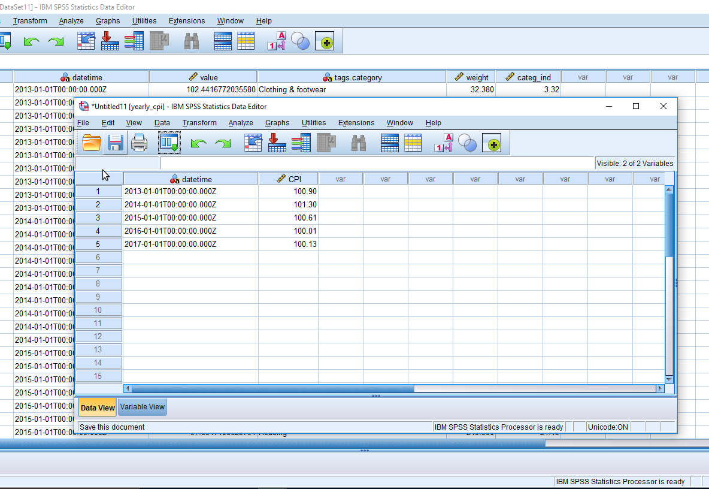

> To change decimals of a scale variable click `Variable View` tab in the lower left corner of SPSS. This tab shows useful info about dataset variables (data type, measure, role etc.) and allows to add/delete/edit columns.


> After user operation (analysis, chart building, open/close file, merge etc.) SPSS generates output file .spv with procedure commands. Storing of these outputs is a matter of your taste. It dependents on achievements, either you would check correctness of operations or not.

### Sample Data
1. [Series commands](resources/commands.txt) that can be imported into ATSD on the **Metrics > Data Entry** page.

2. In order to try SPSS you can download files [weights.csv](resources/weights.csv) and [prices.csv](resources/prices.csv) without retrieving data with SQL on your own.