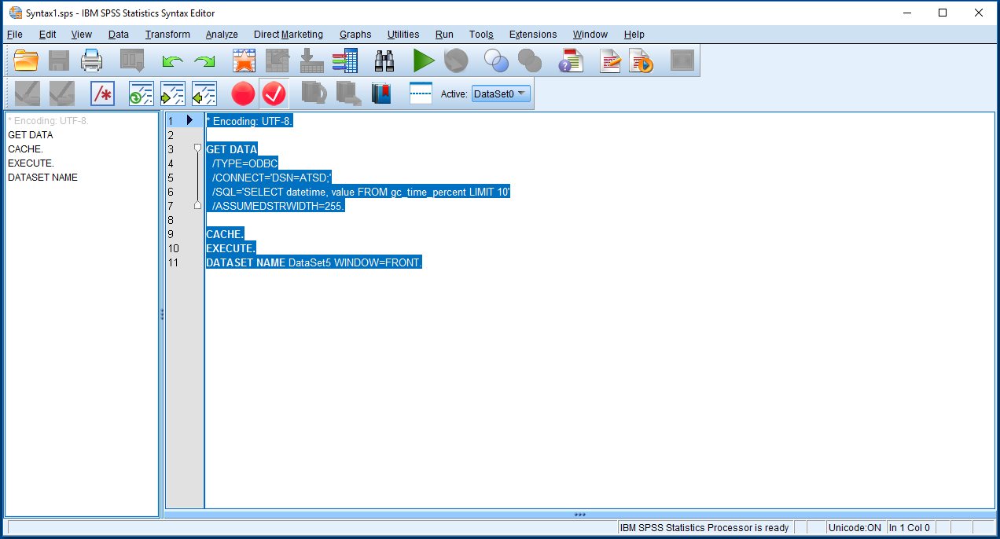
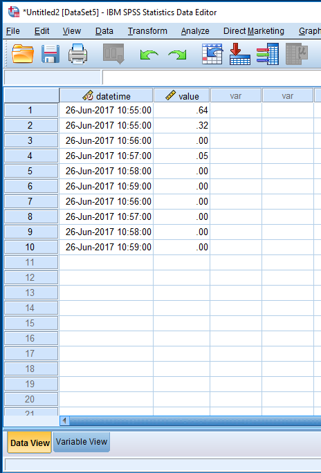

### Configuring the Data Source in IBM SPSS Statistics

Open the attached [script](resources/Syntax1.sps)



```
* Encoding: UTF-8.

GET DATA
  /TYPE=ODBC
  /CONNECT='DSN=ATSD;'
  /SQL='SELECT datetime, value ' +
       'FROM gc_time_percent ' +
       'LIMIT 10'
  /ASSUMEDSTRWIDTH=255.

CACHE.
EXECUTE.
DATASET NAME DataSet5 WINDOW=FRONT.
```


The script will connect to ATSD (`CONNECT='DSN=ATSD'`), execute the query specified in the `SQL` variable and display the dataset.

