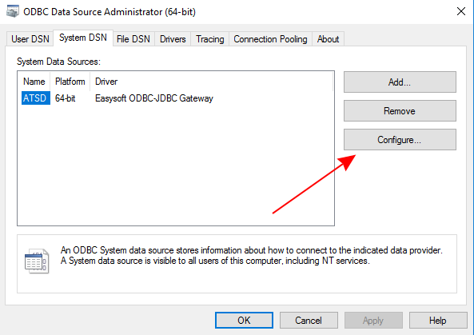
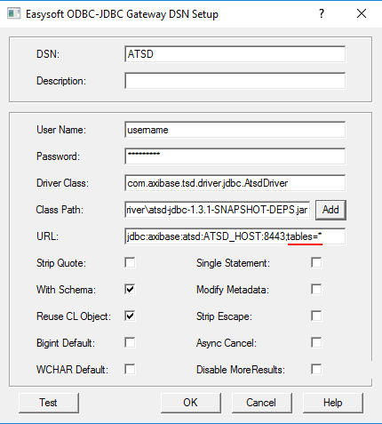

## How to configure ODBC data source to show tables

- Go to **Start**, type `ODBC` and launch ODBC Data Source Manager under an Administrator account


- Open **System DSN** tab, select ATSD data source and click **Configure...**



- Append `tables` property to the DSN URL to filter metrics by name in the Query
  Builder. For example, `tables=*` displays all ATSD metrics as tables whereas `tables=infla*`
  shows only metrics that start with the characters 'infla'. 

  ```text
  jdbc:axibase:atsd:ATSD_HOST:8443;tables=*
  ```
  


> Refer to the [JDBC driver](https://github.com/axibase/atsd-jdbc#jdbc-connection-properties-supported-by-driver) documentation for additional details.

- Click **OK** and exit the wizard