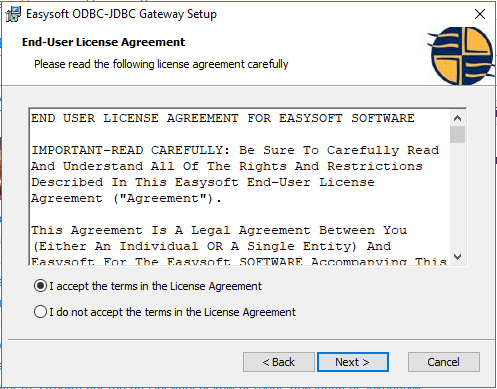
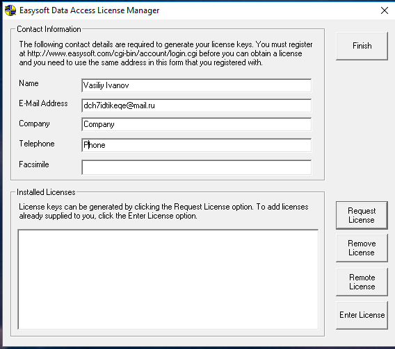
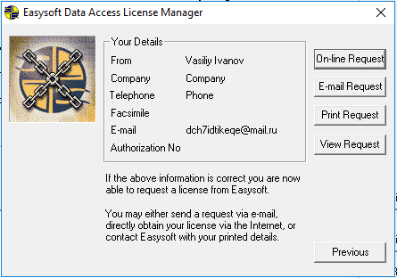
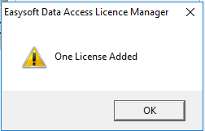

## ODBC-JDBC Bridge

### Overview

This document describes how to install an ODBC-JDBC bridge on a Windows machine. The purpose of the bridge is to serve as a data link between Axibase Time Series Database and Windows applications that do not support [JDBC](https://docs.oracle.com/javase/tutorial/jdbc/overview/) driver technology. 

The bridge intercepts SQL queries from the client applications via the Microsoft [ODBC](https://docs.microsoft.com/en-us/sql/odbc/microsoft-open-database-connectivity-odbc) protocol and transmits the queries into ATSD using the [ATSD JDBC driver](https://github.com/axibase/atsd-jdbc). 

### Downloads and Pre-requisites

1. Download and Install Java Runtime Environment 8 on the Windows system.
2. [Register](http://www.easysoft.com/cgi-bin/account/register.cgi) an account with the ODBC-JDBC Bridge vendor. The account is required for trial license activation.
3. [Download](http://www.easysoft.com/products/data_access/odbc_jdbc_gateway/#section=tab-1) the trial version of the ODBC-JDBC Bridge.
4. [Download](https://github.com/axibase/atsd-jdbc/releases) ATSD JDBC driver with dependencies.

### Bridge Installation

Install and activate the bridge as follows:

  Run the installer under an Administrator account


  Skip the welcome page


  Accept the license agreement



  Choose installation path


  Confirm installation


  Check the **License Manager** checkbox and finish


### License Activation

A license manager window will appear after exiting from the installation wizard. If the window fails to appear go to **Start** and search for **License Manager**. Fill out the form fields as entered in the registered account and click **Request License**



  Choose **Trial**, click Next


  Choose **ODBC JDBC Gateway**, click Next


  Click **Online request**



  If the activation succeeds, a popup window will appear



  Also a window with the new license will be displayed in the License Manager 


### Configure ODBC Data Source

Go to **Start**, type `ODBC` and launch ODBC Data Source Manager under an Administrator account


Open **System DSN** tab, click **Add...**


Choose the **ODBC-JDBC Gateway**, click **Finish**


Enter following settings in the DSN Setup window:

```
DSN: ATSD
User name: <atsd login>
Password: <atsd password>
Driver class: com.axibase.tsd.driver.jdbc.AtsdDriver
Class Path: <path to ATSD JDBC Driver, for example C:\atsd-jdbc-1.2.22-SNAPSHOT-DEPS.jar>
URL: <ATSD URL, for example jdbc:axibase:atsd:https://atsd_host:8443/api/sql;trustServerCertificate=true>
```

Refer to ATSD JDBC [documentation](https://github.com/axibase/atsd-jdbc#jdbc-connection-properties-supported-by-driver)  for additional details about the URL format and the driver parameters.


Click Test to verify the settings. If result is OK, save the settings. The System DSN tab should now display the new data source.


### Configuring the Data Source in IBM SPSS Statistics

Open the attached script (resources/Syntax1.sps)


```
* Encoding: UTF-8.

GET DATA
  /TYPE=ODBC
  /CONNECT='DSN=ATSD;'
  /SQL='SELECT datetime, value ' +
       'FROM gc_time_percent ' +
       'LIMIT 10'
  /ASSUMEDSTRWIDTH=255.

CACHE.
EXECUTE.
DATASET NAME DataSet5 WINDOW=FRONT.
```


The script will connect to ATSD (`CONNECT='DSN=ATSD'`), execute the query specified in the `SQL` variable and display the dataset.


