# IBM SPSS Data Analysis.

## Overview

The [IBM Statistical Package for the Social Sciences](https://www.ibm.com/analytics/us/en/technology/spss/) (SPSS) is an advanced statistical analysis tool. This guide describes the process of loading data from the Axibase Time Series Database into SPSS and demonstrates how to calculate the value of a derived series, using Weighted Consumer Price Indices as an example.

SPSS provides several options for loading datasets from external data sources, such as Excel files or other databases. To complete this exercise, sample data must be available in your instance of ATSD.

## Load Sample Data into ATSD

1. Log into the ATSD web interface
2. Open **Metrics -> Data Entry**, select the 'Commands' tab.
3. Copy the [series commands](resources/commands.txt) into the form and click Submit/Send.


The commands contain the Consumer Price Index (CPI) for each category of items in a consumer's basket as well as a weight for each category in the CPI basket. The CPI is tracked from 2013 to 2017 and uses Year 2016 values as the baseline. Weight values are available for 2017. The underlying data is available in the following [Excel file](resources/eng_e02.xls).

To calculate a weighted inflation index we need to multiply the CPI of each category by its weight divided by 1000 and sum the products.

## Import Data into SPSS

You can import ATSD data into SPSS by configuring an ODBC data source on the Windows machine and retrieving the records with an SQL query. Alternatively, you can run the queries in the ATSD web-based SQL console, export query results into CSV files, and manually load them into SPSS from the local file system.

### Import from ODBC Data Source

Common steps:

* Configure an [ODBC-JDBC bridge]((https://github.com/axibase/atsd/tree/master/integration/odbc)) for ATSD.
* Open **File -> Import Data -> Database -> New query...**.

#### Import both files from Database

* Select table and columns you need. For our example, select `datetime`, `value` and `tags` columns from the table with CPI prices `inflation.cpi.categories.price`.
* If you don't need data aggregation or data limit, click `Finish` button, otherwise, click `Next` step.
* Save imported data to the `prices.sav` file.


Then make the steps described above for the weights table `inflation.cpi.categories.weight`. 

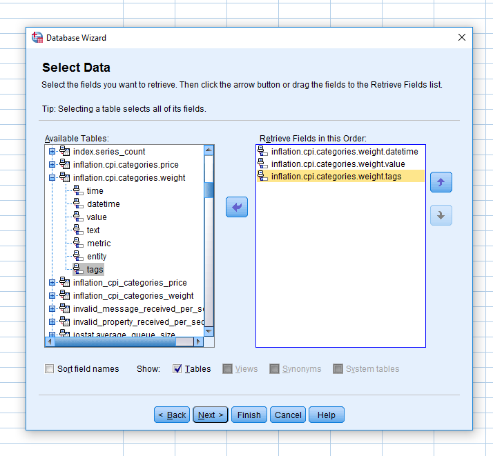

Save data in the `weights.sav`.

#### Import merged dataset from Database

* Select columns with the same name from two different tables
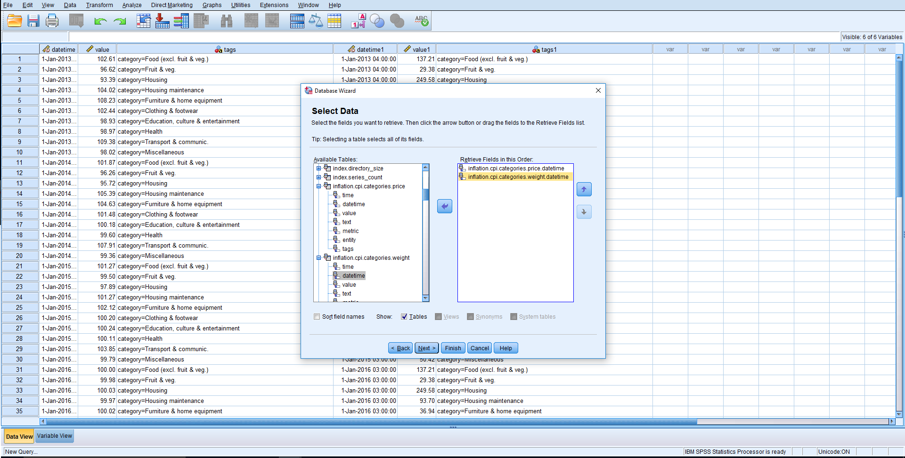
* Skip the next step with join
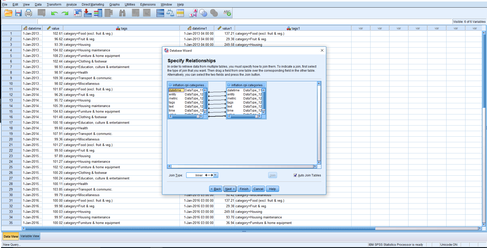
* Skip the next step again and write this query
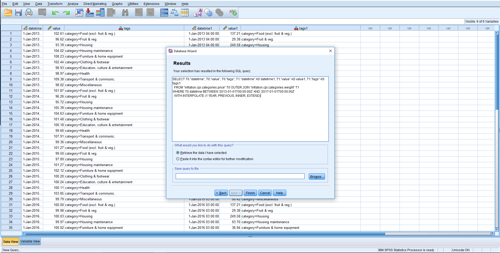
* Save the obtained dataset as `merged.sav`.
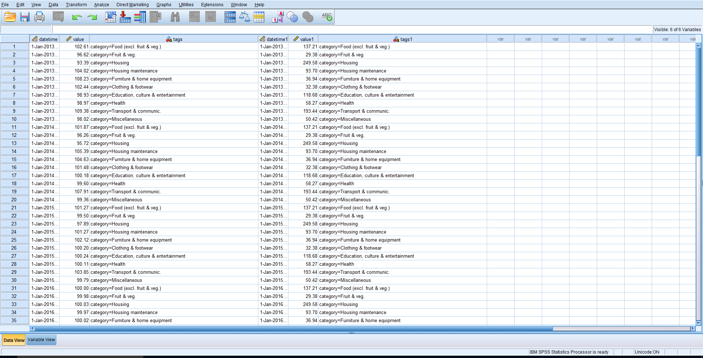
* Click `Variable View` tab, change column name for `value1` into `weight` and remove extra columns: `datetime1` and `tags1`.
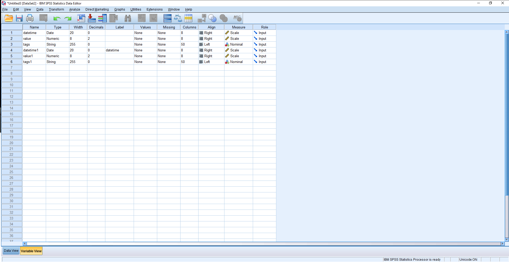
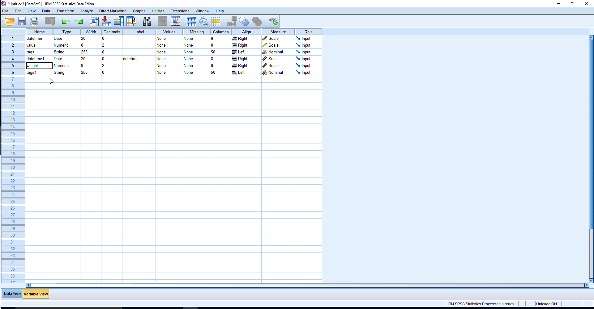
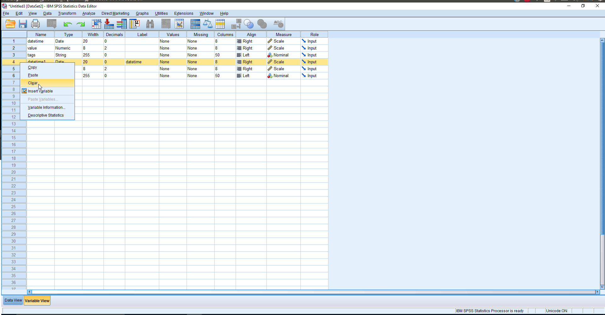
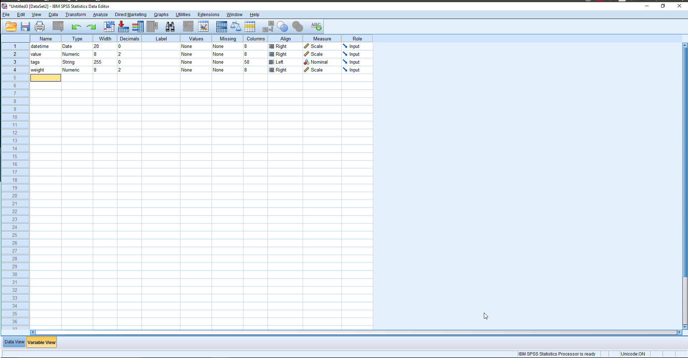

If you have ended all operations successfully, go to the [Analyze Dataset](#analyze_ataset) section.
 
### Import from CSV Files

* Export data from ATSD into CSV files as described in the **Exporting Data from ATSD** section at the end of this article.
* Open **File -> Import Data -> CSV Data...**.
* Select CSV files and click Open to import the `prices.sav` and `weights.sav` files.

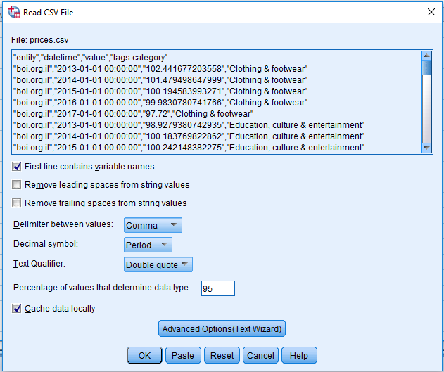

Data from the CSV files are now available as SPSS datasets `prices.sav` and `weights.sav`.


## SPSS User Interface

**Menu Item** | **Description**
--------- | -----------
File | Import data from files, create and save datasets, connect to databases.
Data | Prepare datasets: select rows, aggregate, merge, split.
Transform | Transform data:  calculate new variables, convert dataset into time series or other data structure.
Analyze | Apply statistical functions to the dataset.


## Merge Datasets

### Change Names of Columns

SPSS merges datasets using matching column names, similar to the `SELF JOIN` command in SQL syntax. 

To prevent the `datetime` and `value` columns from being merged, their names are changed in the `weights.sav` dataset using `Variable View` tab, otherwise the merged dataset produced by SPSS will only contain data for 2017.

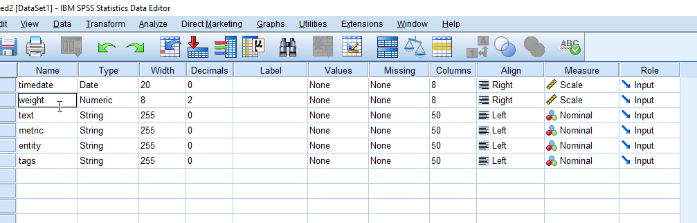

### Merge

Merge the two datasets by adding the `weight` column from the `weights.sav` dataset to the `prices.sav` dataset.

* Open **Data -> Merge Files... -> Add Variables...**
* Select `weights.sav` dataset.
* Select the desired table you want to merge it with. 
* Choose the "One-to-Many" option and open the 'Variables' tab in the dialog window.
* Import `datetime` from the current dataset, and add `value` and `weight` to the included list.
* Move `timedate` from the second dataset to the excluded list.
* Add `tags.category` and `entity` to 'Key Variables' to join the dataset with these columns.


> Since the two datasets have different row counts, make sure you select all the rows. The final dataset should have 27 rows.

Save the merged dataset as a new file `prices_merged.sav`.

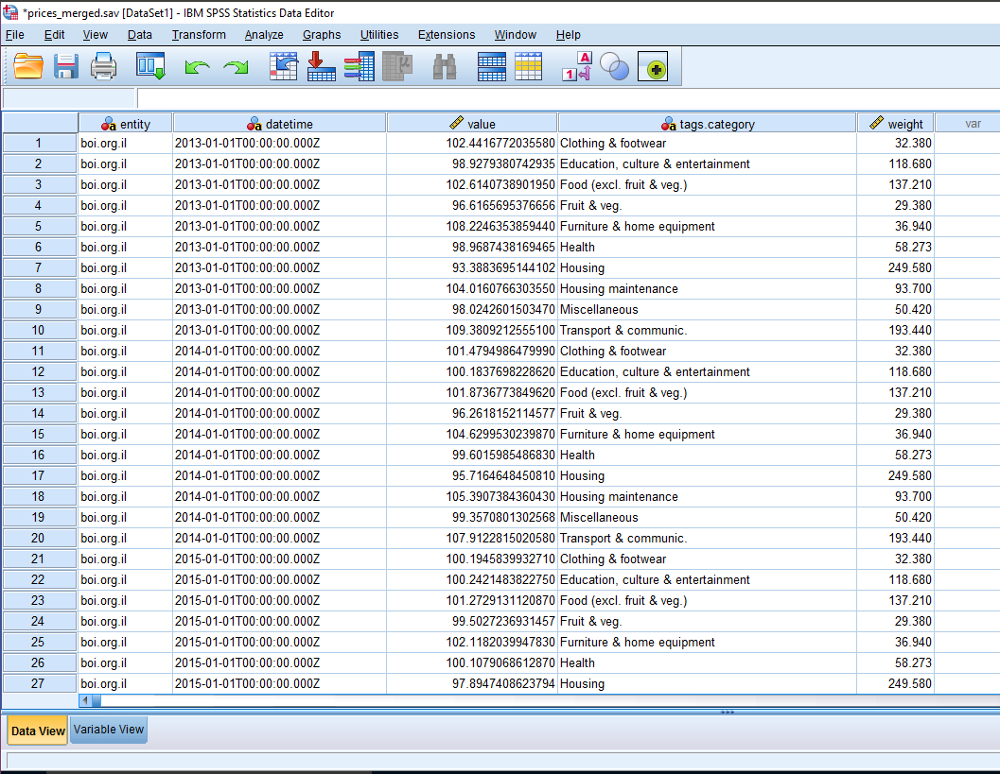

## Analyze Dataset

To calculate the weighted CPI for each year, the CPI value for a given category must be multiplied by its weight and divided by 1000. The resulting products are summed to give the value of the weighted CPI.

### Calculate Weighted CPI per Category

Open the `prices_merged.sav` dataset and create the new column `categ_ind`.

* Open **Transform -> Compute Variable...**  
* Place the columns from the left into the expression editor and specify a formula. 
* Select the `value` and `weight` columns, divide `weight` by 1000 and multiply `value` by the adjusted `weight`. 
* Assign a name to the new column.

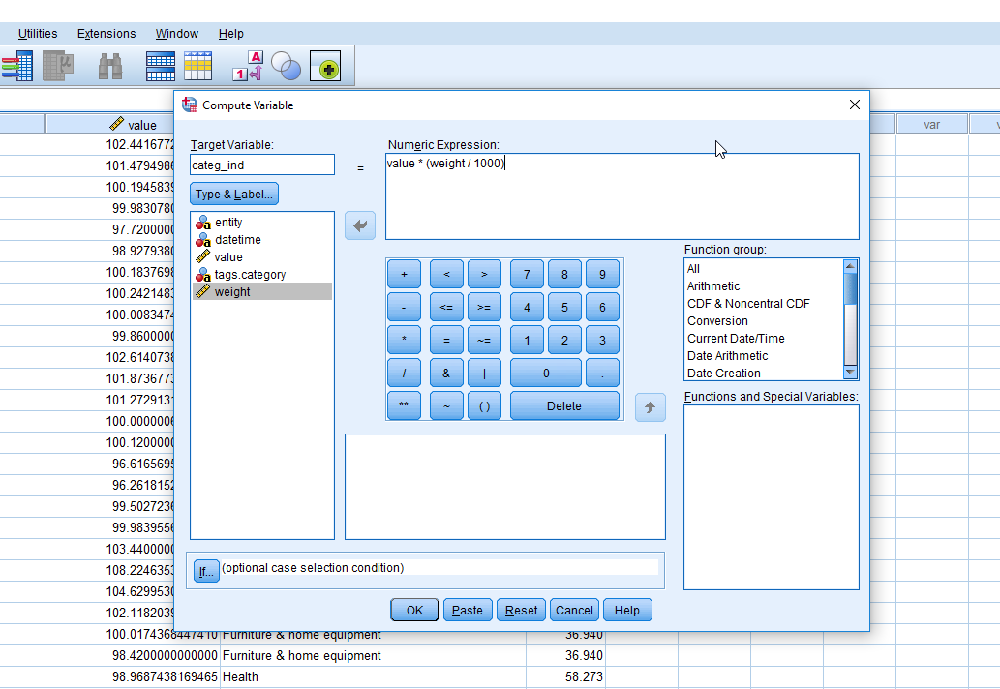

The `categ_ind` column is now available in the dataset.

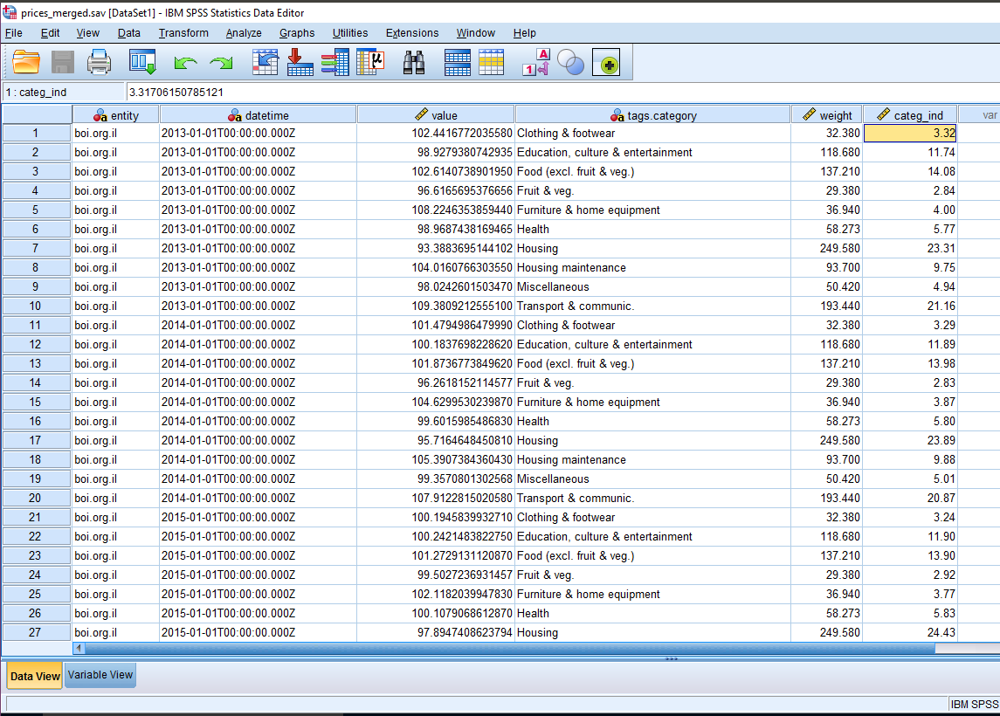

### Calculate Annual CPI

SPSS also provides two alternatives to aggregate data by period.
  
#### Aggregation using the Analyze Menu
    
* Open **Analyze -> Reports -> Report Summaries in Columns...** 
* Move the `categ_index` column to the 'Summary Variables' field and select the `SUM` aggregation function. 
* Set the `datetime` column as the break variable, which is used to group the resulting data. You can format aggregation columns in the dialog window.


    
* Publish the report by selecting **File -> Export As a Web Report** in the output window.
* The output contains the processing log in the results window.
    
    
    
* The report is also available in [HTML format]((resources/index_calculation.htm)).

    

#### Aggregation using the Data Menu
    
* Open **Data -> Aggregate...** 
* Set `categ_ind` as the summary variable and apply the `SUM` function
* Set `datetime` as the break variable
* Customize column formats and output options
* Create a new dataset with the break and aggregated variables 

    
    
* Create a new dataset with final columns `datetime` and `CPI`.

    
    
---

## Exporting Data from ATSD

ATSD provides a web-based SQL console to export query results into various data formats including Excel, CSV, and JSON, with optional metadata composed according to the [W3C Model for Tabular Data](https://github.com/axibase/atsd/blob/master/api/sql/api.md#metadata).

> If you don't have an ATSD instance available, [weights.csv](resources/weights.csv) and [prices.csv](resources/prices.csv) are provided for your convenience. These files contain the output of the SQL queries listed below.

### Prices

Obtain CPI price data by executing the following query: 

```sql
SELECT entity, datetime, value, tags.category 
  FROM inflation.cpi.categories.price 
ORDER BY tags.category, datetime
```


Export query results into `prices.csv`.


### Weight

Obtain weight data by executing the following query: 

```sql
SELECT entity, datetime, value, tags.category 
  FROM inflation.cpi.categories.weight 
ORDER BY tags.category, datetime
```

Export query results into `weights.csv`.