# IBM SPSS Data Analysis.

## Overview

The [IBM Statistical Package for the Social Sciences](https://www.ibm.com/analytics/us/en/technology/spss/) (SPSS) is an advanced statistical analysis tool. This guide describes the process of loading data from the Axibase Time Series Database into SPSS and demonstrates how to calculate the value of a derived series using Weighted Consumer Price Indices as an example.

SPSS provides several options for loading datasets from external data sources, such as Excel files or remote databases. To complete this exercise, sample data must be available in your instance of ATSD.

## SPSS User Interface

**Menu Item** | **Description**
--------- | -----------
File | Import data from files, create and save datasets, connect to databases.
Data | Prepare datasets: select rows, aggregate, merge, split.
Transform | Transform data:  calculate new variables, convert dataset into time series or other data structure.
Analyze | Apply statistical functions to the dataset.

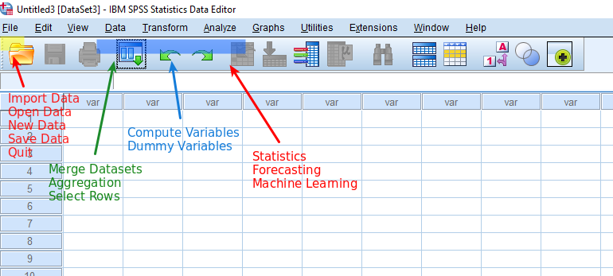

## Load Sample Data into ATSD

1. Log into the ATSD web interface
2. Open **Metrics -> Data Entry**, select the 'Commands' tab.
3. Copy the [series commands](resources/commands.txt) into the form and click Submit/Send.


The commands contain the Consumer Price Index (CPI) for each category of items in a consumer's basket as well as a weight for each category in the CPI basket. The CPI is tracked from 2013 to 2017 and uses Year 2016 values as the baseline. Weight values are available for 2017. The underlying data is available in the following [Excel file](resources/eng_e02.xls).

To calculate the weighted inflation index we need to multiply the CPI of each category by its weight divided by 1000 and sum the products.

## Import Data into SPSS

You can import ATSD data into SPSS by configuring an ODBC data source on a Windows machine and retrieving the records with an SQL query. Alternatively, you can run the queries in the ATSD web-based SQL console, export query results into CSV files, and manually load them into SPSS from the local file system.

### Import Data from Database

#### Prerequisites

* Configure an [ODBC-JDBC bridge](https://github.com/axibase/atsd/tree/master/integration/odbc) for ATSD.

#### Option 1: Load Prices and Weights As Separate Datasets

* Open **File > Import Data > Database > New query...**.
* Select `inflation.cpi.categories.price` table, drag-and-drop `datetime`, `value` and `tags` into the list of selected columns.
* Click **Finish**.
* Save the imported data into the `prices.sav` file.

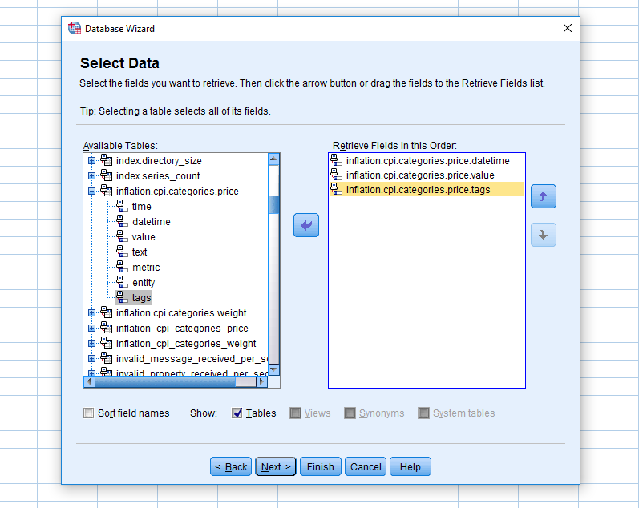

* Open **File > Import Data > Database > New query...**.
* Select `inflation.cpi.categories.weight` table, drag-and-drop `datetime`, `value` and `tags` into the list of selected columns.
* Click **Finish**.
* Save the imported data into the `weights.sav` file.


> Alternatively, you can execute [SPSS scripts](data-source.md) to load records from a datasources automatically.

#### Option 2: Loaded Merged Prices and Weights Dataset

* Select the `datetime` column from both the `inflation.cpi.categories.price` and `inflation.cpi.categories.weight` tables.

* Skip the next steps until a query editor is displayed. 
* Enter the following query which executes a FULL OUTER JOIN with interpolation for the missing weight records:

```sql
SELECT T0."datetime", T0."value", T0."tags", 
  T1."datetime" AS datetime1, T1."value" AS value1, T1."tags" AS tags1 
FROM "inflation.cpi.categories.price" T0 
  OUTER JOIN "inflation.cpi.categories.weight" T1 
WHERE T0.datetime BETWEEN '2013-01-01T00:00:00Z' AND '2017-01-01T00:00:00Z'
  WITH INTERPOLATE (1 YEAR, PREVIOUS, INNER, EXTEND)
```


* Save the dataset as `merged.sav`.

* Click the `Variable View` tab, rename the column `value1` as `weight` and remove the columns `datetime1` and `tags1`.


* Proceed to the [Analyze Dataset](#analyze-dataset) section below.
 
### Import from CSV Files

* Export data from ATSD into CSV files as described in the **Exporting Data from ATSD** section at the end of this article.
* Open **File -> Import Data -> CSV Data...**.
* Select the desired CSV files and click Open to import the `prices.sav` and `weights.sav` files.


Data from the CSV files are now available as SPSS datasets `prices.sav` and `weights.sav`. Proceed to merge datasets.

## Merge Datasets

### Change Names of Columns

SPSS merges datasets using matching column names, similar to the `SELF JOIN` command in the SQL syntax. 

To prevent the `datetime` and `value` columns from being merged, their names must be changed in the `weights.sav` dataset using `Variable View` tab, otherwise the merged dataset produced by SPSS will only contain data for 2017.


### Merge

Merge the two datasets by adding the `weight` column from the `weights.sav` dataset to the `prices.sav` dataset.

* Open **Data -> Merge Files... -> Add Variables...**
* Select `weights.sav` dataset.
* Select the desired table you want to merge it with. 
* Choose the "One-to-Many" option and open the 'Variables' tab in the dialog window.
* Import `datetime` from the current dataset, and add `value` and `weight` to the included list.
* Move `timedate` from the second dataset to the excluded list.
* Add `tags.category` and `entity` to 'Key Variables' to join the dataset with these columns.


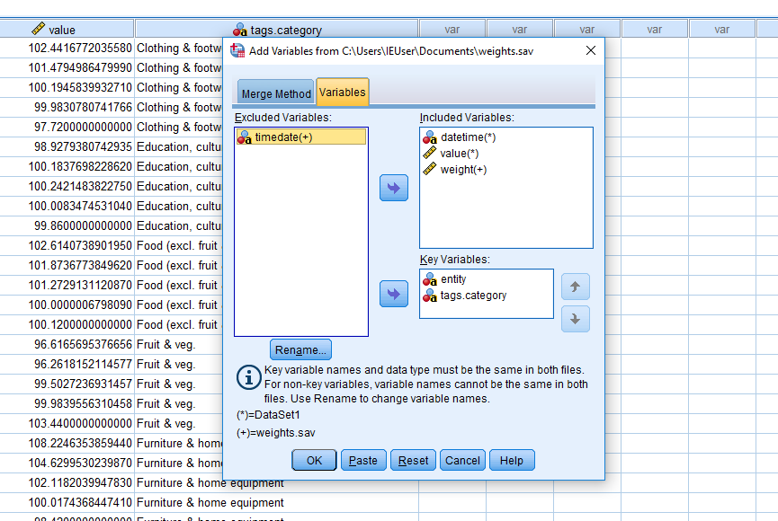

> Because the two datasets have different row counts, be sure you select all the rows. The final dataset should have 27 rows.

Save the merged dataset as a new file `prices_merged.sav`.


## Analyze Dataset

To calculate the weighted CPI for each year, the CPI value for a given category must be multiplied by its weight and divided by 1000. The resulting products are summed to give the value of the weighted CPI.

### Calculate Weighted CPI per Category

Open the `prices_merged.sav` dataset and create the new column `categ_ind`.

* Open **Transform -> Compute Variable...**  
* Place the columns from the left into the expression editor and specify a formula. 
* Select the `value` and `weight` columns, divide `weight` by 1000 and multiply `value` by the adjusted `weight`. 
* Assign a name to the new column.


The `categ_ind` column is now available in the dataset.


### Calculate Annual CPI

SPSS provides two alternatives to aggregate data by period.
  
#### Aggregation using the Analyze Menu
    
* Open **Analyze -> Reports -> Report Summaries in Columns...** 
* Move the `categ_index` column to the 'Summary Variables' field and select the `SUM` aggregation function. 
* Set the `datetime` column as the break variable, which is used to group the resulting data. You can format aggregation columns in the dialog window.


    
* Publish the report by selecting **File -> Export As a Web Report** in the output window.
* The output contains the processing log in the results window.
    
    
    
* The report is also available in [HTML format]((resources/index_calculation.htm)).

    

#### Aggregation using the Data Menu
    
* Open **Data -> Aggregate...** 
* Set `categ_ind` as the summary variable and apply the `SUM` function
* Set `datetime` as the break variable
* Customize column formats and output options
* Create a new dataset with the break and aggregated variables 

    
    
* Create a new dataset with final columns `datetime` and `CPI`.

    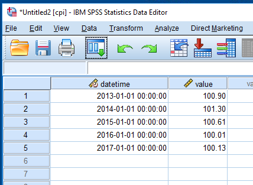
 

## Export Derived Series into ATSD

- Create a new metric in ATSD that will be used to store new series calculated in SPSS. 
- Login into ATSD, open **Metrics** > **Data entry** page and execute the following command:

```ls
metric m:cpi_price
```
 

 
- Open the previously created dataset in SPSS.

- Select **Transform** - **Compute Variable...**

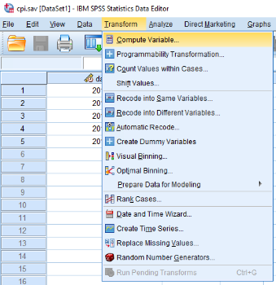

  - Enter `entity` in the **Target Variable** field.
  - Enter `"bls.gov"` in the **Numeric Expression** field.

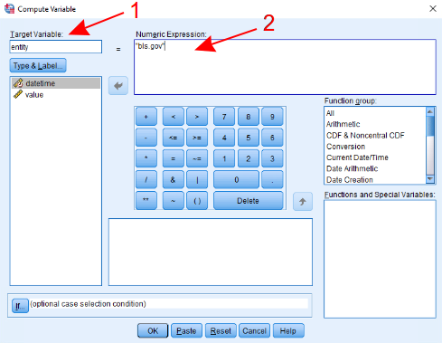

- Click **Type & Label...** button.

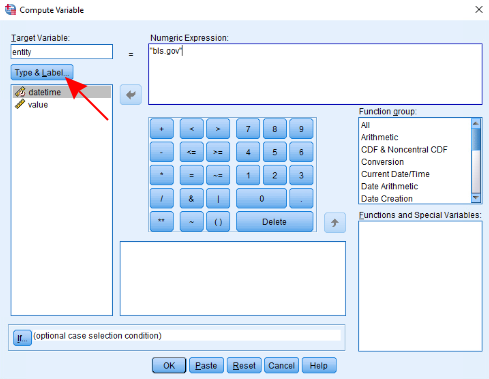

- Set **Type** to **String** and click **Continue**.


- Click **OK** to apply the changes. Column `entity` should now appear in the dataset.

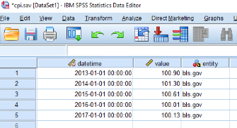

- Open the **File** menu and select **Export** -> **Database...**.


- Select `ATSD` data source, click **Next**.


- Select **Append new records to an existing table** and click **Next**

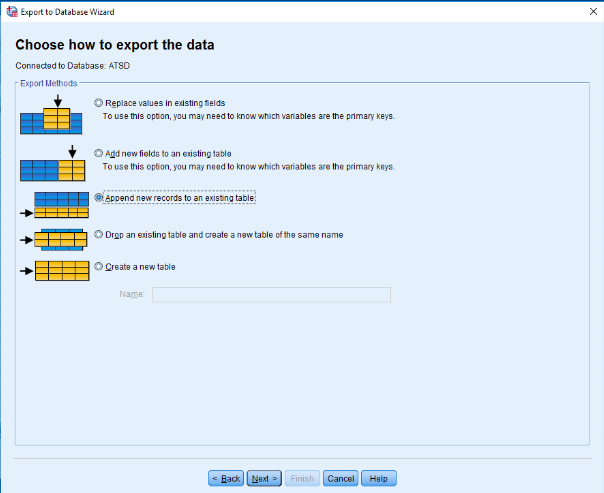

- Choose `cpi_price` table and click **Next**. The list of tables is based on the `tables=` driver property specified in the JDBC URL. If you don't see the desired table in the list, update ODBC data source as described [here](../../odbc/table-config.md) and re-open the export wizard.


- Associate table columns with metric fields.

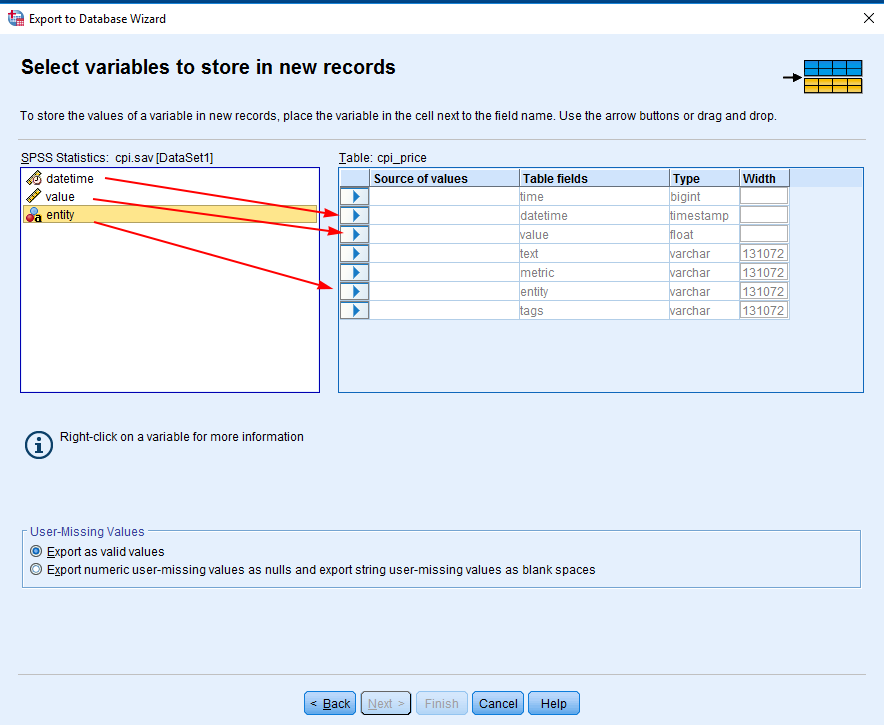

The result should look as follows. Click **Next**
 

 
 - Select **ODBC** - **Row-wise binding**, select **Paste the syntax** and click **Finish**
 
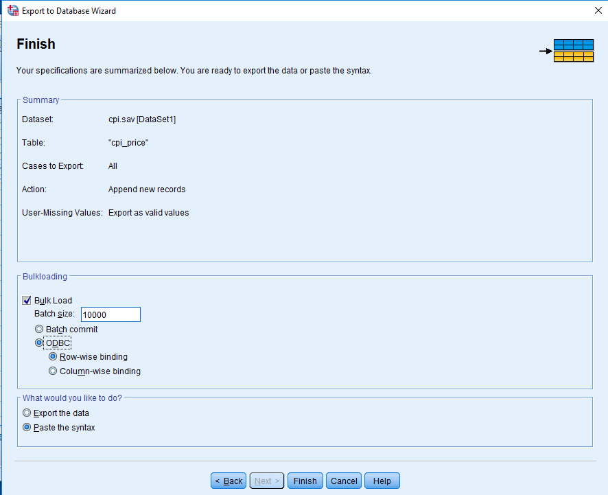

- Paste the following script into the dialog window:

```
SAVE TRANSLATE /TYPE=ODBC
  /BULKLOADING BATCHSIZE=10000 METHOD=ODBC BINDING=ROW 
  /CONNECT='DSN=ATSD;'
  /ENCRYPTED
  /MISSING=IGNORE
  /TABLE='cpi_price' /APPEND
  /KEEP=datetime, value, entity.
```

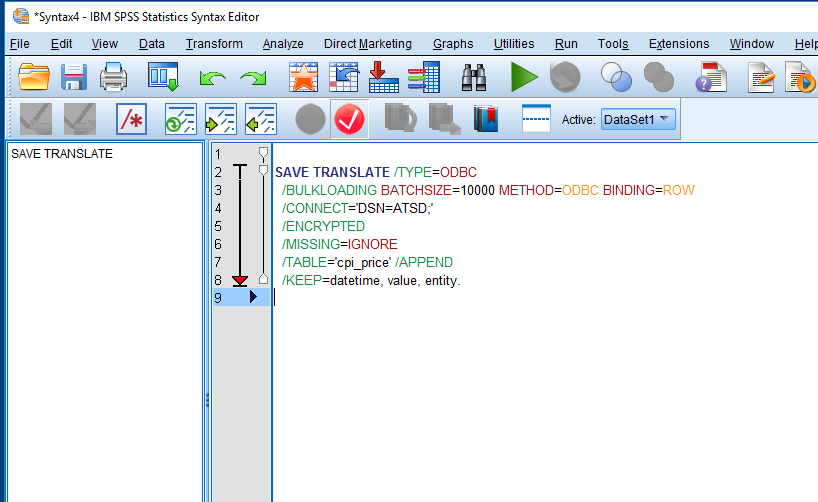

- Right click on the script window and select **Run All** to export the data into ATSD.


## Verify Insertion

To check that data is successfully exported to ATSD, open the ATSD web interface.

- Open the **SQL** tab and execute the following query:

```sql
SELECT entity, datetime, value 
  FROM 'cpi_price'
```

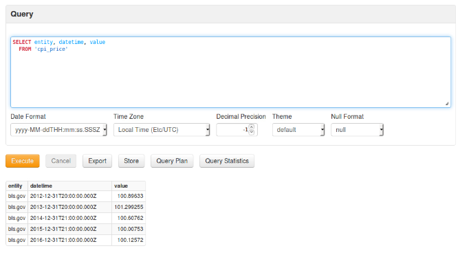

---

## Exporting Data from ATSD into CSV Files

ATSD provides a web-based SQL console to export query results into various data formats including Excel, CSV, and JSON, with optional metadata composed according to the [W3C Model for Tabular Data](https://github.com/axibase/atsd/blob/master/api/sql/api.md#metadata).

> If you don't have an ATSD instance available, [weights.csv](resources/weights.csv) and [prices.csv](resources/prices.csv) are provided for your convenience. These files contain the output of the SQL queries listed below.

### Prices

Obtain CPI price data by executing the following query: 

```sql
SELECT entity, datetime, value, tags.category 
  FROM inflation.cpi.categories.price 
ORDER BY tags.category, datetime
```

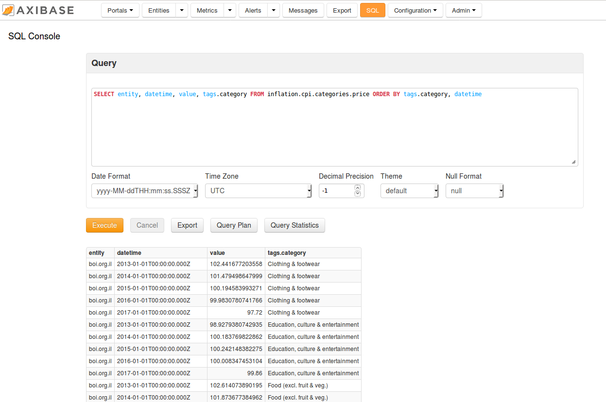

Export query results into `prices.csv`.


### Weight

Obtain weight data by executing the following query: 

```sql
SELECT entity, datetime, value, tags.category 
  FROM inflation.cpi.categories.weight 
ORDER BY tags.category, datetime
```

Export query results into `weights.csv`.
