# Stata

- [Prerequisites](#prerequisites)
- [Loading Data](#loading-data)
- [Exporting Data](#exporting-data)
- [Calculating Derived Series](#calculating-derived-series)
- [Reference](#reference)

## Prerequisites

- Install [Stata](http://www.stata.com/order/) 15
- Install [ODBC-JDBC Bridge](../odbc/README.md)

> If your ATSD installation has too many metrics (more than 10000), add a `tables={filter}` parameter to the [JDBC URL](https://github.com/axibase/atsd-jdbc#jdbc-connection-properties-supported-by-driver) to filter the list of tables visible in Stata.

## Loading Data

Execute the following command in the Stata console: `set odbcdriver ansi`

This configures Stata to interface with ODBC in ANSI mode to prevent string values from being truncated.

### Load Data using Import Wizard

- Click on **File > Import > ODBC data sources**
- Select the ATSD connection in **ODBC data sources**
- Select a table in the 'Tables' list
- Choose one or multiple columns from the `Columns` list
- Click **OK** to import rows containing data in these columns into Stata memory

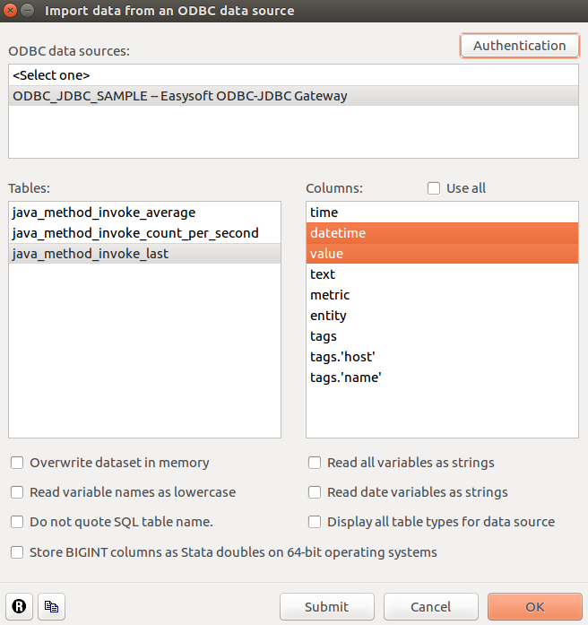

### Load Data with Stata Console

- Type [`odbc list`](https://stata.com/manuals13/dodbc.pdf) in the Stata Console.
- Click on the ATSD Data Source Name (DSN) that you have configured in the ODBC-JDBC Bridge


- Click on a table from the list to view the table's description:

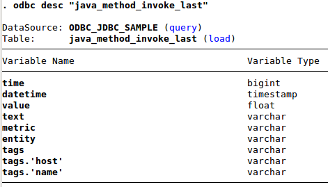

- Click on `load` to load the entire table as a dataset into memory.
- Click on `query` to re-load the list of tables.

## Load Data with SQL Query

- Execute [`odbc load`](https://www.stata.com/manuals13/dodbc.pdf) to load results for a custom SQL query results into memory:

```
odbc load, exec("SELECT time, value, tags.name FROM java_method_invoke_last ORDER BY datetime LIMIT 100") bigintasdouble
```

Syntax:

- `exec("SqlStmt")` allows to issue an SQL SELECT statement to generate a table to be read into Stata.
- `bigintasdouble` specifies that data stored in 64-bit integer (BIGINT) database columns be converted to Stata doubles.

Description of resultset:

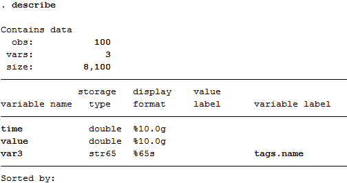

### Convert the UNIX Epoch milliseconds to the Stata milliseconds:

```
generate double datetime = time + tC(01jan1970 00:00:00)
format %tcCCYY-NN-DD!THH:MM:SS.sss!Z datetime
```

Description of resultset:

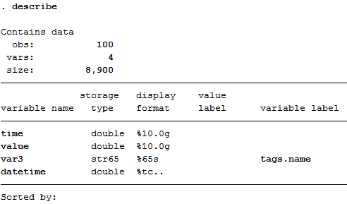

## Exporting Data

### Export Data using Export Wizard

- Follow the path **File > Export > ODBC** data source.
- Click on the ATSD connection in `ODBC data sources`.
- Type the table name into `Tables` field. This will be the metric name holding the exported data.
- Choose the variables to export in the `Variables` drop-down list.
- Type column names from the target metric according to variables selected in the previous step.
- Choose `Append data into existing table` in `Insertion options`.
- Check `Use block inserts` option.
- Click `OK` to export the selected variables into ATSD.

### Export Data using Stata Console

Use the [`odbc insert`](https://www.stata.com/manuals13/dodbc.pdf) command to write data from Stata memory into ATSD.

```
odbc insert var1 var2 var3, as("entity datetime value") dsn("ATSD") table("target_metric_name") block
```

> Make sure the `block` flag is set, otherwise all available records may not be inserted into ATSD.

Syntax:

- `var1 var2 var3` is a list of variables from the in-memory dataset in Stata.
- `as("entity datetime value")` is a list of columns in the ATSD metric. It should be sorted according to list of variables.
- `dsn("ATSD")` is a name of ODBC connection to ATSD.
- `table("metric_name")` is a name of the metric which will contain exported dataset.
- `block` is a parameter to force using block inserts.

## Calculating Derived Series

To calculate the category-weighted consumer price index (CPI) for each year, the CPI value for a given category must be multiplied by its weight and divided by 1000 since its weights are stored as units of 1000 (not 100). The resulting products are summed as the weighted CPI for the given year.

### Load and Save Prices

```
odbc load, exec("SELECT value as price, tags.category as category, datetime FROM inflation.cpi.categories.price ORDER BY datetime, category") dsn("ODBC_JDBC_SAMPLE")
save prices
```

> The data is saved for later access.

Preview `prices`:

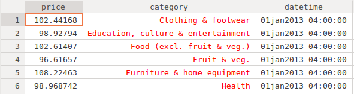

`prices` dataset description:

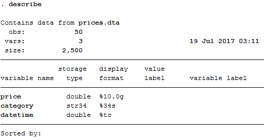

### Load and Save Datetimes

```
clear
odbc load, exec("SELECT datetime FROM inflation.cpi.categories.price GROUP BY datetime ORDER BY datetime") dsn("ODBC_JDBC_SAMPLE")
save datetimes
```

Preview `datetimes` dataset:

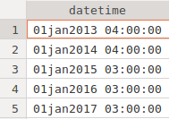

### Load Category Weights

```
clear
odbc load, exec("SELECT tags.category as category, value as weight FROM inflation.cpi.categories.weight ORDER BY datetime, category") dsn("ODBC_JDBC_SAMPLE")
```

Since the `Weights` are available for only one year, we will assume that the category weights are constant through the timespan and therefore can be repeated for each year from 2013 to 2017.

Perform a cross join of weights with datetimes:

```
cross using datetimes
```

Preview the joined dataset:

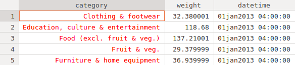

### Merge Weights with Prices

In this step two tables will be appended to perform calculations within one table. This table will have a unique row identifier (composite key of `datetime + category`) in order to join rows with the INNER JOIN operation.

```
merge 1:1 category datetime using prices
drop category _merge
```

Preview the merged dataset:

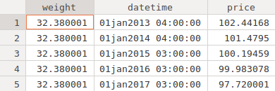

### Calculate New Variable

Multiply two columns element-wise to calculate the inflation index per category:

```
generate inflation = weight * price / 1000
drop weight price
```

Preview the dataset:

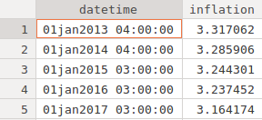

### Group Rows by Date and Aggregate SUM

Group rows by `datetime` and sum weighted price values for each year.

```
bysort datetime : egen value = total(inflation)
sort datetime value
by datetime value :  gen dup = cond(_N==1,0,_n)
drop if dup>1
drop dup inflation
```

This operation will group records by `datetime` and calculate the sum of the `inflation` values for each group.

Preview the dataset:

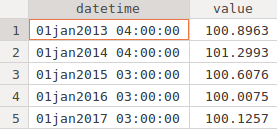

### Add Entity Constant

The entity column is required to store the calculated variable in ATSD.

```
generate entity = "bls.gov"
```

This operation will add a new column `entity` with value `bls.gov` in each row.

Preview the dataset:

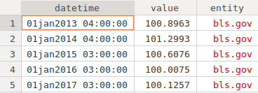

### Insert Data into ATSD

Resultset description:

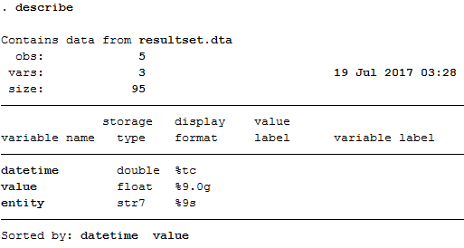

#### datetime as NUMBER

```
replace datetime = datetime - tC(01jan1970 00:00:00)
set odbcdriver ansi
odbc insert entity datetime value, as("entity datetime value") table("inflation.cpi.composite.price") dsn("ODBC_JDBC_SAMPLE") block
```

#### datetime as STRING

```
generate datetime_str = string(datetime, "%tcCCYY-NN-DD!THH:MM:SS.sss!Z")
set odbcdriver ansi
odbc insert entity datetime_str value, as("entity datetime value") table("inflation.cpi.composite.price") dsn("ODBC_JDBC_SAMPLE") block
```

### Check Results

Log in to ATSD and execute the following query in the SQL tab to verify the results:

```sql
SELECT entity, datetime, value FROM inflation.cpi.composite.price
```

```ls
| entity  | datetime                 | value              |
|---------|--------------------------|--------------------|
| bls.gov | 2013-01-01T00:00:00.000Z | 100.89632897771745 |
| bls.gov | 2014-01-01T00:00:00.000Z | 101.29925299205442 |
| bls.gov | 2015-01-01T00:00:00.000Z | 100.60762066801131 |
| bls.gov | 2016-01-01T00:00:00.000Z | 100.00753061641115 |
| bls.gov | 2017-01-01T00:00:00.000Z | 100.12572021999999 |
```

## Script File

- [Link to the `do` file](resources/script.do) that contains all the steps.

## Reference

Stata commands used in this example:

- [adbc](http://www.stata.com/manuals13/dodbc.pdf)
- [save](http://www.stata.com/manuals13/dsave.pdf)
- [clear](http://www.stata.com/manuals13/dclear.pdf)
- [cross](http://www.stata.com/manuals13/dcross.pdf)
- [merge](http://www.stata.com/manuals13/dmerge.pdf)
- [drop](http://www.stata.com/manuals13/ddrop.pdf)
- [generate](http://www.stata.com/manuals13/dgenerate.pdf)
- [by / bysort](http://www.stata.com/help.cgi?bysort)
- [egen](http://www.stata.com/manuals13/degen.pdf)
- [sort](http://www.stata.com/manuals13/dsort.pdf)
