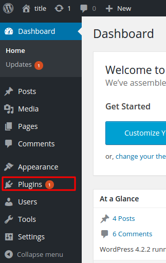
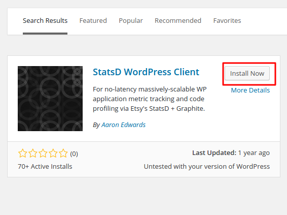
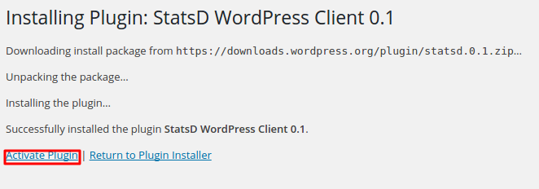

# StatsD

[StatsD](https://github.com/etsy/statsd) is a network daemon that runs on the Node.js platform and listens for statistics, like counters and timers, sent over UDP or TCP and sends aggregates to one or more pluggable backend services.

[Setup the Axibase Time-Series Database StatsD Backend.](statsd-backend.md)

ATSD is able to ingest StatsD format.

Basic Format:

```
{metricname}:{value}|{type}
```

Extended Format:

```
metric.name:value|type|@sample_rate|#tag1:value,tag2
```

#### StatsD Installation and Configuration

Download and install StatsD:

```sh
sudo apt-get install git nodejs devscripts debhelper
mkdir ~/build && cd ~/build
git clone https://github.com/etsy/statsd.git
cd statsd 
dpkg-buildpackage
```

Install the resulting package:

```sh
cd .. 
sudo dpkg -i statsd_0.6.0-1_all.deb
```

Stop and configure StatsD:

```sh
sudo service statsd stop
sudo nano /etc/statsd/localConfig.js
```

Edit the following fields, `graphitePort` is ATSD port for network commands and `graphiteHost` is hostname or ip address of ATSD:

```json
{
  graphitePort: 8081
, graphiteHost: "atsdserver"
, port: 8125
, graphite: {
    legacyNamespace: false
  , globalPrefix: "customPrefix"
  , globalSuffix: "customSuffix"
  }
}
```

Start StatsD:

```sh
sudo service statsd start
```

#### StatsD WordPress Example

Go to the Plugins menu on your WordPress administration page:



Click ‘Add New’, find and install the ‘[StatsD WordPress Client](https://wordpress.org/plugins/statsd/)‘ plugin:



Activate the plugin:



If StatsD is not on localhost or port , you have to define the local daemon IP in wp-config.php:

Usually wp-config.php located in `/var/www/html/wp-config.php`

```php
define('STATSD_IP', 'x.x.x.x' );
```

If needed you can override the default UDP port of 8125 in wp-config.php:

```php
define('STATSD_PORT', xxxx);
```

Metrics collected by StatsD from WordPress:

```
Logins (success, fails, logout)
Password resets (attempts/successes)
User count (guage)
Users (registrations, spam, ham)
Posting (publish, trash, delete)
Commenting (received, approved, trashed, spam, unspam)
Attachments (Add, edit, delete)
XML-RPC (every command individually, you can rollup)
Multisite blog count (guage)
Multiiste blog actions (new, spam, ham, archive, unarchive, delete, undelete)
Page generation times
Query count (type + time when SAVEQUERIES defined)
Remote HTTP requests (count, time - by host)
WP Cron calls
WP Emails
etc: instant tracking of any application metric using API
```

Once collected, these metrics can be found in ATSD under the Entity and Metrics tabs.

