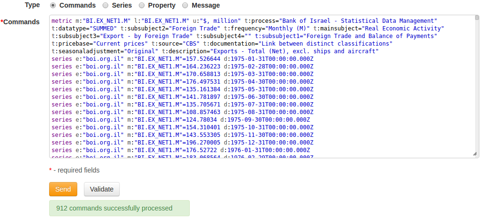
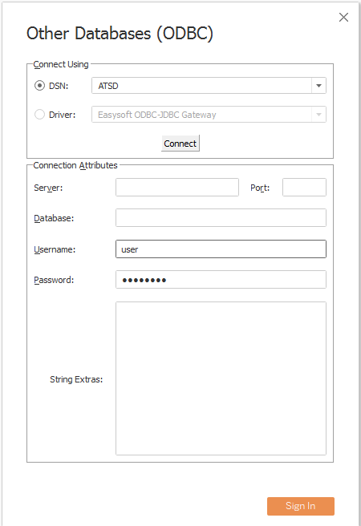
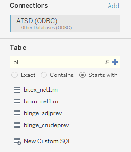
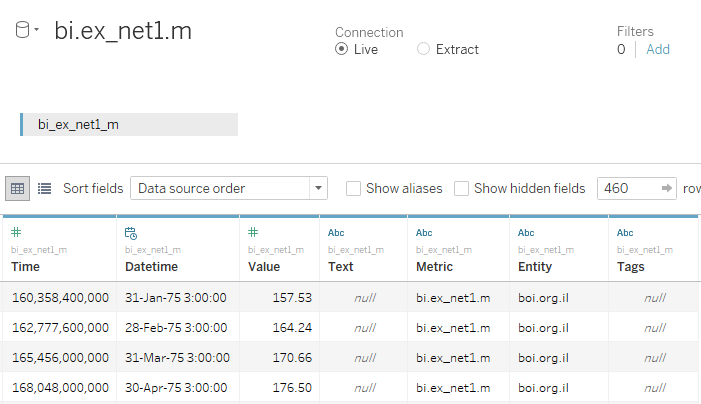
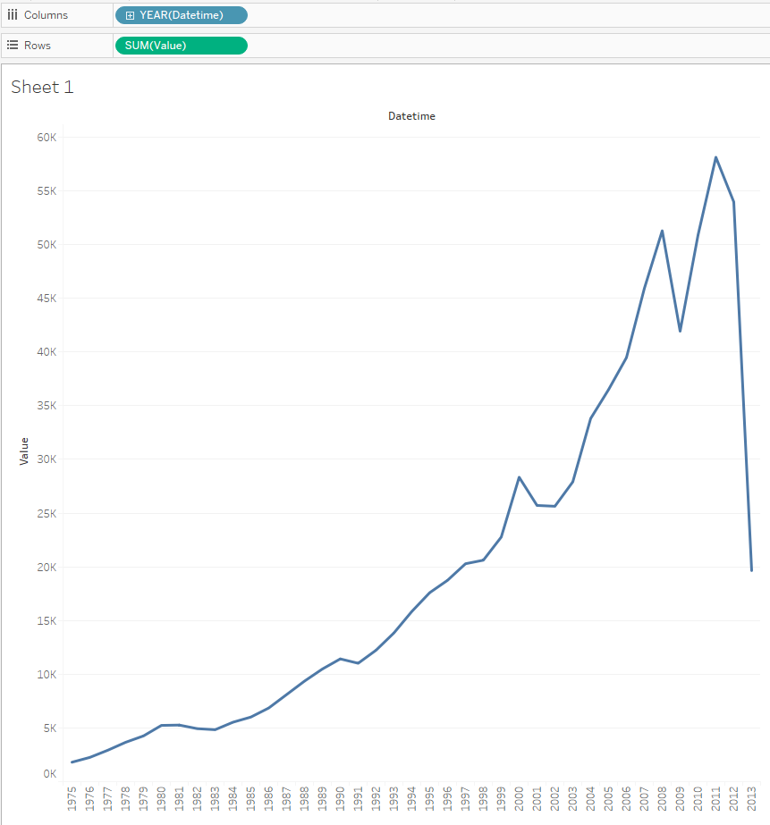

# Tableau

- [Prerequisites](#prerequisites)
- [Configure Database Connection](#configure-database-connection)
- [Review Tables in Data Source Pane](#review-tables-in-data-source-pane)
- [Visualization](#visualization)
- [Examples](#examples)

## Overview

Tableau Desktop is a visualization software that provides tools to query, analyze, and aggregate data from multiple data sources.  The following guide outlines the initial configuration steps and includes examples of using the Tableau Desktop user interface in order to build charts from historical data stored in the Axibase Time Series Database (ATSD).

## Dataset

For the purpose of instruction, we will use the following sample [series commands](resources/commands.txt). The series contain the national import and export statistics over a period of 30+ years. The series are seasonally adjusted and are collected on a monthly basis.

To load the data, log in to ATSD and submit these commands on the **Metrics > Data Entry** page.

## Prerequisites

### Install Tableau

- Install [Tableau Desktop 10.4](https://www.tableau.com/support/releases) 
- Copy [ATSD.tdc](resources/ATSD.tdc) to the `Tableau Repository`. On Windows the repository is located in the `C:\Users\You\Documents\My Tableau Repository\Datasources` directory

### Install ODBC-JDBC Bridge

- Install [ODBC-JDBC gateway](../odbc/README.md)  
- Make sure that the **'Strip Escape'** checkbox is enabled and **'Strip Quote'** is **disabled**

If your ATSD installation has more than 10000 metrics, consider adding a `tables={filter}` property to the [JDBC URL](https://github.com/axibase/atsd-jdbc#jdbc-connection-properties-supported-by-driver) to filter the list of tables visible in Tableau.

## Configure Database Connection

- Launch Tableau
- Select **Connect > To a Server > Other Databases(ODBC)**
- Select the ATSD DSN from the dropdown. This is the DSN you specified during ODBC-JDBC bridge setup
- Press **Connect** and wait a few seconds
- Leave the **Server**,**Port**, **Database** and **String Extras** fields empty
- Press **Sign In**

## Review Tables

- Enter a keyword and click the **Search** button. For this exercise, we will search for the `bi.ex_net1.m` table:

  

- Drag-and-drop the table to Canvas area
- Press **Update Now**.

## Visualization

- Press **Sheet 1**
- Press **OK** to acknowledge the warning about limitations
- Set _Datetime_ to the columns field
- Set _Value_ to the rows field

> Since _time_ and _datetime_ represent recorded times composed of different data types (long and timestamp), make sure you select only one of these columns in your queries. 

Inspect a subset of the visualized data:

- Select some data points in the view
- Right click and choose **View Data**

## Examples

- [Monthly Exports](examples/detailed_values_by_date_no_aggregation_for_one_metric.md)
- [Annual Export Baselines](examples/month_and_year_aggregation.md)
- [Annual Exports](examples/sum_by_year_for_one_metric.md)
- [Lowest Annual Imports](examples/value_aggregation.md)
- [Monthly Export and Imports (JOIN)](examples/detailed_values_by_date_no_aggregation_for_two_metric.md)
- [Monthly Export and Imports (JOIN) - bars](examples/comparision_of_two_metrics_at_one_bar_graph.md)
- [Average Annual Imports](examples/average_by_year_for_one_metric.md)
- [Minimum and Maximum Exports each Year](examples/min_and_max_by_year_for_one_metric.md)
- [Annual Exports and Imports](examples/sum_by_year_for_two_metrics.md)
- [Export - Import by year](examples/export-import_by_year.md)
- [Annual Trade Balance](examples/sum(export)-sum(import)_by_year.md)
