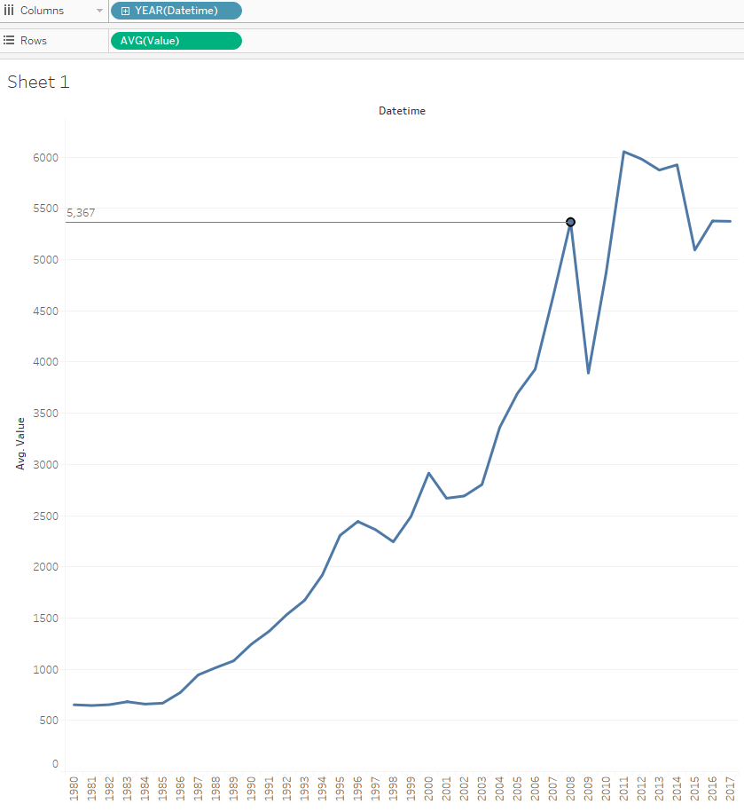

# Average by Year for One Metric

## Overview

Let's build a report illustrating average monthly imports each year.

## Data Source

* Table: `bi.im_net1.m`

## Steps

- Drag-and-drop _Datetime_ column in to the columns field.
- Drag-and-drop _Value_ column in to the rows field.
- Change aggregation from **SUM** to **AVG**
- Optionally add [drop lines](comparision_of_two_metrics_at_one_bar_graph.md#drop-lines)

## Results

